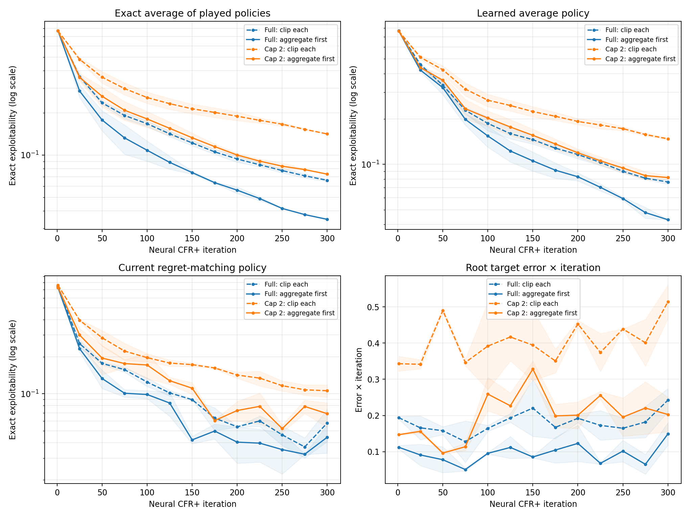

# Neural CFR+ regret target: clip each record or aggregate first?

**Purpose.** The [sampled-target experiment](2026-09-27_23-28-05_cfr_plus_sampled_targets_cpu.md) found that sampling and clipping do not commute, and aggregate-then-clip improved a tabular conditional-regression model. This experiment asks whether the same intervention helps the **production neural trainer**, with its finite regret networks, positive-target loss, recent replay, and learned average network. The [shadow-ledger experiment](2026-09-27_23-58-30_cfr_plus_shadow_neural_cpu.md) found a root target gap but did not change the update.

## What is changed

The control fits each sampled target `ReLU(((t-1)/t) × old_prediction + instantaneous_regret/t)` separately. The intervention keeps the expression *before* `ReLU`, groups visits with the same encoded information set during one player's iteration, takes an inverse-path-probability-weighted mean, then applies `ReLU`. Every visit receives its group's result, preserving replay frequency, sample weights, and the existing positive-target fit loss. The regret buffer is still cleared at the start of the next player update; this is **not** a persistent exact regret table.

The change is exposed as `regret_target_mode="aggregate_then_clip"` in `DeepCFRPlusTrainer`. It is intentionally restricted to CPU and `traversal_backend="gpu_native"` for this diagnostic. The default `clip_each_record` path remains the historical implementation. Both streamed and breadth-first tensor traversals produce raw targets in the experimental mode; this run uses breadth-first to match the preceding shadow experiment.

## Predictions and decision rule

| Result | Interpretation |
| --- | --- |
| Aggregate-first reduces root target error *and* exact exploitability across seeds | Strong evidence that noisy per-record clipping matters in the actual neural loop. Next test: a longer small-game run and a GPU implementation with bounded aggregation. |
| Root target error falls but exploitability does not | The bias is real, but model fit, averaging, or another error may dominate policy quality. |
| Neither improves | The tabular result may not transfer to finite neural fitting; inspect network predictions and optimizer behavior. |
| Aggregate-first improves only with a claim cap | Action-sampling variance may be central. The full-expansion comparison still samples deals and opponent actions. |

Compare **within the same action cap and seed**. Full expansion versus cap 2 changes the number of expanded edges and wall time. The exact played average from the shadow ledger distinguishes current-policy learning from average-network fitting. Exact exploitability is lower when a policy is stronger, and the graph uses a log y-axis so equal vertical distances represent equal ratios.

## Protocol

Use the six-claim spec from the preceding two notes. Keep the same `32×32` networks, learning rate `1e-3`, 32 root traversals per player, eight regret fit steps, four strategy fit steps, positive-target weight `0.5`, and seeds 17 and 23. Run both modes under full expansion and cap 2 for 300 iterations, evaluating current, exact played average, and learned average every 25 iterations. The independent root audit compares each mode's actual target with the exact one-step target for its frozen policy. Preserve per-configuration rows as JSON as they finish.

Snapshot compilation creates temporary neural models before loading their weights. This experiment preserves the Torch random state around that observer code, so evaluation frequency does not change the later training samples. An initial unisolated run was saved as [`neural_clip_order_300_pre_rng_fix.json`](../../data/neural_clip_order_300_pre_rng_fix.json); the results below use the isolated rerun. Both versions used the same evaluation schedule across comparison arms, but the isolated version has cleaner measurement semantics.

Run from the repository root:

```powershell
.\.venv\Scripts\python.exe -u scripts/shadow_neural_cfr_plus_cpu.py --iterations 300 --traversals 32 --eval-every 25 --caps full,2 --seeds 17,23 --clip-modes clip_each_record,aggregate_then_clip --output docs/data/neural_clip_order_300.json
```

The code changes only the target construction; no hyperparameter search is included. The small spec makes exact evaluation possible, but it cannot by itself establish what happens on 18 or 69 claims. A follow-up longer run is needed to test late deterioration.

## Results

The run completed all eight configurations: two target modes × two action caps × two seeds. The saved [per-snapshot results](../../data/neural_clip_order_300.json) contain 104 evaluation rows. Recreate the figure with `python scripts/plot_cfr_plus_cpu_experiments.py` from the repository root.



**How to read the figure.** Blue is full traverser-action expansion; orange is cap 2. Dashed lines clip each record; solid lines aggregate first. Each line is the mean of seeds 17 and 23, with a pale band spanning the two results rather than a confidence interval. The first three panels plot **exact exploitability** on a logarithmic y-axis; lower is better, and equal vertical distances mean equal *ratios*. The last panel is a root-target error multiplied by iteration `t`; it is a target diagnostic on a linear scale, **not** exploitability.

| Target mode | Claim expansion | Learned average at 300 | Exact played average at 300 | Current policy at 300 | Root absolute error × 300 |
| --- | --- | ---: | ---: | ---: | ---: |
| Clip each record | Full | 0.0764 | 0.0660 | 0.0578 | 0.2422 |
| Aggregate, then clip | Full | **0.0429** | **0.0347** | **0.0443** | **0.1491** |
| Clip each record | Cap 2 | 0.1476 | 0.1413 | 0.1058 | 0.5141 |
| Aggregate, then clip | Cap 2 | **0.0817** | **0.0730** | **0.0688** | **0.2027** |

These are means over two seeds. At iteration 300, the learned average is about **44% less exploitable** with aggregate-first under full expansion (`0.0429` versus `0.0764`), and about **45% less exploitable** at cap 2 (`0.0817` versus `0.1476`). The exact average of played policies improves too, so the result is not explained by better strategy-network fitting alone. Both seeds show the same direction in all four comparisons of the learned average and exact played average. The mean learned-minus-exact-average gap is still nonzero: about 0.0082 under full expansion and 0.0087 at cap 2 with aggregation.

The root audit also moves in the predicted direction: its mean absolute error, scaled by iteration, falls by about 38% under full expansion and 61% at cap 2. Because the policies diverge after the first update, each run's exact one-step target refers to its **own** frozen policy; the audit is a within-run accuracy measure, not a common fixed target across runs.

## Conclusion and limits

Changing clipping order helps the **actual neural CFR+ trainer** on this exactly evaluated small game. This is stronger evidence than the previous tabular conditional-regression result: it includes finite regret networks, their optimizer and positive-target loss, and a learned average network. The independent root audit and the exact played-average comparison point toward a regret-target effect.

This is still a six-claim, two-seed, 300-iteration CPU result. Neither target mode had entered a late deterioration regime by iteration 300, and aggregate-first currently groups only records retained in one player's recent buffer. It does not prove that this change fixes 18- or 69-claim training. The [longer matched run](2026-09-28_01-17-33_cfr_plus_neural_clip_order_long_cpu.md) and [deeper-infoset audit](2026-09-28_01-47-35_cfr_plus_neural_depth_target_audit_cpu.md) are recorded separately; a large-game GPU implementation would also need a memory-bounded aggregation design.
