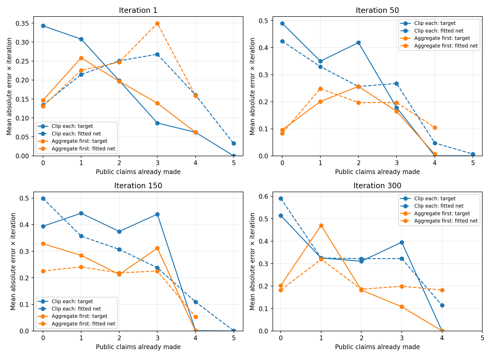

# Where do neural CFR+ targets depart from exact targets?

**Purpose.** The [clip-order intervention](2026-09-28_01-04-50_cfr_plus_neural_clip_order_cpu.md) substantially improved exact policy quality on a six-claim game, and the [earlier shadow audit](2026-09-27_23-58-30_cfr_plus_shadow_neural_cpu.md) found a root target discrepancy. A root-only check can miss problems deeper in the game, where opponent reach and action-sampling importance weights matter more. This experiment audits targets at **every depth reached in the regret buffer**, using an independent exact dense CFR+ value calculation for each frozen neural policy.

## What different outcomes would mean

| Observation | Interpretation |
| --- | --- |
| Aggregate-first reduces error at all depths | Its improvement is not confined to root decisions; a larger-game implementation deserves attention. |
| Root error falls but deep error does not | Deep importance correction, conditional opponent reach, or insufficient visits may dominate later decisions. |
| Target error falls, but fitted-network error stays high | The network or optimizer is failing to reproduce even the improved targets. |
| Both modes retain large deep target error | More conditional samples, lower-variance baselines, or a depth-specific traversal audit may matter more than clipping order alone. This experiment does not directly measure pre-clipping value bias. |

## Method and safeguards

Use the same six-claim spec and CPU `DeepCFRPlusTrainer` setup as the clip-order experiment: `32×32` networks, 32 traversals per player, eight regret steps, four strategy steps, learning rate `1e-3`, random action sampling, and no action baseline. Compare the two target modes at cap 2 for seeds 17 and 23 through 300 iterations. Audit before and after regret fitting at iterations 1, 50, 150, and 300. The target comparison holds each run's frozen policy and previous network prediction fixed.

For each information set represented in that iteration's regret buffer, exact dense CFR+ supplies action values under the frozen neural policy. Divide its counterfactual action values by the opponent/chance reach mass for that private hand and public history to get values **conditional on reaching that information set**. These are compared with the importance-weighted mean target actually presented to the network. Group by public-history depth and report error scaled by iteration `t`, since the new regret signal enters as `1/t`.

Before using the deeper audit, verify that the dense calculation reproduces the independently enumerated Player 1 root action values **and** an independently enumerated continuation calculation at every reachable depth for both players. Snapshot compilation preserves training RNG. The audit runs only at monitor points and never changes the policy update.

Run from the repository root:

```powershell
.\.venv\Scripts\python.exe -u scripts/audit_cfr_plus_neural_targets_cpu.py --iterations 300 --audit-iterations 1,50,150,300 --seeds 17,23 --output docs/data/neural_depth_audit_300.json
.\.venv\Scripts\python.exe scripts/plot_cfr_plus_cpu_experiments.py
```

## Results

All four runs completed. The saved [per-depth audit rows](../../data/neural_depth_audit_300.json) record both players at each monitor. Run `python scripts/plot_cfr_plus_cpu_experiments.py` to recreate the figure. A first attempt stopped because the verifier tried to divide by opponent reach at an **unreachable** history; its completed rows are [preserved separately](../../data/neural_depth_audit_300_verifier_partial.json). The verifier now skips zero-reach information sets. It also independently enumerates continuation values for both players at reachable histories. This was a verifier issue, not a training error.



**How to read the figure.** Each panel is one CFR+ iteration. The x-axis counts claims already made. Blue clips each record; orange aggregates then clips. Solid lines compare the **target shown to the network** with the exact one-step target for that run's frozen policy. Dashed lines compare the **post-fit network prediction** with that exact target. The y-axis is mean absolute error multiplied by iteration `t`, on a linear scale: lower is closer to the exact update. It is **not** exploitability. Each point averages the available seeds at that depth; if only one seed visited a depth, the point has no replication.

| Depth at iteration 300 | Clip-each target error × 300 | Aggregate-first target error × 300 | Clip-each post-fit error × 300 | Aggregate-first post-fit error × 300 | Mean records, clip / aggregate |
| ---: | ---: | ---: | ---: | ---: | ---: |
| 0 | 0.514 | **0.203** | 0.590 | **0.182** | 32 / 32 |
| 1 | **0.325** | 0.470 | 0.325 | 0.320 | 32 / 32 |
| 2 | 0.311 | **0.182** | 0.322 | **0.186** | 27 / 19.5 |
| 3 | 0.396 | **0.108** | 0.322 | **0.199** | 4.5 / 4.5 |

These are means over seeds 17 and 23. The depth-0 target values reproduce the root audit in the 300-iteration [clip-order intervention](2026-09-28_01-04-50_cfr_plus_neural_clip_order_cpu.md), providing a cross-check of the new audit path. At depth 2, aggregate-first has lower target and post-fit errors in this run. At depth 1, **the target comparison goes the other way**, even though post-fit errors are similar. This does not contradict the earlier policy result: the two modes have learned different frozen policies by iteration 300, and 32 traversals provide noisy conditional estimates.

Depth 3 has only about four or five regret records per player update, on average. Depth 4 has one to three records where present; depth 5 is absent from the iteration-300 records. Those points are too sparse to support a strong claim about late decisions. The plotted error is also an absolute difference; it does not distinguish sampling variance from systematic target bias at a fixed policy.

## Conclusion and next boundary

The root improvement is real under an independently validated exact oracle, and aggregate-first does **not** simply move all error to the next traverser decision: depth-2 errors are also lower here. It does not uniformly lower error at every depth, and this audit is still too small to infer behavior in the 69-claim game. The [18-claim CPU comparison](2026-09-28_02-34-03_cfr_plus_18_claim_target_order_cpu.md) finds better exact average-policy exploitability through 75 minutes, but stops before the old neural run's late plateau. A longer matched run and a higher-sample frozen-policy audit of deeper information sets remain useful. More independent deals are needed before interpreting depth-3 and later differences.
