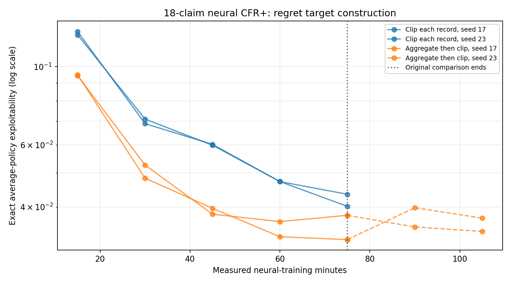
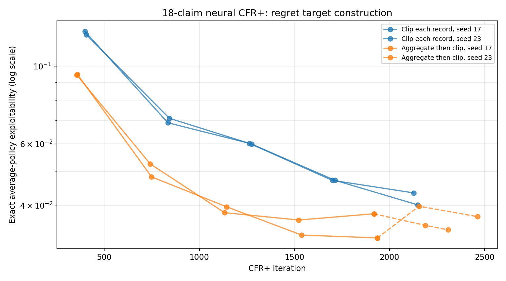

# Does aggregating regret targets help on the 18-claim game?

**Purpose.** The [six-claim neural experiment](2026-09-28_01-04-50_cfr_plus_neural_clip_order_cpu.md) found that averaging sampled regret updates at an information set before clipping improved the learned strategy. Its [800-iteration follow-up](2026-09-28_01-17-33_cfr_plus_neural_clip_order_long_cpu.md) found that the advantage persisted. This run asks whether the result transfers to the 18-claim game under a fixed CPU training budget.

## What different results would mean

| Observation | Interpretation |
| --- | --- |
| Aggregate then clip improves both seeds at equal training time | The target construction affects the production neural loop beyond the six-claim toy, even after accounting for its extra CPU cost. |
| It improves only at equal iteration count | The improved targets cost too much CPU time for this implementation to help under a fixed compute budget. |
| It improves early but loses later | The change accelerates learning without resolving longer-term policy quality. |
| No consistent improvement | The small-game result does not transfer under these network and traversal settings; inspect target error, coverage, and replay at 18 claims. |

## Method

The game has four ranks, four suits, two cards per hand, `RankHigh`, `Pair`, `TwoPair`, and `Trips` claims, and suit symmetry. This is the 18-claim spec used in the earlier exact-evaluation work.

Compare the historical `clip_each_record` target with the experimental `aggregate_then_clip` target. The latter groups visits by encoded information set within one player's update, computes an importance-weighted mean of the raw targets, and clips that mean once. Both arms use full traverser-action expansion; private deals and opponent actions are still sampled. The implementation remains CPU-only and does not maintain an exact regret table across iterations.

Run both modes for seeds 17 and 23. Each arm initially gets **75 measured neural-training minutes**, with 1,024 traversals per player per iteration, `512×512` regret nets, `256×256` average-strategy nets, learning rate `1e-3`, 24 regret steps, six strategy steps, batch size 1,024, positive-regret weight `0.5`, and linear strategy weighting. These networks are smaller than the old GPU reference networks because this machine has a CPU-only PyTorch installation. Save average and current policies plus a rolling checkpoint every 15 training minutes. Evaluate saved **average** policies afterward with the exact dense best responder. Evaluation time is excluded from the training budget.

After the first comparison, resume **only the two aggregate-then-clip arms** from their checkpoints for another 30 measured training minutes, to 105 minutes per arm. The first 15-minute extension of seed 17 ran with two PyTorch threads; after noticing the slowdown, we restored the original eight threads for its remaining 15 minutes and all of seed 23's extension. Background machine load also varied. Thus the continuation gives a useful within-method trajectory, but its time axis is less controlled than the original 75-minute comparison. The saved iteration counts show how much training each arm actually completed.

The [runner](../../../scripts/run_cfr_plus_18_target_order_cpu_overnight.py), [exact evaluator](../../../scripts/evaluate_cfr_plus_18_target_order_cpu.py), and [report plotter](../../../scripts/plot_cfr_plus_18_target_order_cpu_report.py) reproduce the procedure and figures. The full run, including training rows, snapshots, checkpoints, and logs, is under `artifacts/cfr_plus_18_target_order_cpu/20260928-023304/`. The compact [exact-evaluation rows](../../data/neural_18_claim_target_order_105m.jsonl) and figures are copied into `docs` so this record remains readable independently of the larger artifacts. The rows in `docs` also include the iteration and measured training time from each snapshot event; the post-training evaluator's original rows are preserved in the run directory.

## Results

All four initial arms and both aggregate-then-clip continuations completed. The error logs were empty. The exact evaluator completed all 24 saved average-policy snapshots: five per arm in the initial comparison, plus two more for each continued arm. Lower exploitability means a stronger policy.

**How to read the graph.** Blue lines clip each sampled record; orange lines aggregate first. Each line is one seed. The x-axis counts measured CFR+ training minutes, and the y-axis is **exact exploitability on a logarithmic scale**. Equal vertical distances therefore represent equal ratios, not equal absolute differences. The dotted vertical line marks the end of the original matched comparison at 75 minutes; dashed orange segments are the aggregate-only continuation. Each point is a saved policy evaluated after training.

| Training minutes | Clip each record, mean | Aggregate then clip, mean | Relative reduction |
| ---: | ---: | ---: | ---: |
| 15 | 0.1245 | **0.0946** | 24% |
| 30 | 0.0700 | **0.0504** | 28% |
| 45 | 0.0601 | **0.0389** | 35% |
| 60 | 0.0472 | **0.0346** | 27% |
| 75 | 0.0418 | **0.0351** | 16% |

These means cover only two seeds. At 75 minutes, seed 17 finished at `0.04017` versus `0.03232`; seed 23 at `0.04347` versus `0.03789`, respectively. Aggregate then clip was better for both seeds at every snapshot. Its gap narrowed near the end: the aggregate-first mean moved from `0.0346` at 60 minutes to `0.0351` at 75, while clip-each continued from `0.0472` to `0.0418`.

### Aggregate-only continuation: 75 to 105 minutes

| Seed | 75 min (iteration) | 90 min (iteration) | 105 min (iteration) |
| ---: | ---: | ---: | ---: |
| 17 | **0.03232** (1,936) | 0.03982 (2,156) | 0.03718 (2,463) |
| 23 | 0.03789 (1,918) | 0.03510 (2,188) | **0.03409** (2,308) |
| Mean | **0.03510** | 0.03746 | 0.03563 |

Seed 17 deteriorated relative to its 75-minute policy, although it partially recovered after 90 minutes. Seed 23 improved modestly. The two-seed mean at 105 minutes is essentially unchanged from 75 minutes and slightly above the 60-minute mean of `0.03465`. This looks like a plateau over the observed interval, **not a consistent improvement or a demonstrated permanent floor**. We did not continue the clip-each-record arms, so there is no equal-time comparison between target constructions after 75 minutes.

At the original 75-minute endpoint, the aggregate-first arms reached 1,936 and 1,918 iterations. Clip-each reached 2,149 and 2,127 iterations. Thus aggregate-first won **at equal training time despite about 10% fewer iterations**. Grouping records adds CPU work; the result is not explained by more CFR+ iterations.

### Exploitability by iteration

**How to read this graph.** It plots the *same 24 saved policies* against their snapshot iterations rather than training minutes. The y-axis is still logarithmic exact exploitability; dashed orange segments are the continuation. Up to 75 minutes, orange lies below blue across their overlapping iteration range, indicating better policy quality per completed iteration. The continuation extends orange to iteration 2,463 for seed 17 and 2,308 for seed 23, but does not establish continued progress: the two seeds move in different directions. There is no snapshot at identical iterations for the two methods, so comparisons between neighboring points are approximate; no scores were interpolated or evaluated at unsaved iterations.

### Compute cost

The following means describe **only the initial 75-minute matched comparison**, using training rows after each arm's first ten iterations. `Regret fit` includes the target grouping step, because the runner times both inside `_train_regret`. They do not include the variable-thread continuation.

| Target construction | Mean iteration | Traversal | Regret fit, including grouping | Strategy fit | Final iterations at 75 minutes |
| --- | ---: | ---: | ---: | ---: | ---: |
| Clip each record | 2.10 s | 1.08 s | 0.91 s | 0.11 s | 2,138 mean |
| Aggregate then clip | 2.33 s | 1.10 s | 1.12 s | 0.11 s | 1,927 mean |

Aggregate-first was **about 11% slower per iteration** on this CPU. Its regret-fit phase was about 22% slower. We cannot assign that entire difference to the grouping kernel: the policies generated different numbers of regret records (roughly 17.2k versus 16.5k per iteration), and the trajectories diverged. The time plot above is the relevant equal-compute comparison; the iteration plot shows the learning benefit before paying for that extra cost.

### What a GPU implementation would trade

The current experimental implementation is explicitly restricted to CPU. For each player's update it calls `torch.unique(..., dim=0)` on **all retained regret feature rows**, obtains a group index for every record, accumulates weighted targets in `float64`, clips each group's mean, then writes the result back to every retained record. The feature rows are floating-point encodings of a private hand and public claim history. This operation runs after the player's traversal and before regret fitting.

Simply allowing those operations on CUDA would add a full-buffer grouping/sorting pass and substantial temporary allocations to each update. The weighted `float64` target product alone scales with *records × action dimension*, in addition to the feature buffer, group indices, and per-group sums. At 16 million retained records and 70 action columns, just one such `float64` array would occupy about **8.3 GiB**; the current expression can create more than one temporary. It could consume considerable VRAM and GPU time on the 69-claim game even if traversal itself remains streamed. A higher traversal count or a larger action cap can increase the number of generated records, making this cost worse up to the regret-buffer cap; the target width is fixed by the game spec. This is why the CPU slowdown cannot be assumed to carry over unchanged to an A100.

A GPU design should group by a compact, exact information-set key, accumulate weighted raw target sums and weight totals in bounded chunks, then make clipped group targets available to the fitting sampler. Preserving the current experiment's objective also requires preserving each retained visit's sampling frequency and importance weight; replacing many visit rows with one group row would change replay and loss weighting unless sampling is adjusted. For the 69-claim game, public history needs more than one 64-bit word if represented as a claim bitset. The number of *distinct* information sets and the distribution of visits per group will determine whether aggregation is cheap enough. Profile these counts, temporary peak memory, and grouping time before a large run; retain `clip_each_record` as the reference path.

## Takeaways and limits

The small-game target-order result **does transfer** to this 18-claim setting. This is stronger evidence that per-record clipping of noisy sampled updates is a real source of policy error in neural CFR+, rather than an artifact of the six-claim diagnostic. The improvement appears in the learned average policy under an exact best-response evaluation.

The continuation does **not** establish that aggregate-first prevents late deterioration. It reaches 105 minutes, but one seed worsened and the other improved; only aggregate-first was extended, and the extension's CPU conditions changed. The CPU-sized networks and two seeds also limit direct comparison with the old 18-claim GPU reference or the 69-claim run. The experiment did not measure current-policy exploitability or an exact average of played policies, so it does not isolate the average-network contribution at 18 claims. Snapshot creation uses the trainer's ordinary policy construction and may advance the Torch random stream; both modes use the same initial snapshot schedule, but this is not a paired identical-sample experiment.

The next decisive test is to continue **both modes** beyond the historical turning point under stable CPU conditions, with exact evaluation at matched times and iterations and an observer that preserves training RNG. A separate implementation question remains before testing 69 claims: the experimental target grouping scans the retained CPU regret buffer and is not yet a bounded GPU aggregation path.
