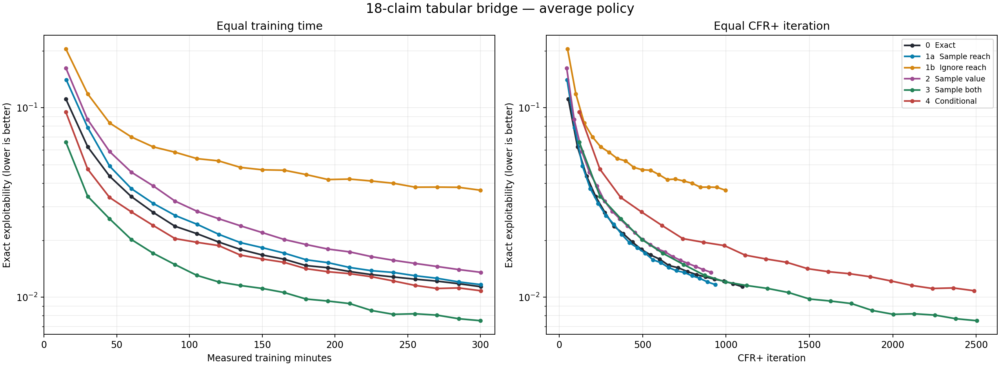
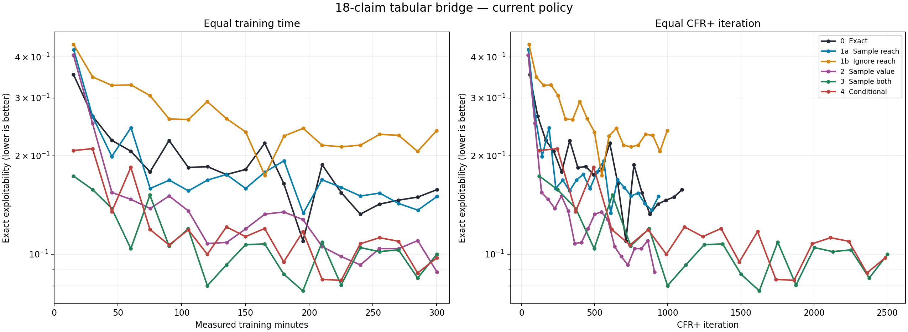

# 18-claim tabular CFR+: reach and sampled values

## Question

Neural CFR+ on the 18-claim game had stopped improving reliably near exact
exploitability 0.02–0.03, even though exact tabular CFR+ could do much better.
Before changing the networks, we wanted to know how much of that gap could
arise from **estimating counterfactual regret**: sampling reach, sampling
action values, or omitting reach from the regret increment.

The outcome here is exact best-response exploitability. Lower is better. The
[bridge explanation](../../explainers/neural_cfr_plus_regret_units_and_bridge.md)
derives the six updates; this report focuses on the measured policies.

## Experiment

All six arms use the same 18-claim game (`r4_s4_h2_hp2pt_ss`), alternating
player updates, nonnegative clipped cumulative regrets, and exact tabular
linear averaging. **There are no neural networks.** Arms 1a, 2, 3, and 4
sample 1,024 root deals per player update, expand every action of the updating
player, and start with seed 17. Each arm receives 300 *measured training
minutes*; exact evaluation and checkpoint time are excluded. Exact best
responses evaluate both the average and current policies every 15 training
minutes.

At an information set `I`, let `q_t(I)` be its counterfactual reach at
iteration `t` (chance and opponent reach before `I`, excluding the updating
player's earlier action probabilities). Let `g_t(I,a)` be the expected
advantage of action `a` **conditional on reaching `I`**. Exact CFR+ adds
`q_t(I) × g_t(I,a)` to the regret table, then clips the cumulative regret at
zero once that iteration's
increment is complete. Each arm changes which part of that increment is
calculated exactly:

| Arm | Reach used | Action advantage used | If no sampled root visits `I` |
| --- | --- | --- | --- |
| **0. Exact baseline** | Exact `q_t` | Exact `g_t` | No sampling; updates every positive-reach `I` |
| **1a. Sample reach** | Estimate `q_t` by counting visits among 1,024 roots | Exact `g_t` | Zero increment |
| **1b. Ignore reach** | Set reach to 1 wherever exact `q_t > 0` | Exact `g_t` | No sampling; updates every positive-reach `I` |
| **2. Sample value** | Exact `q_t` | Estimate `g_t` from visited roots | Zero increment, despite positive exact reach |
| **3. Sample both** | Visit count / 1,024 | Estimate `g_t` from visited roots | Zero increment |
| **4. Conditional** | Set reach to 1 **only if visited** | Estimate `g_t` from visited roots | Zero increment |

Each of arms 2–4 uses its own 1,024 roots per player update to sample action
advantages. If `N` roots visit `I`, arm 3's increment is `(N/1024) × (mean
advantage among those N visits)`: equivalently, the sum of their advantages divided
by **all 1,024 roots**, including the non-visits as zeros. Arm 4 divides by
`N` instead. The distinction between 1b and 4 is also important: **4 skips
an information set when it has no visit; 1b never does so when exact reach
is positive.** Arm 4 therefore retains some dependence on reach even though
it has no explicit `q_t` factor.

### Units and validation

The dense exact solver counts 91 possible opponent-card combinations for each
fixed own hand. A sampled root also draws the player's own hand. To compare
like units, the runner scales exact increments by that hand's root probability
divided by 91; sampled reach is the number of roots visiting the infoset
divided by 1,024. The exact arm's policy is unchanged by this fixed per-hand
regret scaling. A small-game verifier checked that equivalence, the sampled
root/value units, all six update paths, and checkpoint restoration. A
100,000-deal 18-claim audit found sampled root and shallow opponent reach
consistent with the exact values within sampling error.

Before looking at the results, the useful comparisons were: 0 versus 1a
for reach-sampling error; 0 versus 1b for the effect of missing reach; 1a
versus 3 for sampled action values; and 3 versus 4 for reach weighting when
both use sampled values. Arm 2 has an extra complication: if an infoset is
never visited, it receives no update even though its exact reach can be
positive. Its outcome cannot be attributed to value noise alone.

## Results

**How to read the figure:** each point is a saved exact evaluation; lines
connect those points. The left panel compares equal *training time* and the
right panel equal *CFR+ iteration count*. Both vertical axes are logarithmic.
The fast sampled-only arms reach about 2,500 iterations; the arms that compute
exact action values or reach end near 900–1,100. The right-hand lines should
only be compared where their iteration ranges overlap.

| Arm | Average at 60m | Average at 150m | Average at 300m | Iterations at 300m | Current at 300m |
| --- | ---: | ---: | ---: | ---: | ---: |
| 0 Exact | 0.03401 | 0.01672 | 0.01137 | 1,097 | 0.15735 |
| 1a Sample reach | 0.03738 | 0.01826 | 0.01166 | 936 | 0.15006 |
| 1b Ignore reach | 0.07008 | 0.04707 | 0.03673 | 996 | 0.23850 |
| 2 Sample value | 0.04574 | 0.02193 | 0.01354 | 909 | 0.08824 |
| 3 Sample both | **0.02017** | **0.01113** | **0.00752** | 2,503 | 0.09990 |
| 4 Conditional | 0.02822 | 0.01593 | 0.01083 | 2,487 | 0.09748 |

The final average-policy value is also the best saved average-policy value
for every arm. There is no sustained late worsening over these 300 minutes.
The sampled-only arms have small individual upticks, but both continue to
improve overall through the last hour.

### Reach matters, even with a perfect conditional value

Sample reach closely follows exact CFR+ despite estimating reach from 1,024
roots. At 300 minutes it is 0.01166 versus 0.01137. At roughly 900 iterations,
linear interpolation between saved evaluations gives about 0.01196 for sample
reach and 0.01265 for exact. The sampled arm being slightly better at this one
point is not evidence that noise helps: CFR+ does not guarantee that the exact
policy is best at every finite iteration, and there is only one sampled seed.

In contrast, **ignoring reach** ends at 0.03673—about 3.2 times the exact
arm's 300-minute exploitability. At roughly 900 iterations it is about
0.03814 versus 0.01265. This is a deterministic comparison, so sampling
variance cannot explain the gap. If an infoset's reach were a fixed positive
factor throughout training, multiplying all its regrets by that factor would
leave regret matching unchanged. In this game the reach changes with the
policies, and discarding its time-varying weight substantially changes the
learned average.

### Sampling both quantities is competitive per iteration and fastest per time

Arm 3 ends at **0.00752**, the lowest exploitability after equal training
time. It completes 2,503 iterations while exact completes 1,097. Mean
iteration times from the training logs are about 7.2 seconds and 16.4
seconds, respectively: arm 3 skips the expensive full exact-value backup.

At equal iteration count, arm 3 has no clear advantage over exact. Around
300, 600, and 900 iterations its interpolated exploitabilities are 0.03053,
0.01760, and 0.01283, compared with exact's 0.02599, 0.01592, and 0.01265.
Thus its equal-time win comes primarily from completing more updates. The
result shows that full traverser-action expansion with 1,024 sampled roots
can continue to learn a good *tabular average* on this game; it does not show
that the sampled increment is more accurate than the exact one.

Arms 3 and 4 use the same sampled action-value construction and finish almost
the same number of iterations (2,503 versus 2,487). Yet arm 4, which averages
over visits without the visit-frequency factor, ends at 0.01083. It is about
44% more exploitable than arm 3 at equal time. At roughly 900 iterations the
gap is also visible: 0.01929 versus 0.01283. This reinforces the importance
of preserving counterfactual reach when using sampled values.

Arm 4 still does better than 1b, even at matched iterations: about 0.01929
versus 0.03814 at iteration 900. This does **not** imply that a noisy
advantage is inherently better than an exact one. For a frozen policy with
per-root visit probability `q`, arm 4 makes any update with probability
`1 - (1 - q)^1024`; its expected *pre-clip* increment is approximately that
probability times `g_t`. For rare information sets this attenuates the
increment, whereas 1b always adds the full `g_t`. The probability changes
as the policy changes, so arm 4 retains a crude, time-varying reach weight.
Sampling noise, clipping, and diverging policy trajectories also differ;
these runs do not isolate which of those effects explains arm 4's advantage
over 1b.

### The exact-reach, sampled-value arm also misses rare infosets

Arm 2 finishes at 0.01354, close to but above exact's 0.01137. It computes
exact reach and an exact value backup, then substitutes a sampled conditional
value. It is **not** a clean value-noise ablation because it gives zero to
unvisited infosets. At its final iteration, the no-visit diagnostics were:

| Expected visits per iteration, `1024 × q` | Infosets with positive exact reach | No sampled visits |
| --- | ---: | ---: |
| Below 0.1 | 833,735 | 99.8% |
| 0.1 to below 1 | 12,147 | 77.0% |
| 1 to below 10 | 2,093 | 14.9% |
| At least 10 | 365 | 0% |

Most positive-reach infosets are very rare under that policy. Their skipped
updates and noise in the visited values are both plausible contributors to
arm 2's gap. The table does not tell us their strategic importance.

### Current-policy exploitability is much noisier

The current strategies oscillate and are far more exploitable than their
averages. At 300 minutes, sample value has the lowest *current* value
(0.08824), but its *average* (0.01354) is worse than arm 3's (0.00752).
Exact has current exploitability 0.15735 despite an average of 0.01137.
The smoother, improving average curves are the relevant outcome here; current
exploitability is not a reliable ranking of final average policies.

## Takeaways and limits

1. **Missing reach is a real error in this tabular bridge.** It damages the
   policy even when every conditional action advantage is exact. Restoring
   visit-frequency weighting also improves the fully sampled comparison.
2. **Reach sampling itself is tolerable here.** With full traverser action
   expansion, 1,024 sampled roots, and a tabular regret table, sampled reach
   tracks exact CFR+ closely at matched iteration count.
3. **Sampled action values do not create a 0.02–0.03 floor in this tabular
   setup.** Arm 3 reaches 0.00752 by 300 minutes and is still improving.
   The [previous neural experiment](2026-09-28_13-29-00_18_claim_target_sampling_factorial.md)
   had a 1,024-root aggregate-first, seed-17 average of 0.02769 at 300
   minutes. That is useful context, **not a controlled ablation**: network
   fitting, inherited regret predictions, target construction, and runtime
   differ as well as the regret representation.

Arm 4 shows what happens when a *tabular* regret update discards visit
frequency. It is not a literal replay of the neural trainer: neural fitting
can encounter the same visited information set repeatedly and thereby weight
it implicitly in the loss. That weighting need not reproduce a counterfactual
`q_t` multiplier in the **cumulative regret update**, especially when the
target includes yesterday's network prediction. The next bridge should test
those two effects separately rather than treating arm 4 as a neural result.

This is one sampled seed. It does not measure seed variability or prove that
the same relationships hold on larger games. No arm here uses a neural regret
network, a learned average network, or traverser-action subsampling. The next
diagnostic should introduce those components one at a time while retaining
the same reach units and exact average-policy evaluation.

## Data and reproducibility

The [240 exact evaluation rows](../../data/tabular_18_claim_bridge_20260929.jsonl)
and [plot script](../../../scripts/plot_cfr_plus_18_tabular_bridge.py) reproduce
the figures with
`python scripts/plot_cfr_plus_18_tabular_bridge.py --data-file docs/data/tabular_18_claim_bridge_20260929.jsonl`.
The [runner](../../../scripts/run_cfr_plus_18_tabular_bridge.py)
stored full training JSONL, the final rolling checkpoint for each arm, and
source hashes on the VM under
`/root/liars_poker/artifacts/cfr_plus_18_tabular_bridge/main_20260929`.
A compact copy of all numeric logs is local under
`artifacts/cfr_plus_18_tabular_bridge_numeric/main_20260929`; the large
checkpoints remain on the VM. All six arms completed normally. The run began
on 2026-09-29; an early diagnostic-speed fix caused
a restart from the initial checkpoints at 01:49:45 UTC. Pre-restart training
rows are preserved separately as `*.jsonl.superseded` and are not in these
curves. Periodic dense policies were intentionally not saved, so the numeric
history is available but only the final state is directly resumable.
