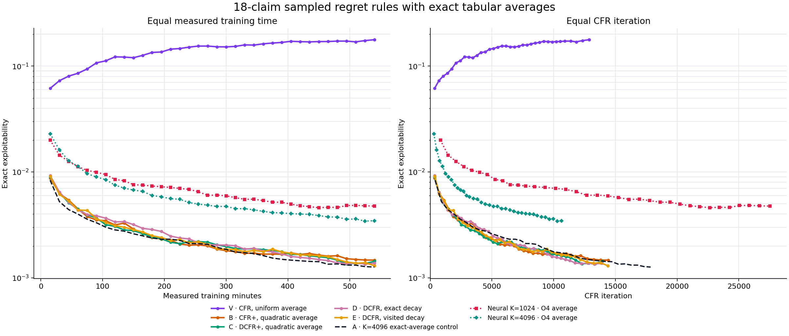

# 18-claim sampled tabular regret: clipping and discounting

> **Status (2 October): exact-average rerun complete.** All five new arms reached 540 measured training minutes, with exact evaluations at 15-minute intervals. The earlier neural-average run remains for historical context, but its close rankings were not reliable.

## Question

The neural CFR+ runs often improve quickly and then flatten. Before adding another rule to a neural network, we want to know whether a different **regret update** or **average-policy weighting** helps when the regrets themselves are stored exactly in a table. This removes regret-network fitting from the comparison while keeping the same noisy traversal signal.

The outcome is **exact exploitability of the learned average policy** at matched CFR iterations and measured training minutes. Lower is better. We will use one seed (17) for each arm. A small difference is a lead for another experiment, not a reliable ranking across random seeds.

## What is sampled

This uses the 18-claim game: `ranks=4, suits=4, hand_size=2`, with `RankHigh`, `Pair`, `TwoPair`, and `Trips`, and suit symmetry. Each iteration samples 4,096 root deals for each traverser, samples opponent actions, and fully expands the traverser's actions. At a visited information set, the update is the mean sampled **conditional advantage** over that iteration's visits. At an unvisited information set, the sampled increment is zero.

This is the regret update of **arm 4 (`conditional`)** in the [tabular bridge experiment](2026-09-29_01-42-50_18_claim_tabular_bridge.md): reach is used only as a visited/not-visited gate, with no estimated reach multiplier. The regret table starts at zero. All arms store **cumulative regret**: there is no division by iteration `t`, and no `N/K` multiplier. Regret matching reads the positive part of the stored row, including for rules that retain negative entries.

One important difference from the bridge remains: this faster runner fits a **neural average-policy network** from strategy records. The bridge computed the average exactly. A gap between this experiment and bridge arm 4 could therefore come from average-policy fitting, the different number of roots, or other implementation details. The experiment does not isolate the averaging step.

## Six arms

Write `g_hat` for the mean conditional advantage at a visited information set. The following rule applies once per iteration to a visited row. `t` is the CFR iteration number. The table stores regrets exactly as updated, but `g_hat` is still a noisy estimate; these are not exact CFR updates.

| Arm | Regret rule | Weight of iteration `t` in the average |
| --- | --- | --- |
| V: vanilla CFR | `R <- R + g_hat`; keep negative entries | `1` |
| A: CFR+ | `R <- max(0, R + g_hat)` | `t` |
| B: CFR+, quadratic average | Same regret rule as A | `t^2` |
| C: DCFR+ | `R <- max(0, d_t R + g_hat)`, where `d_t = (t-1)^2 / ((t-1)^2 + 1)` | `t^2` |
| D: DCFR, exact decay | Multiply **old** positive entries by `(t-1)^1.5/((t-1)^1.5+1)` and old negative entries by `1/2`, then add `g_hat` | `t^2` |
| E: DCFR, visited-only decay | Same update as D on visited rows | `t^2` |

For C and D, **discounting still occurs on iterations with no visit**. We calculate it lazily when a row is next read or updated; this should equal eager discounting of every row each iteration. For E, both the increment and the discount happen only on a visit. This tests whether the sparse-update shortcut changes the result. V, A and B leave unvisited rows unchanged.

The [DCFR paper](https://arxiv.org/abs/1809.04040) motivates separate positive and negative discounts and quadratic averaging. The [VR-DeepDCFR+ paper](https://arxiv.org/abs/2511.08174) motivates the positive-only discount in C. Their published results do not predict the outcome here: our sampled conditional increments omit the counterfactual reach magnitude.

## How to interpret the comparisons

| Compare | Main difference | What an improvement would suggest |
| --- | --- | --- |
| V vs A | Clipping and average weighting both change | The CFR+ package helps under this sampling scheme; the comparison alone cannot identify which part. |
| A vs B | Average weights only | Give later strategy records more weight in a neural follow-up. |
| B vs C | Discount old positive regret | Old sampled regret is worth forgetting faster. |
| B vs D | Signed regret plus different positive and negative discounts | A gain motivates separating negative-regret handling from discount strength in a follow-up; this comparison alone does not isolate either. |
| D vs E | Discount all rows versus visited rows | If D wins, a neural implementation needs a way to decay predictions at unvisited states. |

The average is itself fitted from a 2,000,000-record strategy replay buffer, so single snapshot differences may reflect average-network noise. Compare trajectories and windowed values, and use a second seed or an exact-average confirmation if two arms are close. A tabular win is not yet a neural win: a network must also fit the chosen state over many iterations.

## Run design (first run)

- **Seed:** 17 for every arm, with the same initial network and traversal RNG seed.
- **Regret table:** zero at the start of each arm; one row per 18-claim information set. The regret networks are instantiated by the existing trainer but are not fitted or used for regret prediction.
- **Strategy fit:** 256 by 256 MLP, six steps per iteration, batch 1,024, learning rate `1e-3`, two-million-record replay buffer.
- **Budget:** 180 measured training minutes per arm. The six arms run concurrently with eight PyTorch threads each. Exact evaluation and checkpoint time are outside this budget. Wall time and iteration counts depend on VM load and the rule.
- **Monitoring:** exact exploitability of the saved average policy every 15 measured minutes; a rolling resumable checkpoint at the same interval; training and evaluation JSONL logs; comparison graph with logarithmic exploitability on the vertical axis.
- **Pause/resume:** the runner checks a `PAUSE` file between iterations and saves a checkpoint before exiting. Starting it again in the same output directory resumes incomplete arms.

The implementation is in [the tabular discount trainer](../../../liars_poker/algo/cfr_discount_tabular.py) and [the runner](../../../scripts/run_cfr_plus_18_tabular_discount.py). The runner selects one arm; [the launcher](../../../scripts/launch_cfr_plus_18_tabular_discount.sh) starts all six in separate CPU processes. The VM run is under `artifacts/cfr_plus_18_tabular_discount/main_20260930`, with a rolling checkpoint and JSONL evaluations in each arm directory. The [dashboard](../../../scripts/monitor_cfr_plus_18_tabular_discount.py) is on port 8768. It plots bridge arm 4 as a dashed reference, labelled with its different root count and exact average.

The neural CFR+ cleanup now builds neural targets in [one shared function](../../../liars_poker/algo/cfr_plus_targets.py) for all three traversal paths. The tabular discount trainer uses the same regret-record hook but stores conditional advantages directly. This avoids recovering `g_hat` by subtracting old regrets, with no extra buffer column or checkpoint migration. The runner's outputs and table update rules are unchanged. Before using the results to choose a neural discount rule, confirm that the tabular curves remain sensible and remember that the average policy here is learned, not exact.

## First run results (superseded)

The six arms ran from scratch on 30 September and 1 October for 540 measured minutes each, reaching 36,000–50,000 iterations. Every value was averaged with the online neural average network.

| Arm | Iteration at 540 min | Online-average exploitability |
| --- | ---: | ---: |
| V: vanilla CFR, uniform average | 36,364 | 0.216 |
| A: CFR+, linear | 49,472 | 0.0043 |
| B: CFR+, quadratic | 50,010 | 0.0050 |
| C: DCFR+, quadratic | 45,887 | 0.0051 |
| D: DCFR exact decay, quadratic | 44,766 | 0.0056 |
| E: DCFR visited-only decay, quadratic | 49,442 | 0.0039 |

The ranking of A–E changed between 180 minutes (D best) and 540 minutes (E best), and their spread is smaller than the online average's noise. The screen therefore does not rank the rules; only V's failure is clear-cut. The comparison figure has been dropped. The evaluation rows remain in each arm's `evaluations.jsonl` under `artifacts/cfr_plus_18_tabular_discount/main_20260930/` on the VM.

Two observations from this run still stand, because they do not depend on the averaging:

- **V's signed regrets grow very negative.** At the 180-minute checkpoint, 47.9% of V's legal regret entries were negative, with mean −306.6 and minimum −25,651; arm A has none, because it clips after each update. Such large negative values can keep an action out of the strategy long after later samples favour it. The share of visited rows with no positive legal action was similar in V and A (46.1% against 44.5%), so uniform-fallback rows alone do not explain V's gap, and V also differs in its average weighting.
- **Root count changes the conditional update's effective reach weighting.** A visited-conditional update applies the full mean advantage whenever an information set is visited at least once, which happens with probability `1-(1-q)^K` for per-root visit probability `q`. At `q = 0.0001`, that rises from about 0.097 at `K = 1,024` to 0.336 at `K = 4,096`. More roots therefore change *which* information sets receive full-strength updates, not just how noisy the updates are.

### Batched bridge controls

These two from-scratch seed-17 controls were added during the first run. `exact4096` is **arm A of the rerun** below.

| Control | Roots per player | Regret update | Average policy | Traversal |
| --- | ---: | --- | --- | --- |
| `exact4096` | 4,096 | Arm A: clip cumulative visited-conditional mean after each update | Exact, own-reach-weighted linear average | Batched CPU |
| `neural1024` | 1,024 | Same | 256 by 256 neural network, six fit steps per iteration | Batched CPU |

Both save a rolling resumable checkpoint and a policy every 15 measured training minutes. Two separate evaluator processes compute exact exploitability from completed snapshots; training does not wait for evaluation. Their files are under `artifacts/cfr_plus_18_batched_bridge_controls/main_20260930/{exact4096,neural1024}`. Each targets 540 measured training minutes. The exact-average observer adds CPU work inside each training iteration, so compare its **iteration-axis** trajectory with arm A as well as its time-axis trajectory.

Arm A versus `exact4096` holds root count, batched traversal, regret rule, and initial seed fixed. It tests the evaluated average-policy construction, though the exact observer also changes iteration cost. The historical bridge arm 4 versus `neural1024` holds root count and intended regret rule fixed, but changes traversal implementation and average construction. The two new controls differ in *both* root count and averaging, so their direct gap cannot be attributed to either factor alone.

The exact observer converts tabular regrets to a dense current policy and accumulates each iteration with exact own-reach and linear iteration weights. Its conversion matched the existing dense compiler within `1.79e-7` on populated rows. A steady-state exact-average iteration took about 1.8 seconds (roughly 1.05 seconds for averaging and 0.65 for traversal); the neural-average control took about 0.2 seconds. Exact averaging improved the final policy here, at a substantial throughput cost.

Both controls completed 540 minutes and their final snapshots were evaluated:

| Control | Roots | Iteration | Final exact average exploitability |
| --- | ---: | ---: | ---: |
| `exact4096` | 4,096 | 17,855 | **0.00126** |
| `neural1024` | 1,024 | 162,736 | 0.00470 |

This is not a pure averaging comparison: root count and throughput differ, and the exact observer makes each iteration slower. The exact-average result is stronger at equal training time, while the neural run completes about nine times as many iterations. The [8768 dashboard](../../../scripts/monitor_cfr_plus_18_tabular_discount.py) retains the full curves and bridge reference.

The [fixed-deal traversal audit](../../../scripts/audit_cfr_plus_18_traversal_parity.py) compared the recursive bridge and batched CPU paths under the same deterministic policy and dealt hands. Across both players and two deals, **13,530 regret records matched exactly**: maximum root-value and action-advantage error were both zero. Code review also shows both paths deal without replacement, sample opponent actions from the current policy, and fully expand traverser actions in these configurations. This checks the traversal estimator and payoff indexing under the audited policy; independent random streams mean it is not a bit-for-bit comparison of stochastic training trajectories.

In a separate one-shot CPU traversal timing with 1,024 roots per player and a uniform policy, recursive versus batched times were **2.034 versus 0.243 seconds for player 1** and **0.535 versus 0.071 seconds for player 2**. The batched path was therefore about **8.4× and 7.5× faster**, respectively, for traversal alone on the loaded VM. The bridge also spends time refreshing dense strategies, recomputing own reach, and accumulating its exact average; these figures do not predict the full-run speed ratio.
## Exact-average rerun

### Design

The first six-arm run evaluated a neural average-policy network. Its results could not distinguish regret-rule quality from errors in that network's average. This rerun removes both neural networks and computes the tabular average exactly after every iteration. It keeps the same 18-claim game, seed 17, 4,096 sampled roots per player, sampled opponent actions, full traverser-action expansion, and conditional-mean regret increments. There is no `N/K` multiplier and no division by iteration `t`.

Each visited information set receives its iteration's mean conditional advantage; unvisited sets receive no increment. The exact average uses own reach and each arm's specified iteration weight. The experiment therefore compares regret update rules and averaging weights without neural fitting error. Arm A is the existing K=4,096 CFR+ linear-average run; V and B-E were trained in the new rerun.

| Arm | Regret update | Exact-average weight |
| --- | --- | --- |
| V | Vanilla CFR: add conditional mean, retain negative regret | `1` |
| A | CFR+: clip cumulative regret at zero | `t` |
| B | Same CFR+ update | `t^2` |
| C | CFR+ with positive-regret discount `((t-1)^2 / ((t-1)^2+1))` before the increment | `t^2` |
| D | DCFR: discount old positive and negative regret separately before adding the increment | `t^2` |
| E | Same signed DCFR update as D, but discount a row only when visited | `t^2` |

C and D apply the discount lazily, when a row is next read or updated; this is equivalent to eagerly discounting every row each iteration. E intentionally differs by leaving unvisited rows undiscounted. Arm A is a reference, not a sixth new run.

All five new arms target 540 measured training minutes. Exact exploitability is evaluated every 15 measured minutes in separate evaluator processes. Evaluation time is excluded from the training budget. The runner saves resumable checkpoints and policy snapshots at the same cadence. The run directory is `/root/liars_poker/artifacts/cfr_plus_18_tabular_discount_exact_average/main_20261002`; the 8769 dashboard overlays these arms with A and the K=1,024/4,096 neural O4 averages.

### Results

The left panel compares equal measured training time; the right panel compares equal CFR iteration count. Each point is an exact exploitability evaluation, and both vertical axes are logarithmic. Lower is better. The solid colored lines are the five new exact-average runs. The dashed dark line is A, the prior exact-average K=4,096 CFR+ control. The dotted lines are O4-fitted neural averages shown only as context; those runs also use neural regret networks, so they are not controlled comparisons.

All five new arms completed their 540-minute budgets. The runner wrote the final snapshots and exact evaluations; the sessions exited with `target_reached`.

| Arm | Iterations at 540 min | Final exact-average exploitability | Best observed |
| --- | ---: | ---: | ---: |
| V | 12,865 | 0.17750 | 0.06157 at 15 min |
| B | 14,410 | 0.001471 | 0.001471 at 540 min |
| C | 13,939 | 0.001433 | 0.001357 at 495 min |
| D | 13,879 | 0.001374 | 0.001348 at 525 min |
| E | 14,387 | **0.001303** | **0.001303 at 540 min** |

At 540 minutes, the comparison control A had reached 17,855 iterations and 0.001264 exploitability. It is therefore best at equal time. At each new arm's final iteration, linear interpolation on A's measured curve gives about 0.00143-0.00148. B is slightly worse at the matched iteration; C is about tied; D and E are modestly better. The largest of those differences is about 9%, and all comparisons use one seed.

### Interpretation

- **Exact averaging gives much lower values than the earlier online neural average.** At 540 minutes, B-E range from 0.00130 to 0.00147, while the first run's online-average values were roughly 0.004-0.006. This is not a paired test: the runs were separate trajectories, so do not attribute the whole gap to the average estimator alone.
- **Vanilla CFR fails badly under this sampled conditional update.** Its average exploitability rises from 0.0616 at 15 minutes to 0.1775 at 540 minutes. The evidence strongly favors clipping or discounting over retaining signed cumulative regrets here.
- **Quadratic-average CFR+ keeps improving.** B falls from 0.00874 at 15 minutes to 0.00147 at 540 minutes; it does not show the worsening seen in V.
- **Discounting gives a small late-stage advantage in this seed.** C, D and E finish at 0.00143, 0.00137 and 0.00130. D briefly reaches 0.00135 at 525 minutes, then ends slightly higher; E reaches its best value at the final point. These are meaningful leads for follow-up, not a reliable ranking from one seed.
- **Visited-only decay does not look harmful in this run.** E is the best new arm at the end despite skipping discount operations on unvisited rows. Its difference from D is small and needs replication.
- **A remains the time-efficiency reference.** A is lower at equal time (0.001264 vs E's 0.001303) and completes about 24% more iterations than E. At equal iteration, D/E are modestly better than A's interpolated curve. The five new runs competed with other CPU jobs, so these throughput differences do not cleanly measure per-arm compute cost.
- **Neural O4 references remain materially more exploitable in this window.** That is consistent with the tabular-regret advantage, but it does not isolate whether the gap comes from neural regret approximation, traversal details, or their different training setup.

The central result is that all clipped or discounted arms keep improving through nine hours when evaluated with exact averages, while vanilla CFR degrades. Discounting and quadratic averaging change the result by at most about 9% at matched iterations, which is within what one seed can resolve. **Decision: keep CFR+ with linear averaging.** No further discounting runs are planned.

**Why vanilla CFR fails here.** The table increment is the conditional mean advantage at visited information sets. That is the counterfactual regret divided by that iteration's reach, applied only when the set is visited. Its per-iteration scale therefore changes with reach. Regret matching is scale-invariant only for a fixed scale. Without the floor, the signed sum does not bound true regret, and the average drifts away. CFR+'s floor and DCFR's negative-regret discount both keep the effect bounded in practice.

This matters for any neural method that avoids bootstrapping, for example by fitting a regret network to a replay of past increments. Such a method cannot use plain CFR on these units. It needs reach-weighted increments, or a rule like D or E, which worked here.

### Files and reproducibility

The exact-average trainer is [`cfr_discount_exact_average.py`](../../../liars_poker/algo/cfr_discount_exact_average.py), the runner is [`run_cfr_plus_18_tabular_discount_exact_average.py`](../../../scripts/run_cfr_plus_18_tabular_discount_exact_average.py), and the launcher is [`launch_cfr_plus_18_tabular_discount_exact_average.sh`](../../../scripts/launch_cfr_plus_18_tabular_discount_exact_average.sh). The plotting script is [`plot_cfr_plus_18_tabular_discount_exact_average.py`](../../../scripts/plot_cfr_plus_18_tabular_discount_exact_average.py). Metrics captured from the VM are stored under [`cfr_plus_18_tabular_discount_exact_average_20261002`](../../data/cfr_plus_18_tabular_discount_exact_average_20261002); the five resumable checkpoints and policy snapshots remain on the VM.
