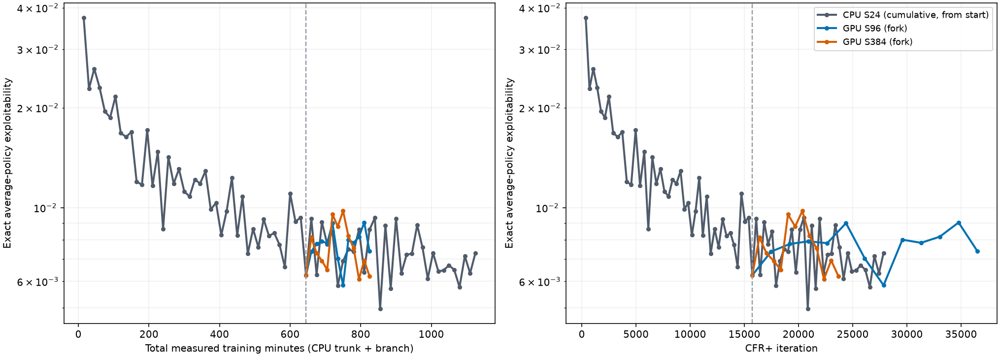
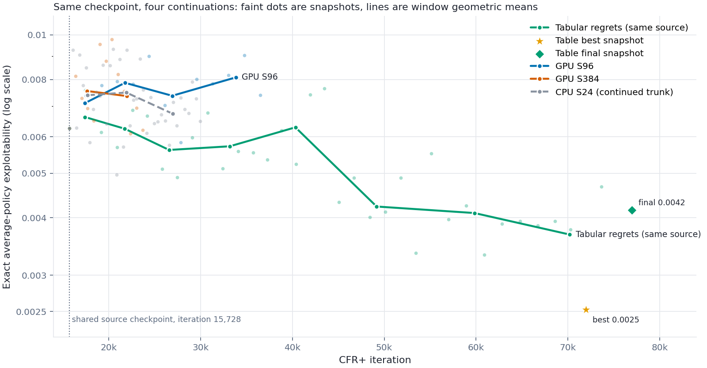

# 18-claim neural CFR+: how much regret fitting per iteration?

## Question

Our neural CFR+ runs fit each regret network with **24 Adam steps of 1,024 rows** per player update. That is about 25,000 sampled rows, less than one pass over the roughly 50,000 Player 1 and 11,000 Player 2 records generated by 4,096 roots. VR-DeepDCFR+ ([paper](https://arxiv.org/abs/2511.08174), [code](https://github.com/rpSebastian/DeepPDCFR)) instead takes **750 steps of 2,048 rows** per update. It runs only about 500 iterations and uses much smaller 3×64 networks. It spends about 60 times as many fit samples per update and 25 times fewer updates than our long runs.

The tabular regret fork gives a reason to take this seriously. On the plateaued normalized seed-31 run, it replaced the regret network with a table: an exact fit at every visited information set, with no generalisation. The average-policy exploitability then fell from 0.0222 to 0.0071 in 90 fork minutes, while the neural continuation of the same run stayed near 0.022. The fork ran on the VM under `artifacts/cfr_plus_18_tabular_regret_forks/oens_0300m`. Under-fitting at visited information sets is therefore a live suspect.

This experiment asks whether more regret fitting per iteration improves the **cumulative conditional** neural trainer. That trainer is our best neural configuration and has been improving steadily as roughly `iteration^−0.5`. The question is asked both per iteration and per unit of compute. Exact average-policy exploitability is the outcome; lower is better.

## Overnight design

The source is a frozen copy of the CPU `conditional4096` checkpoint at **645 measured training minutes, iteration 15,728**, SHA-256 `81e519f7aebfcc3790e7fd858526119d45b0d4a4059f20582e050766e0adf9ca`. It is under `artifacts/cfr_plus_18_gpu_fit_forks/source/` on the VM. This is seed 17, cumulative units, `aggregate_then_clip`, 4,096 roots, 512×512 regret networks and 256×256 strategy networks. The CPU S24 run keeps training from this same state.

| Arm | Regret fit per player update | Notes |
| --- | --- | --- |
| **S24** | 24 steps × 1,024 | CPU continuation from the source; contextual control |
| **S96** | 96 steps × 1,024 | First GPU fork, three measured training hours |
| **S384** | 384 steps × 1,024 | Second GPU fork, three measured training hours |

S768 was not part of this sweep. A tabular-regret continuation from the same cumulative source was started after the GPU runs finished; its setup and progress are recorded below.

Everything else stays as in the source run: the traversal, target mode, learning rate `1e-3`, restored Adam state, strategy fitting and replay. Only the regret fit steps change. Batch size stays at 1,024 so that one variable moves; on a GPU a larger batch costs little, and batch size can be a second sweep. Both GPU forks begin from identical network, optimizer, replay and RNG state. The S24 continuation passes through that source checkpoint on CPU. GPU and CPU arithmetic may cause their later trajectories to diverge even with the same initial state.

Forking a late checkpoint is cheaper than training from scratch. It also studies the regime we care about: signal accumulated over thousands of iterations, with slow late progress. If a clear winner emerges, a from-scratch run should confirm that the benefit is not specific to this starting point.

## Measurements

- **Exact average- and current-policy exploitability** from saved snapshots every 15 GPU training minutes, evaluated by separate CPU processes. The CPU S24 curve is shown from its beginning. Plot against total measured training minutes **and** CFR+ iteration. Total minutes for each GPU fork add its GPU continuation to the CPU trunk, so equal minute values do not represent equal hardware or iteration counts. Snapshots scatter around the trend; compare several points, not just one.
- **Training loss and timing** for every iteration: traversal, regret fitting including grouping, strategy fitting, record counts, iteration rate, and GPU allocated/reserved memory. The dashboard also records GPU utilization and device memory use.

## What different results would mean

| Observation | Interpretation |
| --- | --- |
| Per-iteration progress improves monotonically with steps and approaches the table arm | Under-fitting at visited information sets limits the neural run. Choose the step count by wall time on the GPU. |
| More steps win per iteration but lose per GPU training minute | Fitting helps each update but slows down the number of updates enough to lose under a time budget. |
| Training loss falls with more steps but exploitability does not improve | Fitting the sampled targets more closely is insufficient. Possible limits include generalisation to unvisited information sets, target quality or the average network. |
| Large step counts get worse | The network over-fits one iteration's noisy targets. 768 steps draw about 786,000 rows from roughly 50,000, about 16 passes. More roots per update or regularisation would be needed. |
| S96 improves but S384 does not | A moderate fit increase may be useful, while 384 steps may overfit or spend too much time fitting. |

## Compute: CPU projection and GPU smoke measurement

On the CPU VM, the cumulative conditional run's latest 200 iterations took a median **2.68 seconds**. This was with eight PyTorch threads and a heavily loaded host, load average about 29 on 128 logical CPUs. Traversal took 2.07 seconds, regret fitting for both players including target grouping 0.56 seconds, and strategy fitting 0.05 seconds. That is about **12 ms per regret fit step**. A separate micro-benchmark on the same host measured 9.2 ms per step for a 512×512 MLP at batch 1,024. Projected CPU iteration times are therefore:

| Arm | Regret fitting per iteration | Iteration | Iterations in 4 hours |
| --- | ---: | ---: | ---: |
| S24 | about 0.6 s | about 2.7 s | about 5,400 |
| S96 | about 2.2 s | about 4.3 s | about 3,300 |
| S384 | about 9 s | about 11 s | about 1,300 |
| S768 | about 18 s | about 20 s | about 700 |

At 700 iterations, S768 would add only about 5% to the source run's iteration count. Its average policy would hardly move, because linear weighting keeps most of the weight on the inherited history. A CPU-only sweep could therefore report "no improvement" merely because the expensive arms were starved. This projection is **for CPU only**; the GPU measurements below are much faster.

The same instance has an idle **RTX 4060 Ti (16 GB)**. A micro-benchmark on it measured:

| Network | Batch | GPU ms per Adam step | CPU ms per step (8 threads, loaded host) |
| --- | ---: | ---: | ---: |
| 512×512 | 1,024 | 1.17 | 9.2 |
| 512×512 | 2,048 | 1.03 | 20.0 |
| 2048×2048 | 2,048 | 5.23 | 136.7 |

That isolated micro-benchmark did **not** measure a full iteration; in particular its 1.8-second S768 extrapolation omitted overhead and was optimistic. The trainer now allows cumulative `aggregate_then_clip` on CUDA **only for the 18-claim reference spec with `gpu_native` traversal**. Larger specs retain the guard. This reuses the existing device regret buffer and processes the two players sequentially; it does not keep a second regret replay or dense table on the GPU.

The [CUDA smoke script](../../../scripts/smoke_cfr_plus_18_cuda_aggregate.py) was run on the VM's RTX 4060 Ti from the cumulative seed-17 checkpoint at iteration 15,056. It compared CPU and GPU grouping on 60,000 rows of real checkpoint features and masks with randomized raw targets: maximum absolute target difference was **0**. It then loaded the real checkpoint on CUDA and ran full 4,096-root iterations at all four fit-step counts. Losses were finite. A further 100 consecutive S24 iterations completed in **32.0 seconds**, ending at iteration 15,161. The source checkpoint was only read; the smoke saved a disposable checkpoint and restored it successfully. We have **not** done a paired 100-iteration CPU/GPU trajectory or exact-policy comparison, so this establishes target-construction parity and operational viability, not equal learning curves.

After CUDA warmup, full-iteration timings on that card were:

| Arm | Regret fitting per iteration | Full iteration | Estimated iterations in 4 measured training hours |
| --- | ---: | ---: | ---: |
| S24 | 0.09 s | 0.33 s | **about 44,000** |
| S96 | 0.33 s | 0.57 s | **about 25,000** |
| S384 | 1.17–1.30 s | 1.41–1.54 s | **about 9,800** |
| S768 | 2.34–2.59 s | 2.58–2.83 s | **about 5,300** |

These figures come from one or two warmed full iterations per arm, except S24, which also had the 100-iteration soak at 0.32 s/iteration. They are planning estimates, not guaranteed throughput. The smoke saw traversal near 0.22 s per warmed iteration and strategy fitting near 0.02 s. Four hours means **measured trainer time**; checkpointing, exact evaluation, machine contention and longer-term changes in traversal cost add wall time. At the source's roughly 15,000 iterations, even S768's projected 5,300 further iterations is material, but the inherited average still changes more slowly than in S24. The same-step comparison must therefore use both time and iteration axes.

The actual **three-hour** GPU budget projects roughly **19,000 additional iterations for S96** and **7,300 for S384**. The CPU S24 continuation is much slower per iteration, so it may need to keep running after the GPU jobs finish to cover the latter portions of their iteration ranges. The direct GPU-to-GPU comparison is cleanest on the time axis; CPU S24 is most useful at overlapping iteration counts.

With the checkpoint loaded, allocated GPU memory was about **2.14 GiB**. The 100-iteration soak peaked at **2.26 GiB allocated** and **3.59 GiB reserved** on a 16 GiB card. The standalone 60,000-row grouping test reserved about **0.04 GiB**. No extra memory-saving representation is needed for this 18-claim configuration; these measurements do not justify lifting the guard for larger games.

Exact evaluation remains on CPU. Compiling to a dense policy and computing a best response takes roughly 25–55 seconds. A separate evaluator should read saved snapshots, as now, so that evaluation does not steal training time.

## A related design choice, tested separately: clip on read with a plain MSE loss

VR-DeepDCFR+ avoids the grouping step entirely by moving the clip. This sweep deliberately keeps our current target so that fit amount and target form are not confounded. The idea should be tested next, however, and it changes the loss we should use.

**The two target constructions.** For an information set visited `N` times in one iteration, with sampled advantages `G_1 … G_N` and previous prediction `old`:

| | Target stored for each visit | Network trained to | Clip applied |
| --- | --- | --- | --- |
| Ours, `aggregate_then_clip` | `max(0, old + mean_k G_k)`, the same value for all `N` visits | Reproduce the clipped group mean | Before fitting, per group of **identical** feature rows |
| VR-DeepDCFR+, clip on read | `old + G_k`, which may be negative, one per visit | Reproduce the unclipped values | After fitting, whenever the output is used: regret matching and the next iteration's `old` both read `max(0, output)` |

With squared error, a network that can fit each information set separately converges to the mean of its targets. For clip on read that is `old + mean G`, and reading it gives `max(0, old + mean G)`: exactly our target. At information sets visited many times per iteration, the two are therefore the same method in two implementations. Clip on read needs no `torch.unique` pass and no CPU-only guard.

**Where they differ.** Our grouping merges only rows with identical features, within one iteration. For an information set visited once, `aggregate_then_clip` reduces to clipping one noisy sample: the per-record clipping bias the [clip-order experiments](2026-09-28_13-29-00_18_claim_target_sampling_factorial.md) removed elsewhere. Clip on read keeps that sample's negative value in the target. The network can then average it with similar information sets through generalisation *before* anything is clipped. In the [330-minute late audit](2026-09-29_13-47-16_18_claim_late_checkpoint_update_audit.md), about half of the visited information sets had fewer than one expected visit per update even with 4,096 roots. At 69 claims almost every visit is a singleton. So the difference is already measurable here and decisive for scaling.

**Why the loss should become plain MSE.** Our regret loss gives weight `1.5` to target entries above `1e-6` and weight `1` otherwise (`regret_positive_weight=0.5` in [`_train_model`](../../../liars_poker/algo/deep_cfr_plus.py)). With clipped targets that shared one value per information set, this only changes the relative emphasis *between* entries: a positive regret entry counts more than a clipped zero. With unclipped per-visit targets, it weights individual **samples** by their sign. The weighted mean then moves towards the positive samples, reintroducing the clipping bias in a softer form.

For example, suppose one entry receives two targets, `+1` and `−1`, whose true mean is `0`. With the weights applied directly, minimising `1.5(p − 1)² + (p + 1)²` gives `p = 0.2`, not `0`. The code also divides each row's weighted error by that row's total weight, which dilutes the ratio without removing it. If the row has one other legal action whose target is positive, the positive sample's effective weight is `1.5/3 = 0.5` and the negative one's `1/2.5 = 0.4`. Minimising `0.5(p − 1)² + 0.4(p + 1)²` gives `p ≈ 0.11`. Either way the fitted cumulative regret is biased upwards by a noticeable fraction of the noise scale. The same sign-dependent weight already contributes to bias under `clip_each_record`, where zeros produced by clipping receive lower weight than surviving positive samples.

Clip on read should therefore use unweighted squared error over legal entries, which is what VR-DeepDCFR+ does. If we later want extra emphasis on strategically important entries, the weight must not depend on the noisy sample. For instance, it could depend on the previous prediction `old`, which is fixed before sampling.

**A proposed follow-up.** Compare `aggregate_then_clip` with the positive weight against clip on read with plain MSE. Hold the fit amount at the winner of this sweep. Run both at 4,096 roots and at a low root count such as 512, where singletons dominate. Clip on read should gain more at low roots if the argument above is right. At high roots, the two should be similar at repeatedly visited information sets.

## Results

Both GPU forks completed their **180 measured training minutes** without an evaluation error or an out-of-memory failure. They produced 12 policy snapshots each, evaluated exactly for both average and current policy. They branched from the same checkpoint, whose average-policy exploitability was **0.00626**. The CPU S24 run continued from that checkpoint and had reached 1,125 total training minutes when these results were collected. The GPU runs and CPU control used different hardware, so the most direct resource comparison is S96 against S384.

| Arm | Added iterations in 180 min | Median iteration | Median regret fit | Peak GPU reserved | Final average exploitability | Best average snapshot | Geometric mean, final four snapshots |
| --- | ---: | ---: | ---: | ---: | ---: | ---: | ---: |
| GPU S96 | 20,779 | 0.519 s | 0.288 s | 3.55 GiB | 0.00739 | 0.00584 at +105 min | 0.00808 |
| GPU S384 | 7,951 | 1.358 s | 1.128 s | 5.70 GiB | 0.00621 | 0.00610 at +150 min | 0.00667 |

The iteration and fitting medians exclude the first 100 warmup iterations. Traversal and strategy fitting took about 0.214 s and 0.017 s per iteration in either GPU arm. S384 used four times as many fit steps, took about **2.6 times longer per iteration**, and completed **38% as many iterations** in the same training time. Its reserved-memory peak stayed well inside the 16 GiB card, although it was higher than the short smoke test's peak.

Both panels have a **logarithmic exploitability axis**; lower is better. The dashed line marks the shared source checkpoint at 645 CPU training minutes and iteration 15,728. The left panel adds GPU continuation minutes to the CPU trunk, so a horizontal comparison with CPU S24 is **not** an equal-hardware compute comparison. The right panel compares learning at similar iteration counts. Each plotted fork point is one exact evaluation of a saved 15-minute snapshot, not an approximate best response.

The curves fluctuate substantially. S384 ended below S96 and had a better final-four-snapshot geometric mean, but its geometric mean over **all 12 snapshots** was 0.00757 versus 0.00772 for S96: a small difference beside the point-to-point variation. At the four overlapping S96 snapshot iterations, interpolating S384's curve gives virtually the same geometric mean. Compared with the CPU S24 curve at overlapping iteration counts, neither GPU arm shows a consistent improvement. The CPU continuation itself reached **0.00496 at iteration 20,850**, better than either fork's best sampled snapshot, and later rose to **0.00730 at iteration 27,842**. This underlines why the best single point or the final point alone is a poor verdict.

The current-policy evaluations did not reveal a hidden, sustained win for more steps: final current-policy exploitability was **0.0389** for S96 and **0.0292** for S384, with large fluctuations across snapshots. The average policy remains the main outcome. Training loss is recorded, but lower loss on replayed targets would not by itself show that the policy learned better regrets.

### Takeaway

*Revised note (30 September, evening): the same-source tabular fork below shows that even exact regret storage improved only slowly over the iteration range these forks covered, so this sweep was probably too short to detect a table-like gain. Read the takeaway below as "not shown", not "ruled out". The longer continuations at the end of this note test it directly.*

**Increasing regret fitting from 24 to 96 or 384 steps did not produce a clear, sustained improvement in exact average-policy exploitability in this late cumulative-conditional run.** S384 sometimes looked better late in training, but this is one seed and a noisy sequence of 12 snapshots. The experiment weakens the hypothesis that simply taking more Adam steps on each iteration's sampled regret targets explains the plateau. It does **not** prove that the regret network is accurate: noisy or biased targets, generalisation to unseen information sets, forgetting, the fixed learning rate, and the average network remain possible limits. The earlier tabular-regret rescue started from a different, normalized run; its success cannot be attributed solely to replacing 24 neural fit steps with a larger number.

I would not commit to an S768 run on this evidence. A more informative follow-up is to measure held-out target error and action-distribution error at strategically weighted information sets, or compare against a tabular-regret continuation from **this same cumulative checkpoint**. Those would distinguish inadequate fitting from a problem in the targets or their neural representation.

The exact-evaluation records are archived for [S96](../../data/cfr_plus_18_gpu_fit_s96_exact_20260930.jsonl), [S384](../../data/cfr_plus_18_gpu_fit_s384_exact_20260930.jsonl), and [CPU S24](../../data/cfr_plus_18_gpu_fit_cpu_s24_exact_20260930.jsonl). [The runner](../../../scripts/run_cfr_plus_18_gpu_fit_forks.py) saved the policy snapshots and resumable checkpoints every 15 training minutes; [the dashboard](../../../scripts/monitor_cfr_plus_18_gpu_fit_forks.py) generated the figure. The VM run directory was `artifacts/cfr_plus_18_gpu_fit_forks/overnight_20260930/`.

### Tabular-regret continuation from the same source

To test whether fitting quality at visited information sets is the limit, a tabular-regret fork was started from the **same frozen checkpoint** used by S96 and S384: iteration 15,728, 645.016 measured minutes, SHA-256 `81e519f7aebfcc3790e7fd858526119d45b0d4a4059f20582e050766e0adf9ca`. Its initial exact average-policy exploitability was 0.006257, matching the source evaluation.

The fork keeps the source strategy network, strategy replay, and strategy optimizer state, but replaces the regret networks with a lazy table. It initializes each visited information set from the source network's nonnegative regret prediction, then updates visited rows using the same **cumulative conditional `aggregate_then_clip`** update. It uses 4,096 traversals per player and **does not divide regret increments by iteration**. The regret-network optimizers are no longer used; the strategy network keeps the source settings. Exact average-policy exploitability is evaluated every 15 measured fork minutes. Training and resumable checkpoints run in a separate tmux session, using four CPU threads while the original CPU S24 continuation remains active.

The target is 180 measured training minutes, matching each GPU branch. The run is at `artifacts/cfr_plus_18_gpu_fit_forks/overnight_20260930/tabular_cumulative/` on the VM. Its curve is overlaid on the same total-training-time and CFR+-iteration graphs at port 8767; the dashboard table reports its progress and latest exact average value. The table's maximum allocated size is about 190 MiB, and the initial resumable checkpoint was saved before training continued. The original CPU S24 continuation reached its 1,200-minute target shortly after this fork started and exited; the tabular run continues separately. It was later extended to 540 measured fork minutes.

#### Results

The tabular fork completed 540 measured minutes at iteration 76,953. Its 540-minute exact average-policy exploitability was **0.00416**; its best saved point was **0.00252 at 495 minutes**. Evaluations are archived in [the tabular fork data](../../data/cfr_plus_18_gpu_fit_tabular_cumulative_exact_20260930.jsonl). The full CPU S24 record through 1,200 minutes is in [the CPU S24 data](../../data/cfr_plus_18_gpu_fit_cpu_s24_exact_full_20260930.jsonl).

**How to read the graph.** All four curves start from the same checkpoint, at iteration 15,728 (dotted line). The x-axis is CFR+ iteration, **not** compute: the table runs on CPU at about 0.55 s per iteration, the GPU forks at 0.52 s (S96) and 1.36 s (S384), and CPU S24 at about 2.7 s. Faint dots are individual 15-minute snapshots, each an exact best-response evaluation of the saved average policy. Lines join the geometric means of snapshots within fixed iteration windows. The table's star marks its best snapshot (0.00252 at 495 fork minutes); its diamond marks the final evaluated snapshot (0.00416 at 540 minutes). The latest snapshot is intentionally separate from the smoothed window line. The y-axis is logarithmic; lower is better. Single snapshots scatter by about ±15%, so compare the lines, not isolated dots.

Geometric means of exact average-policy exploitability within matched iteration windows:

| Iterations | Tabular regrets | CPU S24 | GPU S96 | GPU S384 |
| --- | ---: | ---: | ---: | ---: |
| 16k–20k | 0.0066 | 0.0074 | 0.0076 | 0.0078 |
| 20k–24k | 0.0062 | 0.0075 | 0.0079 | 0.0074 |
| 24k–30k | 0.0056 | 0.0067 | 0.0074 | — |
| 30k–37k | 0.0057 | — | 0.0081 | — |
| 37k–45k | 0.0063 | — | — | — |
| 45k–55k | 0.0042 | — | — | — |
| 55k–65k | 0.0041 | — | — | — |
| 65k–72k | 0.0035 | — | — | — |

The table sits about 15–30% below the neural arms at every shared window. However, it too improved only slowly over the range the neural arms covered: 0.0066 to 0.0057 between 16k and 37k iterations, comparable to snapshot noise. Its clear gains came **after about 40k iterations**, reaching 0.0035 by 65k–72k. The neural arms stopped at 23.7k (S384), 29.9k (CPU S24) and 36.5k (S96), so they cannot show whether they would follow.

Fitted against log iteration, the slopes are −0.49 for the table over its whole range and −0.24 for CPU S24 over 16k–30k. GPU S96 is flat, at +0.05 over 17k–36.5k. With one seed this is weak evidence, but more fitting does not look better in trend. If anything it looks slightly worse, which would fit the idea that harder fitting disturbs predictions at unvisited information sets.

**What this changes.** The tabular fork continued improving into later iterations, but S24 and S96 were not continued to the same range. It remains unresolved whether longer neural training would follow the table.

### Combined interpretation

The tabular fork?s best later values show that replacing the regret networks can continue improving this trajectory, but they do not isolate the regret representation: the fork keeps the neural average network and strategy replay, starts from a late checkpoint, and runs more iterations than the original 180-minute comparisons. Its best value is not its endpoint. The evidence supports continued table learning while leaving open whether longer neural continuations would make similar progress.

## Limits

- One source run and seed. Forks share their starting state, but later random draws and policies diverge. The result could depend on this checkpoint. A later repeat with another continuation seed would test robustness.
- The learning rate is fixed at `1e-3`. More steps at a fixed rate is also a larger effective update. If S768 is unstable, an S768 arm at `3e-4` would separate step count from step size.
- The average network and its six fit steps are unchanged. If it limits the curve, the regret arms may look more alike than their current policies do; evaluating both policies helps expose that possibility.
- We did not measure held-out regret-target error or exact regret-fit quality in these forks. Exploitability is decisive for policy quality, but it does not identify which part of the update caused the result.
