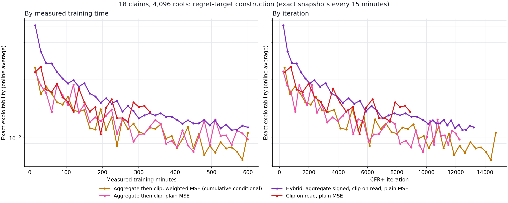
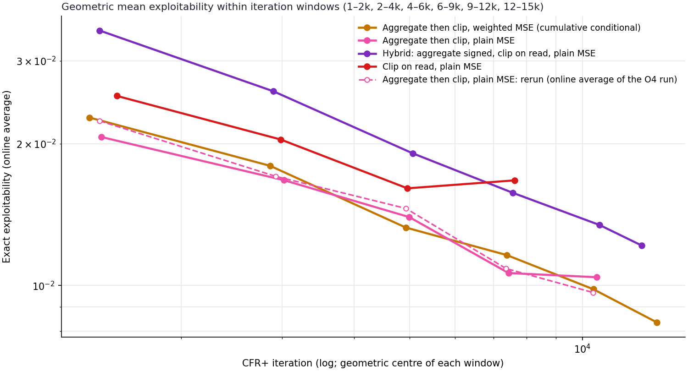

# 18-claim neural CFR+: clip on read, hybrid and aggregate-then-clip with plain MSE

## Summary

Three regret-target constructions with plain masked MSE were compared against the established recipe, aggregate-then-clip with positively weighted MSE (cumulative conditional). All runs use 4,096 roots per player.

- **Aggregate-then-clip with plain MSE matches the weighted-MSE recipe.** Per iteration, the two stay within about 10% of each other in every window. The positive-target loss weight is not needed.
- **The hybrid (aggregate signed targets, clip on read) is worse throughout:** about 1.7× worse than aggregate-then-clip early, narrowing to about 1.3× by 9,000–12,000 iterations.
- **Clip on read is worse and stalls.** It is about 1.2× worse than aggregate-then-clip up to 6,000 iterations, then stops improving; it ended at 0.0163 after 330 minutes.
- **Averaging repeated information-set targets and clipping the mean before fitting is the best of these constructions.** Plain MSE has been the default since: the [neural O4 run](2026-10-01_07-56-40_18_claim_neural_o4_refit_cpu.md) is a rerun of the plain-MSE aggregate arm with O4 averaging.

All curves here are the **online neural average**, which is 2–3× more exploitable than an O4 refit of the same trajectory and noisy from snapshot to snapshot. Compare arms with each other, not with O4 or exact-average results.

## Question

The cumulative conditional trainer averages sampled regret increments over repeated visits to the same information set within an iteration, then clips that mean at zero before fitting. It also weights positive targets 1.5× in the regret loss (`regret_positive_weight=0.5`). Two questions follow:

1. **Is clipping before fitting the right place to clip?** A state visited once has its noisy target clipped before the network can generalise across similar states. Fitting **signed** targets and clipping the network's output when it is read (for regret matching and as the next iteration's prior) keeps that evidence. See the [clip-on-read explainer](../../explainers/clip_on_read_regret_targets.md) and the [aggregation explainer](../../explainers/aggregation_and_clip_on_read.md).
2. **Is the positive-target weighting needed,** or does plain MSE work as well?

## Arms

All arms: 18-claim `r4_s4_h2_hp2pt_ss`, seed 17, from scratch on CPU with eight threads, 4,096 roots per player per iteration, full traverser-action expansion, conditional sampled advantages, cumulative regret units. The prior network output is clipped before it enters the next target.

| Arm | Target construction | Regret loss | Measured minutes | Dashboard colour |
| --- | --- | --- | ---: | --- |
| Cumulative conditional (reference) | **Aggregate then clip:** average raw targets over identical information sets within the iteration, clip the mean at zero, fit | Weighted MSE (positive targets 1.5×) | 1,200 | Orange |
| Aggregate then clip, plain MSE | Same | Plain masked MSE | 600 | Pink |
| Hybrid | Average raw targets over identical information sets, **do not clip**; fit signed means; clip on read (`aggregate_then_clip_on_read`) | Plain masked MSE | 600 | Purple |
| Clip on read | **No aggregation:** fit every visit's signed target separately; clip on read | Plain masked MSE | 330 | Red |

Shared settings: 512×512 regret network and 256×256 average-policy network; learning rate `1e-3`; batch 1,024; 24 regret steps and 6 strategy steps per iteration; 4,000,000-row regret buffer; 2,000,000-row strategy reservoir with linear iteration weighting; traversal batch 512. Policy snapshots and a rolling resumable checkpoint every 15 measured minutes. Port 8765's independent evaluator computes the exact exploitability of each saved average policy; evaluation time is excluded from the training budget.

**Not a clean factorial.** The reference ran earlier (29–30 September) under different CPU load and an earlier code revision. Clip on read ran on 30 September. The hybrid and plain-MSE aggregate arms ran concurrently afterwards, finishing on 1 October; they started about eight minutes apart. Compare by **iteration** first; time-axis differences mix in CPU contention.

## Results

### Final values

| Arm | Iterations | Median s per iteration | At 330 min | At 600 min | Final | Best (iteration) |
| --- | ---: | ---: | ---: | ---: | ---: | ---: |
| Cumulative conditional (weighted MSE) | 29,939 at 1,200 min | 2.44 | 0.0122 | 0.0110 | 0.0065 | 0.0050 (20,850) |
| Aggregate then clip, plain MSE | 12,235 | 2.62 | 0.0123 | 0.0097 | 0.0097 | 0.0077 (9,771) |
| Hybrid | 13,214 | 2.41 | 0.0158 | 0.0122 | 0.0122 | 0.0116 (12,449) |
| Clip on read | 8,898 | 2.19 | 0.0163 | — | 0.0163 | 0.0107 (5,447) |

Single snapshots of the online average move by up to about 30%, so final and best values are rough. The windowed means below are the better comparison. Seconds per iteration were measured under different, shared CPU loads; clip on read is somewhat cheaper because it skips grouping, but the difference is small next to the load effects.

### Curves

*Colours match the 8765 dashboard. The cumulative conditional reference is cut at 600 minutes; it continued to 1,200. Clip on read stopped at 330 minutes.*

### Matched-iteration comparison

*Each point is the geometric mean of the snapshots inside one iteration window. The dashed pink line is the online average of the later [neural O4 run](2026-10-01_07-56-40_18_claim_neural_o4_refit_cpu.md), which reran the plain-MSE aggregate recipe with the same seed. It shows how much an identical recipe varies between runs.*

| Iterations | Weighted MSE (reference) | Aggregate, plain MSE | Hybrid | Clip on read | Aggregate rerun |
| --- | ---: | ---: | ---: | ---: | ---: |
| 1,000–2,000 | 0.0227 | 0.0207 | 0.0348 | 0.0253 | 0.0224 |
| 2,000–4,000 | 0.0180 | 0.0167 | 0.0258 | 0.0204 | 0.0171 |
| 4,000–6,000 | 0.0133 | 0.0140 | 0.0191 | 0.0161 | 0.0146 |
| 6,000–9,000 | 0.0116 | 0.0106 | 0.0157 | 0.0167 | 0.0109 |
| 9,000–12,000 | 0.0098 | 0.0104 | 0.0134 | — | 0.0097 |
| 12,000–15,000 | 0.0084 | — | 0.0122 | — | — |

### Interpretation

1. **Positive-target weighting is unnecessary.** Plain and weighted MSE with aggregate-then-clip alternate in the lead, never by more than about 10%. The rerun of the plain-MSE recipe differs from the original by a similar amount, so the two losses are indistinguishable at this resolution.
2. **Clipping the aggregated mean before fitting beats fitting signed targets.** The hybrid keeps the same within-iteration averaging but leaves the mean signed; it is consistently worse, by about 1.3–1.7×. A plausible reason, not tested here: signed targets spend network capacity fitting negative regrets that regret matching ignores, and fitting error around zero then leaks into positive regret when the output is clipped on read.
3. **Explicit aggregation also matters.** Clip on read differs from the hybrid only in not averaging repeated visits. It starts between the hybrid and aggregate-then-clip, then stalls after about 6,000 iterations. Relying on the optimizer to average many noisy per-visit targets works early but not as the regret targets shrink.

The hybrid was meant to keep aggregation's variance reduction while preserving signed evidence for generalisation. It did not beat plain aggregation, at least at 18 claims, where most information-set rows are repeat visits. In larger games most information sets are visited once per iteration, so grouping has less to average and the gap could narrow. These results do not test that.

## Records

All four runs completed on the VM under `artifacts/cfr_plus_18_cumulative_regret/main_20260929/`: `conditional4096/`, `aggregate_plain_mse4096/`, `hybrid_plain_mse4096/` and `clip_on_read4096/`. Each keeps its final checkpoint, 15-minute policy snapshots, `training.jsonl` and `events.jsonl`; exact evaluations are in `live_exact.jsonl`. The three plain-MSE manifests confirm `regret_positive_weight=0`. The extra arms are registered in `extra_arms.json`, which sets the dashboard colours.

A first aggregate launch accidentally used the default positive weight of 0.5. It was stopped after 51 iterations, kept under `preflight_wrong_weight/` and excluded.

Local data: [`live_exact_plain_mse_arms.jsonl`](../../data/cfr_plus_18_clip_on_read_and_aggregation_mse/live_exact_plain_mse_arms.jsonl) for the three plain-MSE arms and [`cfr_plus_18_cumulative_conditional4096_full_20260930.jsonl`](../../data/cfr_plus_18_cumulative_conditional4096_full_20260930.jsonl) for the reference. [`plot_cfr_plus_18_clip_on_read_and_aggregation_mse.py`](../../../scripts/plot_cfr_plus_18_clip_on_read_and_aggregation_mse.py) regenerates both figures.
