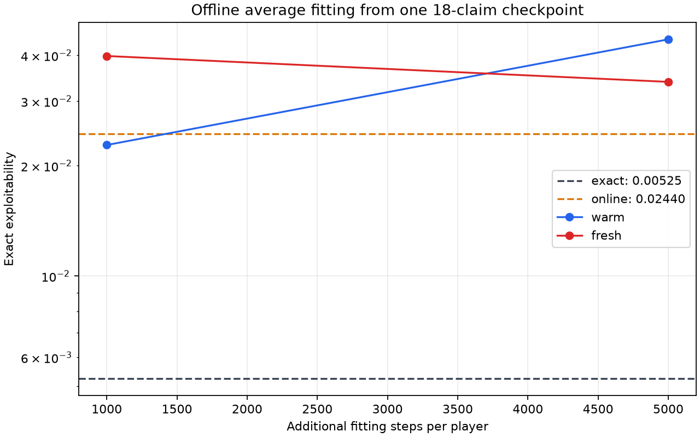
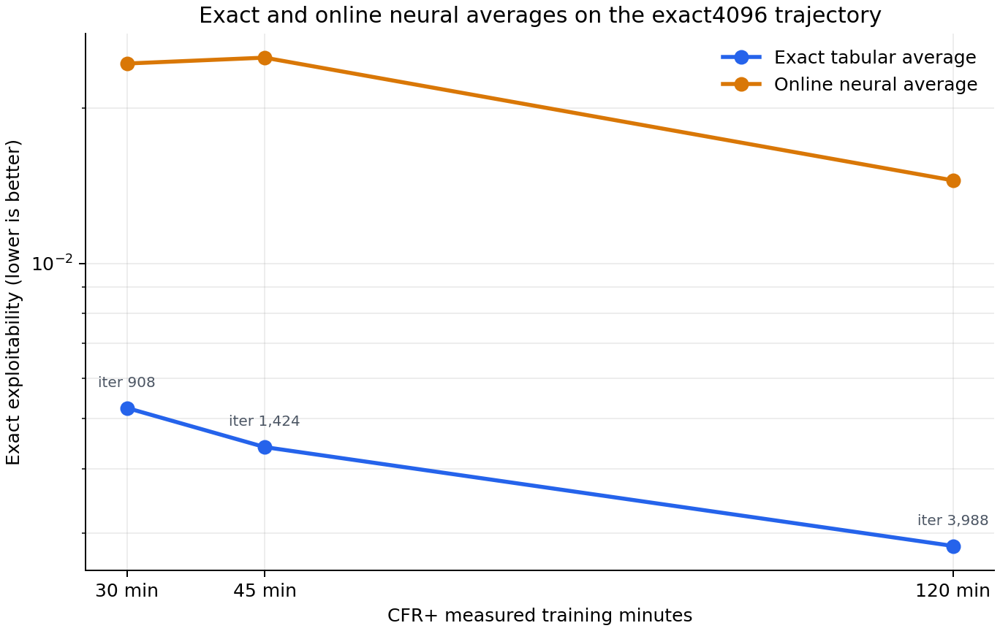
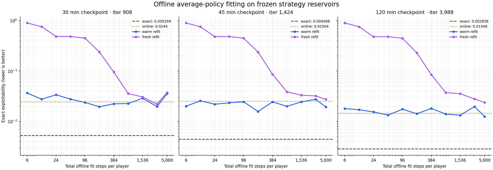

# 18-claim offline average-policy fitting

## Question

How much of the gap between our sampled tabular CFR+ run and its evaluated neural average comes from fitting the average-policy network? We can answer this without generating another CFR trajectory. The ongoing `exact4096` run stores, at the **same iteration**, an exact own-reach-weighted linear average, a strategy-record reservoir, and the online average-network weights. We can freeze a checkpoint, refit only the average network, and compare all resulting policies with exact best responses.

This is a study of **policy extraction from a fixed trajectory**. Regret updates, traversals, root count, and learning rate do not change between candidates at a checkpoint. The 18-claim game has `ranks=4`, `suits=4`, `hand_size=2`, and claims `RankHigh`, `Pair`, `TwoPair`, `Trips` with suit symmetry. The source run uses seed 17, 4,096 roots per player, batched CPU traversal, cumulative conditional-mean CFR+ updates, and linear average weights. See the [discounting experiment](2026-09-30_00-55-09_18_claim_tabular_discounting.md) for its training setup and the [GPU schedules note](../../explainers/gpu_training_schedules.md) for why average fitting is worth isolating.

## What is held fixed

At checkpoint iteration `t`, compare policies built from that *one* checkpoint:

| Policy | Construction | What it tells us |
| --- | --- | --- |
| Exact average | The run's accumulated exact own-reach-weighted linear strategy | Reference for this trajectory; no strategy-network fitting or reservoir approximation |
| Online neural average | The two saved strategy networks after six fit steps per iteration | What our current online training produced |
| Warm refit | Continue fitting copies of those online networks **and their saved Adam state** on the frozen reservoir | Whether the online network is undertrained at this checkpoint |
| Fresh refit | Initialize new networks of the same width and fit on that same reservoir | Whether a fresh optimizer/model avoids a poor online fit |

Use **exact exploitability** of each policy as the primary outcome. Lower is better. An offline neural policy can happen to score below the exact trajectory average, so `neural exploitability − exact exploitability` is a comparison, **not** a mathematically nonnegative approximation error. Keep first- and second-player best-response values as well as their sum. A secondary diagnostic is action-distribution distance to the exact average over enumerated information sets, reported both uniformly and weighted by the exact average's own reach; this helps interpret a score change but does not replace exploitability.

The checkpoint's strategy reservoir is a uniform sample of generated records with iteration weights stored on each row. Use its **existing features, target strategies, legal masks, and weights**. Match the online `256 × 256` strategy architecture, batch size `1,024`, weighted cross-entropy loss, and learning rate `1e-3` first. Copy the reservoir and model state into a separate process; fitting must not mutate or pause the trainer. Fix the refit seeds and record them.

## Fit-step sweep

At each of the 30-, 45-, and 120-minute checkpoints, compare the exact and saved online policies with a **warm** and a **fresh** fit at cumulative milestones of 6, 12, 24, 48, 96, 192, 384, 768, 1,536, 3,072, and 5,000 optimizer steps per player. Each milestone continues the same fit trajectory; they are not independent fits. Warm starts from the saved online networks and their Adam states. Fresh starts from newly initialized networks and optimizers. Both use the frozen checkpoint reservoir, 256 by 256 networks, batch size 1,024, weighted cross-entropy, and learning rate 1e-3.

One step is one minibatch update for one player's strategy network. Thus 6 steps per player are 6,144 sampled row draws per player, while 5,000 steps are 5.12 million draws per player. Rows are sampled with replacement from the 2,000,000-record reservoir; 5,000 steps are not five full passes through a fixed ordering of the data. Exact exploitability was evaluated for all policies. Fitting ran sequentially on the idle GPU; the 72 evaluations ran CPU-only, with four workers per checkpoint queue.

The [sweep plot](../../figures/experiment_cfr_plus_18_offline_average_step_sweep.png) uses log scales on both axes and shows each checkpoint separately. Dashed and dotted horizontal lines mark its exact and saved-online exploitability. Complete results, fit progress, source metadata, and evaluated policy files are in the [30-minute](../../data/cfr_plus_18_offline_average_step_sweep/step_sweep_0030m), [45-minute](../../data/cfr_plus_18_offline_average_step_sweep/step_sweep_0045m), and [120-minute](../../data/cfr_plus_18_offline_average_step_sweep/step_sweep_0120m) folders. The plotting code is [here](../../../scripts/plot_cfr_plus_18_offline_average_step_sweep.py); the CPU evaluation worker is [here](../../../scripts/evaluate_cfr_plus_18_average_fit_sweep.py).

The 30-minute `exact4096` checkpoint was preserved on the VM at `artifacts/cfr_plus_18_offline_average_study/exact4096_0030m_checkpoint.pt` (iteration **908**, 1.2 GiB). Its manifest is saved beside it. The 45-minute checkpoint (iteration **1,424**) was also preserved there. The live trainer has **one rolling checkpoint**, overwritten every 15 measured training minutes. Later stages must be copied before that overwrite if their replay data and neural weights will be needed. Saved exact-policy snapshots alone do not contain the corresponding strategy reservoir. Preserve no more stage copies than needed, and check free disk before each copy.

## How to read possible results

| Observation at the same checkpoint | Interpretation |
| --- | --- |
| Warm refit closes most of the online-to-exact gap | Online average fitting was insufficient; more or later fitting is promising. |
| Fresh refit improves but warm refit does not | The online network or its optimizer may be stuck; test reset/refit at snapshot time. |
| Both refits improve at 1,000 and again at 5,000 steps | Fitting budget still matters; extend the step curve before changing the reservoir or architecture. |
| Both refits plateau well above the exact reference | More steps at this architecture and reservoir are insufficient. Reservoir coverage, target weighting, model capacity, loss, or a mismatch between sampled records and the formal average remain possible. This result alone does **not** identify which. |
| Exploitability barely changes although action distance falls | Better imitation under the chosen weighting does not necessarily improve strategically important decisions. Inspect role-specific BR values and where the remaining action errors occur. |

Compare **within each checkpoint** before comparing stages: the trajectory itself changes over time. One seed and one reservoir sample cannot establish a universal fitting recipe. If the same pattern appears at early and late checkpoints, it becomes a stronger lead for the neural runs.

## Results: 30-minute checkpoint

The [offline runner](../../../scripts/run_cfr_plus_18_offline_average_fitting.py) fitted copies of the two strategy networks on the VM's RTX 4060 Ti and evaluated their policies with the exact CPU best-response evaluator. The source trainer continued independently. Each role's reservoir contained 2,000,000 records. The exact average reconstructed from the checkpoint scored **0.005249**, identical to the run's independently saved 30-minute exact-policy evaluation.

| Policy | Additional fit steps per player | Exact exploitability | Uniform action TV to exact | Own-reach-weighted action TV |
| --- | ---: | ---: | ---: | ---: |
| Exact accumulated average | — | **0.005249** | 0 | 0 |
| Saved online neural average | 0 | 0.024396 | 0.08446 | 0.02009 |
| Warm refit | 1,000 | 0.022778 | 0.08594 | 0.01949 |
| Warm refit | 5,000 | 0.044224 | 0.08325 | 0.01729 |
| Fresh refit | 1,000 | 0.039836 | 0.09374 | 0.04601 |
| Fresh refit | 5,000 | 0.033862 | 0.08569 | 0.02225 |

The vertical axis is logarithmic; **lower is better**. Dashed lines are the exact and saved-online policies from this one checkpoint. Solid lines follow the same warm or fresh refit from 1,000 to 5,000 total refit steps per player. These are exact evaluations, not Monte Carlo BR estimates. The [numeric results](../../data/cfr_plus_18_offline_average_fitting_0030m.jsonl) retain both role-specific BR values and fitting/evaluation times. A 1,000-step refit took about three GPU seconds for both players; each exact evaluation took about 19 CPU seconds, plus roughly three seconds to compile a neural policy.

At this early checkpoint, the online neural policy is about **4.6 times** as exploitable as the exact accumulated average from the *same* trajectory. The small 1,000-step warm improvement closes only about 8% of that exploitability difference; extending it to 5,000 steps makes the policy substantially worse. Fresh refits also remain worse than the saved online policy. Thus simply fitting this frozen reservoir longer with the same architecture, loss and learning rate does **not** recover the exact average at 30 minutes.

The warm 5,000-step network has *lower* action TV to the exact policy under both reported weightings than the online network, yet *higher* exploitability. Average action agreement does not identify the strategically important errors. This one checkpoint cannot distinguish a reservoir/target mismatch from inadequate architecture, loss choice, learning-rate instability, or weak coverage of important information sets. It also does not establish what causes the **late** neural plateau. The later sweep across three checkpoints is reported below; regret fitting and learning-rate schedules remain separate questions.

## Exact average versus online neural average

The checkpoint also lets us compare the exact accumulated average with the online neural average at the same training point. These two policies came from the same `exact4096` regret trajectory. The exact average is accumulated by the observer; the online neural average is the strategy network trained during that run.

| Training time | Iteration | Exact average | Online neural average |
| ---: | ---: | ---: | ---: |
| 30 min | 908 | **0.005249** | 0.024396 |
| 45 min | 1,424 | **0.004408** | 0.025044 |
| 120 min | 3,988 | **0.002836** | 0.014483 |

There are **three paired checkpoints**, not six. The run wrote a policy snapshot every 15 minutes, but the `exact4096` snapshots were exact averages. The neural policies and their replay reservoirs were available from full trainer checkpoints; 30 and 45 minutes were preserved for the initial offline study. We have now also copied the 120-minute rolling checkpoint to `/root/liars_poker/artifacts/cfr_plus_18_offline_average_study/exact4096_0120m_checkpoint.pt` on the VM and evaluated its exact and online averages. The exact/neural policy files and numeric results for this point are saved locally in [`docs/data/cfr_plus_18_offline_average_fitting_0120m`](../../data/cfr_plus_18_offline_average_fitting_0120m). An exact-policy snapshot alone cannot recover the neural policy that existed at that time. The 15-minute exact evaluation is recorded elsewhere, but there is no paired online-neural evaluation for it in the saved data. Additional paired points require copying a full checkpoint or explicitly saving and evaluating both averages at that time.

The exact average improves across these points, from 0.00525 at 30 minutes to 0.00284 at 120 minutes. The online neural average is non-monotonic across the first two points, then improves to 0.01448 at 120 minutes. It remains about **5.1 times** as exploitable as the exact average at 120 minutes. This supports a persistent average-fitting gap on this trajectory, but three checkpoints—two early and one at 120 minutes—cannot establish its cause or show whether the gap keeps widening later.

## Implementation lesson: exact averaging should not train a neural averager by default

The `exact4096` arm was intended to produce an exact average, but it also trained the neural strategy network. The cause is visible in the runner: its shared `make_trainer` configuration sets `strategy_train_steps=6` and allocates a strategy replay buffer; `ExactAverageTabularDiscountTrainer` adds exact-average accumulation on top of that inherited trainer. The `exact4096` control then saves the exact observer's policy, while the inherited online network continues fitting in the background. That extra work was not needed to construct or evaluate the exact average. It later enabled this same-trajectory online-versus-exact and offline-refit analysis, but that is a separate diagnostic benefit, not a requirement of an exact-average run.

Going forward, make the averaging mode explicit and independent of the traversal backend: for example `average_mode="exact"`, `"neural"`, or explicitly `"both"`. Exact mode should allocate/update the exact accumulator and should not create a strategy network, optimizer, or replay buffer. Neural mode should create those components and skip the exact accumulator. Both mode should be opt-in for controlled comparisons. A batched traversal implementation should make no implicit choice about averaging. The current run's exact and neural tracks are therefore a useful comparison, but future exact runs should avoid paying for neural averaging unless that comparison is the stated purpose.

## Results: cumulative fit-step sweep

| Checkpoint | Exact average | Online neural | Best warm refit | Warm at 5,000 | Best fresh refit | Fresh at 5,000 |
| --- | ---: | ---: | --- | ---: | --- | ---: |
| 30 min, iter 908 | 0.005249 | 0.024396 | 0.019584 at 192 | 0.035668 | 0.022073 at 3,072 | 0.037378 |
| 45 min, iter 1,424 | 0.004408 | 0.025044 | 0.015737 at 192 | 0.019321 | 0.027367 at 5,000 | 0.027367 |
| 120 min, iter 3,988 | 0.002836 | 0.014483 | 0.012500 at 5,000 | 0.012500 | 0.023839 at 5,000 | 0.023839 |

The **warm-start results are irregular**, not a smooth “more steps is better” curve. At 30 and 45 minutes, the best warm checkpoint is 192 steps, while 5,000 steps is worse than the saved online network at 30 minutes. At 120 minutes, the warm refit reaches its best result at 5,000 steps and improves modestly on the online network. None of the warm refits approaches the exact accumulated average.

Fresh fits start far from a useful policy: exploitability is about 0.9 at six steps and remains around 0.45 through 96 steps. It then falls quickly as the randomly initialized networks learn the frozen targets. At 30 minutes, fresh fitting briefly beats the online network at 3,072 steps but regresses by 5,000. At 45 and 120 minutes, even the best fresh result remains worse than the online policy. More fitting from scratch is therefore not a reliable way to reproduce the online average under this setup.

The 120-minute checkpoint has a smaller online-to-exact gap than the 30- and 45-minute checkpoints, and its warm refit also gets closer to the exact average. That is consistent with the online averager benefiting from the longer training history, but the experiment has one source run and only three checkpoints. It does not establish a general time trend. Within each sweep, all milestones share one initialization, optimizer trajectory, and sampled replay sequence; jagged points are observations along that one stochastic fit, not replicated estimates. The refit-step sweep shows that **fit budget matters in a checkpoint- and initialization-dependent way**, but extra fitting on this fixed reservoir does not consistently close the neural-to-exact gap.

At 5,000 steps, each player has drawn 5.12 million replay rows with replacement—about 2.56 draws per row on average if all 2 million records are present. The inconsistent outcomes cannot be attributed simply to too few optimizer steps. They leave open whether the limiting factor is replay coverage or weighting, the objective, optimizer trajectory, model capacity, or strategic errors that are poorly reflected by average action agreement. This experiment holds those choices fixed and does not distinguish among them.
