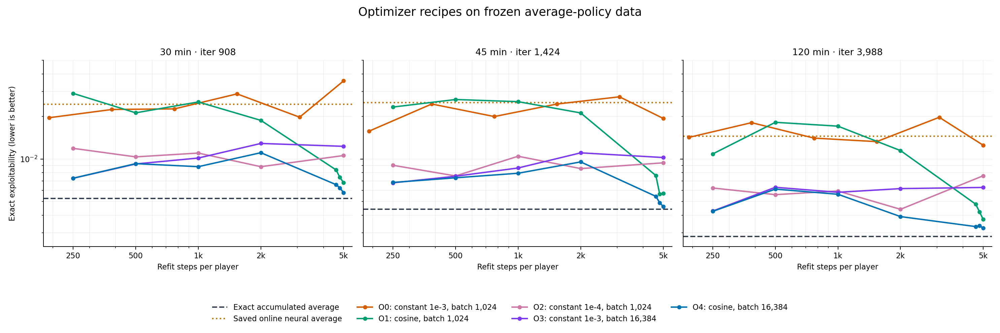
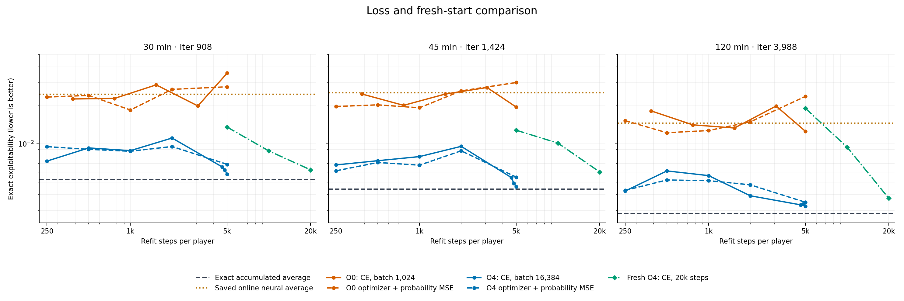
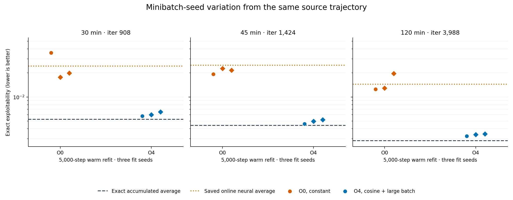

# 18-claim average-policy fitting: learning rate, batch size and loss

## Question

In the [offline average-fitting study](2026-09-30_21-47-00_18_claim_offline_average_fitting.md), the online neural average was about **five times** as exploitable as the exact accumulated average from the same trajectory. That held at all three preserved checkpoints:

| Checkpoint | Exact average | Online neural average | Ratio |
| --- | ---: | ---: | ---: |
| 30 min, iteration 908 | 0.005249 | 0.024396 | 4.6× |
| 45 min, iteration 1,424 | 0.004408 | 0.025044 | 5.7× |
| 120 min, iteration 3,988 | 0.002836 | 0.014483 | 5.1× |

Refitting the network on the frozen reservoir did not close this gap. Warm refits jittered by roughly ±30% around the online value at every budget from 6 to 5,000 steps, while action-distribution distance to the exact average fell only slowly. Fresh refits finished worse than the online network. Every refit used the online recipe: constant learning rate `1e-3`, batch 1,024 and weighted cross-entropy.

That pattern suggests a floor set by the fitting **recipe** rather than the number of steps. This experiment tests two explanations:

1. **Optimizer noise.** With a constant learning rate and small batches, Adam never settles. If exploitability depends on precise mixing probabilities at a relatively small number of important information sets, the remaining step-to-step noise could by itself produce the jitter and the level. Decaying the learning rate, or averaging over larger batches, should then reduce both.
2. **Objective.** Cross-entropy weights errors by log-probability. That puts heavy emphasis on small probabilities and relatively little on the exact ratio between two substantial ones. VR-DeepDCFR+ fits its average network with **squared error on probabilities**, which penalises errors in large probabilities directly. If mixing ratios on the main line of play are what matters, squared error may do better.

The outcome is **exact exploitability** of each fitted average policy; lower is better. The exact average from the same checkpoint is the reference.

**Capacity is held fixed.** The network stays at 256 by 256, matching the online averager. This is a deliberate decision: capacity is not considered the likely limit. It would be revisited only if every arm below fails.

## Source checkpoints and fixed settings

The run used three full `exact4096` checkpoints preserved under `artifacts/cfr_plus_18_offline_average_study/`:

- `exact4096_0030m_checkpoint.pt` (iteration 908)
- `exact4096_0045m_checkpoint.pt` (iteration 1,424)
- `exact4096_0120m_checkpoint.pt` (iteration 3,988)

Each contains the exact own-reach-weighted average, both players' 2,000,000-record strategy reservoirs, and the online strategy networks and Adam states. The source run is seed 17, 4,096 roots per player, sampled tabular regrets with cumulative conditional-mean CFR+ updates, and linear average weighting. See the [discounting experiment](2026-09-30_00-55-09_18_claim_tabular_discounting.md).

Fixed across all arms:

- the reservoir's features, target strategies, legal masks and per-record weights, with weights normalised per batch as in training;
- 256 by 256 strategy networks;
- Adam;
- **warm start** from the online networks and their Adam states, unless stated otherwise;
- exact evaluation with the existing CPU evaluator.

## Arms

### Stage 1: optimizer noise (weighted cross-entropy throughout)

| Arm | Learning rate | Batch | Steps per player |
| --- | --- | ---: | ---: |
| O0 baseline | constant `1e-3` | 1,024 | 5,000 (already measured; rerun only for seed replicates) |
| O1 | cosine decay `1e-3` → `1e-5` over the fit | 1,024 | 5,000 |
| O2 | constant `1e-4` | 1,024 | 5,000 |
| O3 | constant `1e-3` | 16,384 | 5,000 |
| O4 | cosine decay `1e-3` → `1e-5` over the fit | 16,384 | 5,000 |

- **O1 versus O0** asks whether annealing removes the jitter and lowers the level.
- **O2** asks whether a lower rate alone suffices, without a schedule.
- **O3** reduces gradient noise through the batch instead of the learning rate. At 5,000 steps it draws about 82 million rows per player, about 41 draws per reservoir row, so it also tests whether the reservoir is being used thoroughly.
- **O4** combines both.

Evaluate at 250, 500, 1,000, 2,000 and 5,000 steps. For the cosine arms, only the 5,000-step point reflects the complete schedule; earlier points are mid-schedule. For O1 and O4, also evaluate 4,600 and 4,800 steps. Three points near the end show whether the end-of-fit jitter has collapsed.

### Stage 2: objective

Take the best Stage 1 setting, judged by the mean of its last three evaluations at each checkpoint, and repeat it with **weighted squared error on probabilities**:

```text
per_sample = sum over legal actions of (softmax(masked logits) - target)^2
loss = mean over the batch of (normalised record weight * per_sample)
```

Run the same squared-error loss under the O0 baseline optimizer as well, so its effect is seen under both noisy and annealed fitting. The warm-started networks were trained with cross-entropy, which is fine: the refit changes only the objective from that point on.

### Fresh-start check

Repeat the single best setting from a **fresh** initialisation for 20,000 steps per player. Evaluate at 5,000, 10,000 and 20,000 steps. This asks whether a well-configured fit from scratch at snapshot time can replace online averaging. That is the strategy used by VR-DeepDCFR+, which refits its average network from scratch every three iterations.

### Seed replicates

The step-sweep curves were single stochastic fit trajectories, so their jitter has no error bar. Refit O0 and the best final setting with **two further minibatch seeds** at each checkpoint, evaluating the final point. This gives a fit-to-fit spread against which to judge differences between arms.

## Reproducibility

The completed manifests, fit logs, exact evaluations and policies are in [the result bundle](../../data/cfr_plus_18_average_fit_optimizer). The runner is [here](../../../scripts/run_cfr_plus_18_average_fit_optimizer_experiment.py). Warm-start arms restore Adam state, so each arm's learning rate was explicitly reset after loading the optimizer; this avoids silently running every arm at the source checkpoint's rate.

## How to read the results

| Observation | Interpretation |
| --- | --- |
| Annealed or large-batch fits collapse the jitter **and** move substantially towards the exact average | The online averager is limited by optimizer noise. Fix it with a decaying learning rate, larger batches, or a periodic low-noise refit before each evaluation or deployment. |
| Jitter collapses but the level stays near the online value | Optimizer noise explains the fluctuation but not the gap. The objective or the data (coverage, weighting) are the next suspects. |
| Squared error beats cross-entropy under the same optimizer | The objective matters. Adopt squared error on probabilities, as VR-DeepDCFR+ does, for the online averager as well. |
| A fresh 20,000-step fit with the best settings matches or beats the warm refits | Refitting from scratch at snapshot time is viable. The online averager need not be trained every iteration. |
| No arm closes much of the gap | The limit lies in the reservoir data, the capacity held fixed here, or strategically important errors the fit objective does not target. Next: the attribution test (substitute the neural average into the exact one region by region: depth, player, own-reach bin, hand) and a snapshot-mixture average that avoids distillation altogether. |

Judge differences against the seed-replicate spread and across all three checkpoints. A setting that wins at one checkpoint only is not a finding. Report role-specific best-response values and action-distribution distance to the exact average alongside exploitability, but decide on exploitability.

## Results

Completed 1 October 2026. The measured results, manifest and selection scores are preserved in [`docs/data/cfr_plus_18_average_fit_optimizer/`](../../data/cfr_plus_18_average_fit_optimizer). All values below are **exact exploitability**, where lower is better. All three checkpoints come from the same seed-17 training trajectory. The run selected **O4: cosine decay from `1e-3` to `1e-5`, batch 16,384, weighted cross-entropy**. The figures can be regenerated with [`plot_cfr_plus_18_average_fit_optimizer.py`](../../../scripts/plot_cfr_plus_18_average_fit_optimizer.py).

### Optimizer recipe



**Figure 1.** Each panel refits the same saved average network on its frozen strategy reservoir. The dashed horizontal line is the exact accumulated average from that checkpoint; the dotted line is its saved online neural average. Both axes are logarithmic. O1 and O4 have extra evaluations near the end of their cosine schedules. O0 points below 192 steps are omitted here so the useful part of the curves is legible; they remain in the data.

| Exact exploitability | 30 min | 45 min | 120 min |
| --- | ---: | ---: | ---: |
| Exact accumulated average | 0.005249 | 0.004408 | 0.002836 |
| Saved online neural average | 0.024396 | 0.025044 | 0.014483 |
| O0: constant `1e-3`, batch 1,024, 5k steps | 0.035668 | 0.019321 | 0.012500 |
| O1: cosine, batch 1,024, 5k steps | 0.006796 | 0.005692 | 0.003733 |
| O2: constant `1e-4`, batch 1,024, 5k steps | 0.010569 | 0.009387 | 0.007603 |
| O3: constant `1e-3`, batch 16,384, 5k steps | 0.012283 | 0.010234 | 0.006285 |
| **O4: cosine, batch 16,384, 5k steps** | **0.005777** | **0.004596** | **0.003243** |

At exactly 5,000 steps, O4 is best of the tested optimizers at every checkpoint. O1 is next best. A lower constant learning rate or a larger batch helps relative to the old O0 recipe, but neither works as well as the combination. The gap between O4 and the exact average is 0.000528, 0.000188 and 0.000407, respectively: O4 removes about 97%, 99% and 97% of the saved online network's excess exploitability. This is strong evidence that the online average network *can* represent a good average on these three frozen reservoirs.

The O1/O4 curves improve sharply near the end because their learning rates approach `1e-5`. An earlier point on those curves has **not** completed the cosine schedule; it is not a stand-alone fit with a shorter cosine schedule. The predeclared selection rule also favored O4 (mean final-three-point score 0.004830 versus O1's 0.006028), although the final-three points occur at different step numbers across recipes. The matched 5,000-step comparison above supports the same choice more directly.

This does not isolate *gradient noise alone*: batch 16,384 draws sixteen times as many reservoir rows per optimizer step as batch 1,024, and the cosine schedule changes the effective learning rate as well as late-step noise. It tells us that the **fitting recipe**, rather than network capacity or lack of useful data in these reservoirs, explains most of this particular average-policy gap.

### Loss and fresh-start fitting



**Figure 2.** Solid lines use weighted cross-entropy (CE); dashed lines with the same color use weighted probability MSE under the *same optimizer recipe*. The green line is a fresh O4 network trained to 20,000 steps. The fresh fit has its own 20,000-step cosine schedule, so its 5,000-step point is mid-schedule. Horizontal references are as in Figure 1. Both axes are logarithmic. These probability losses fit the **average strategy network**, not the regret network.

| 5,000-step warm fit, unless marked | 30 min | 45 min | 120 min |
| --- | ---: | ---: | ---: |
| O4 + cross-entropy | **0.005777** | **0.004596** | **0.003243** |
| O4 + probability MSE | 0.006887 | 0.005468 | 0.003479 |
| O0 + cross-entropy | 0.035668 | **0.019321** | **0.012500** |
| O0 + probability MSE | **0.027861** | 0.030112 | 0.023423 |
| Fresh O4 + cross-entropy, **20,000 steps** | 0.006241 | 0.006005 | 0.003735 |

Probability MSE does not beat cross-entropy with the winning optimizer at any checkpoint. Under O0 it wins at 30 minutes but loses at 45 and 120 minutes. Changing the loss alone is therefore not the answer in this study. The fresh 20,000-step fit gets close to the exact average, but it is worse than the warm O4 fit with one quarter as many steps at all three checkpoints. A good fresh fit is possible, but these data favor keeping the online network and refining it at snapshot time.

### Fit-seed spread and policy distance



**Figure 3.** Each dot is one 5,000-step fit on the *same* checkpoint data; the circle is the first fit and the diamonds use two additional minibatch seeds. The horizontal lines are the exact and saved online averages. The vertical axis is logarithmic. These are fit-seed replicates, **not** independent CFR+ training seeds.

| 5,000-step fit range across three seeds | 30 min | 45 min | 120 min |
| --- | ---: | ---: | ---: |
| O0 | 0.017675–0.035668 | 0.019321–0.022690 | 0.012500–0.019650 |
| O4 | 0.005777–0.006501 | 0.004596–0.005184 | 0.003243–0.003444 |

O4's worst seed beats O0's best seed at every checkpoint. Its smaller fit-to-fit spread also fits the visual picture of a quieter late-stage optimizer, although different reservoir exposure is part of the recipe.

| Checkpoint | Exact `p_first` / `p_second` | O4 `p_first` / `p_second` | O4 own-reach-weighted action TV |
| --- | ---: | ---: | ---: |
| 30 min | 0.53956 / 0.46569 | 0.54001 / 0.46577 | 0.00713 |
| 45 min | 0.53908 / 0.46533 | 0.53940 / 0.46520 | 0.00522 |
| 120 min | 0.53847 / 0.46437 | 0.53877 / 0.46448 | 0.00247 |

The role-specific BR values and own-reach-weighted action distance also move close to the exact average. Uniformly weighted action TV stays much higher, about 0.086–0.091, so the fit is much less exact at rarely reached information sets. These distance metrics are descriptive; exploitability is the decision metric.

### Takeaways

The three frozen reservoirs contain enough information for a 256 by 256 average network to reproduce nearly all of the exact average's policy quality. A decaying learning rate plus a larger batch makes that possible with 5,000 warm fitting steps; changing cross-entropy to probability MSE does not improve it. This revises the earlier offline step-sweep conclusion: its apparent fitting floor belonged to the **old constant-rate, small-batch recipe**, not to average-policy fitting in general.

The result is local to three checkpoints on one 18-claim training trajectory. It does not show that the regret-learning plateau is solved, that this recipe works online without a final refit, or that it scales to 69 claims. The next practical comparison is to evaluate a periodic or final O4-style average-network refit on a run where the regret updates themselves are held fixed.
