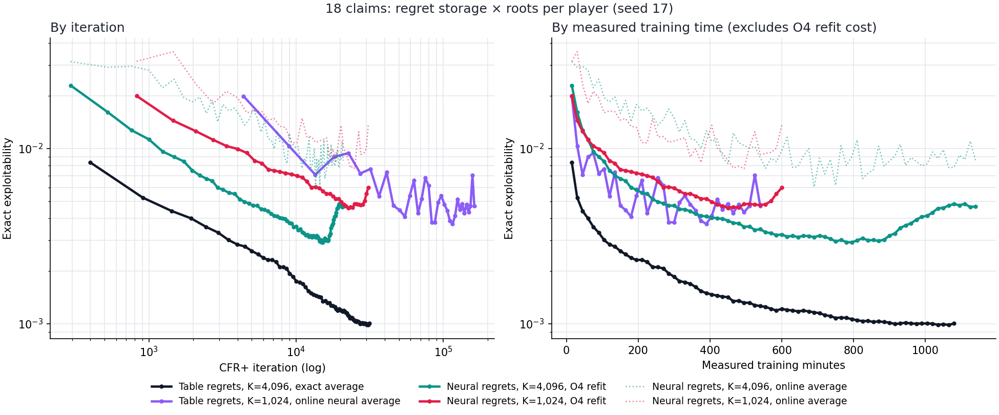
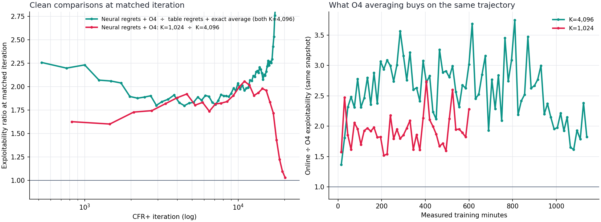

# 18-claim neural CFR+: aggregate-then-clip plain MSE with O4 average refits

## Summary

- **O4 gives a large, consistent averaging gain.** On the same trajectory, the O4 policy beat the online average at every one of 80 snapshots. The median gain was 2.7× at K=4,096 and 1.9× at K=1,024. Training is unchanged; only the averaging differs.
- **K=4,096 beats K=1,024 with neural regrets, per iteration and per minute.** At 600 minutes, O4 scored 0.0032 at K=4,096 against 0.0060 at K=1,024, even though K=1,024 ran 2.6× more iterations. At matched iterations K=1,024 is 1.6–2.0× worse, and the gap widens over time.
- **K=1,024 stalls; K=4,096 keeps improving.** K=1,024 bottomed at 0.0046 around 22.6k iterations, then rose to 0.0060 by 31k. K=4,096 was still falling at the end.
- **At K=4,096, neural regrets cost about 2× against a table.** The ratio to `exact4096` is 1.8–2.2× at matched iterations and does not shrink. About 1.1× of that is O4 versus exact averaging, so the regret network accounts for roughly 1.75×.
- **Both neural runs get worse late, and averaging is not the cause.** K=4,096 bottomed at 0.0029 (iteration 15.2k) and rose to 0.0047 by 20.9k. K=1,024 rose after 22.6k. On `exact4096`'s final checkpoint (31.5k iterations), O4 is still 1.24× the exact average. The regret network's later iterates must be at least about 2× worse than its earlier average ([continuation](#k4096-continuation-to-1140-minutes)).

## Question

The [offline average-fitting experiment](2026-10-01_00-58-40_18_claim_average_fit_optimizer_and_objective.md) showed that the old online neural average was much more exploitable than the exact accumulated average on the same 18-claim trajectory. A 5,000-step warm refit with a cosine learning-rate decay, batch 16,384 and weighted cross-entropy (O4) nearly removed that gap at three saved checkpoints.

Does that improvement carry through a complete neural CFR+ run? The comparison also asks whether 1,024 versus 4,096 sampled roots per player changes the regret-learning trajectory when both arms use the same average-policy recipe.

## Runs

Both runs start from scratch at seed 17 on the 18-claim game. They run **600 measured neural-training minutes each**, concurrently on the VM, with batched `gpu_native` traversal on CPU. The arms differ only in roots per player per iteration:

| Arm | Roots per player | Regret rule | Average fit |
| --- | ---: | --- | --- |
| `neural_o4_k1024` | 1,024 | Cumulative conditional, aggregate then clip, plain masked MSE | Six online steps per iteration; O4 warm refit every 15 training minutes |
| `neural_o4_k4096` | 4,096 | Same | Same |

Fixed trainer settings: 512 by 512 regret networks; 256 by 256 strategy networks; learning rate `1e-3`; fitting batch 1,024; 24 regret steps; six online strategy steps; 4,000,000 regret-record capacity; 2,000,000 strategy-record capacity; traversal batch 512; linear strategy weighting. `regret_positive_weight=0` makes the regret loss plain masked MSE. The average fit remains weighted cross-entropy. This follows the ongoing [plain-MSE aggregation experiment](2026-09-30_10-37-00_18_claim_clip_on_read_and_aggregation_mse.md).

At each 15-minute checkpoint, a frozen copy of the strategy reservoir, strategy networks and Adam states is passed to another CPU process. That worker warm-starts from the saved online network and Adam state, fits **5,000 steps per player** at batch 16,384 under cosine decay from `1e-3` to `1e-5`, and publishes an O4 policy. It never reads the trainer's live reservoir. The online policy is also saved, so its exact exploitability can be compared to the O4 policy from the same trajectory and minute. Another CPU process evaluates completed policies exactly. The 8768 dashboard plots both policies and the older bridge/discount controls by measured training minutes and CFR+ iteration.

The runner keeps one rolling full checkpoint per arm, refreshed at every 15-minute snapshot, plus the committed policy snapshots, fit/evaluation rows and logs. A frozen input is deleted after its O4 fit is published. The trainer pauses at a snapshot boundary if the previous frozen input has not yet been consumed, bounding temporary disk use. Measured training time excludes snapshot serialization, refitting, waiting and exact evaluation; **wall-clock cost will be higher**, so comparisons by measured time do not include all compute spent on O4.

## What the results would mean

- If O4 policies stay consistently below the paired online policies, the average network was a material source of exploitability in these runs. The O4 refit improves the average but does not change the regret-network updates.
- If O4 closes the early gap but later plateaus, the remaining limit is likely in regret learning, reservoir coverage, or strategic errors that the average objective still misses. Compare the plateau to the prior tabular-regret and exact-average controls; do not infer the cause from exploitability alone.
- If K=4,096 improves over K=1,024 per iteration but not per training minute, extra traversal data helps statistically but its CPU cost offsets the gain. Both axes are needed.
- If O4 and online values are close, the old optimizer recipe may have been less important on these new trajectories than on the three offline-study checkpoints. A difference in source trajectory matters: this is a new run, not a refit of those old policies.

These are one-seed runs. They measure the combined effect of the chosen regret rule and O4 averaging, not an isolated test of batch size versus learning-rate schedule.

## Status

The initial runs completed 600 measured training minutes. K=4,096 was then continued to 1,140 minutes; K=1,024 remains at 600 minutes. The K=4,096 exact exploitability values, including the continuation, are in [`neural_o4_k4096.jsonl`](../../data/cfr_plus_18_neural_o4_cpu_20261001/neural_o4_k4096.jsonl). Its trainer has reached the requested target. The last VM check showed 76 O4 fits and 152 online/O4 evaluations for K=4,096, with the final snapshot marked ready. The fit-worker processes remained alive, but their CPU-time counters did not increase between checks, consistent with idle workers waiting for more input rather than ongoing fitting. The K=1,024 run remained at its original 600-minute target.

Local copies of the evaluation rows are in [`docs/data/cfr_plus_18_neural_o4_cpu_20261001/`](../../data/cfr_plus_18_neural_o4_cpu_20261001). The batched table-regret controls are in [`docs/data/cfr_plus_18_batched_bridge_controls_20260930/`](../../data/cfr_plus_18_batched_bridge_controls_20260930). [`plot_cfr_plus_18_neural_o4_cpu.py`](../../../scripts/plot_cfr_plus_18_neural_o4_cpu.py) regenerates both figures.

An end-to-end smoke test passed before launch; its temporary files were removed. A complete 5,000-step O4 fit took about 15.7 CPU-minutes, slightly longer than the 15-minute snapshot interval, so the trainer occasionally waited at a snapshot boundary. Measured minutes exclude that wait, the refit and evaluation. **Wall-clock cost was therefore substantially higher than the time axis shows.**

## Results

### How these runs fit with the earlier controls: a 2×2

The 8768 dashboard plots these two runs next to the two [batched bridge controls](2026-09-30_00-55-09_18_claim_tabular_discounting.md#batched-bridge-controls). All four use seed 17, the same CFR+ rule (cumulative conditional mean, aggregate then clip), linear averaging weights and batched CPU traversal. Together they cross **regret storage** with **roots per player**:

| | K=1,024 | K=4,096 |
| --- | --- | --- |
| **Table regrets** (bridge controls) | `neural1024`: online neural average. 0.0047 at 163k iterations (best 0.0037) | `exact4096`: **exact** average. **0.0013** at 17.9k |
| **Neural regrets** (this experiment) | `neural_o4_k1024`: O4 refit. 0.00598 at 31k (best 0.00460 at 22.6k) | `neural_o4_k4096`: **0.00469 at 20.9k** after continuing to 1,140 minutes; best 0.00292 at 15.2k / 795 minutes |

The **averaging method is not held fixed across the matrix**. The top row uses the old online average at K=1,024 but an exact average at K=4,096. The bottom row uses O4 in both cells. Only two comparisons are close to clean:

- **Bottom row: roots, with averaging held fixed.** Both runs use neural regrets and O4 averaging.
- **Right column: regret storage at K=4,096.** Exact versus O4 averaging also differs, but that costs only about 1.1× ([Part A](2026-10-01_10-25-57_18_claim_average_fit_traversal_schedule_regret_noise.md)).

The left column compares table regrets averaged by the old online averager, which is 2–5× worse than exact, with neural regrets averaged by O4. It says nothing reliable about regret storage. The top row changes roots and averaging together.

The missing cell is **table regrets, K=1,024, exact average**. Part B of the [traversal schedule experiment](2026-10-01_10-25-57_18_claim_average_fit_traversal_schedule_regret_noise.md) filled it: the exact-average table run reached 0.00281 after 540 minutes, substantially below the neural O4 K=1,024 run (0.00598 at 600 minutes). This supports a regret-network cost at K=1,024, though the runs are separate single-seed trajectories.

*Solid lines: the evaluated policy for each cell of the 2×2. Dotted lines: the online average policies of the two neural runs; each O4 point is a refit of the same snapshot. On the time axis, `exact4096` includes its exact-averaging overhead (about 1.05 s of 1.8 s per iteration). Neither neural run includes the O4 refit time.*

How to read the overview:

- **By iteration (left).** From best to worst throughout: table + exact (K=4,096), neural + O4 (K=4,096), neural + O4 (K=1,024). The purple table run with the online average needs far more iterations to reach the same level, mostly because its average is weak.
- **By time (right).** At 300 minutes the scores were 0.0019 (`exact4096`), 0.0038 (`neural1024`), 0.0047 (O4, K=4,096) and 0.0060 (O4, K=1,024). By 540 minutes they were 0.0013, 0.0047, 0.0035 and 0.0048. The neural K=4,096 run passes both K=1,024 runs at about 400 minutes; both K=1,024 runs flatten near 0.004–0.005.
- **The dotted online curves** sit 2–3× above their O4 refits and jump around from snapshot to snapshot. This is the averaging problem from the [offline fitting study](2026-10-01_00-58-40_18_claim_average_fit_optimizer_and_objective.md), now confirmed on full runs.

### The clean comparisons

*Left: exploitability ratios at matched iterations, with the denominator interpolated on log-iteration and log-exploitability. Right: online ÷ O4 exploitability for the same snapshot.*

**Regret network versus table at K=4,096 (left, teal).** At matched iterations, neural regrets with O4 are 2.2× worse early, about 1.8–1.9× from 2k to 9k iterations, and 2.0–2.1× by 12k. The gap is flat or slightly widening, not closing. Allowing about 1.1× for O4 versus exact averaging leaves roughly **1.75× from the regret network**. These are two separate one-seed trajectories, so part of the ratio is run-to-run noise. Its stability over about 40 snapshots suggests the level is real.

| Iteration | Neural regrets + O4 | Table + exact average | Ratio |
| ---: | ---: | ---: | ---: |
| 1,000 | 0.0113 | 0.0051 | 2.23 |
| 2,000 | 0.0075 | 0.0040 | 1.89 |
| 4,139 | 0.0051 | 0.0028 | 1.83 |
| 8,058 | 0.0040 | 0.0021 | 1.90 |
| 11,949 | 0.0032 | 0.0016 | 2.07 |

**Roots, with neural regrets and O4 (left, red).** K=1,024 is 1.6× worse than K=4,096 at about 1,000 iterations and 2.0× worse by 11k; the gap grows with iterations. The K=4,096 run is also better per measured minute from about 400 minutes on, despite completing only 39% as many iterations.

**O4 averaging gain (right).** O4 beat the online average at every snapshot. The median online ÷ O4 ratio was **2.7× at K=4,096** and **1.9× at K=1,024**, with no trend over the run.

### Interpretation

1. **The averager is no longer the main limit.** O4 recovers most of the averaging loss; the remaining O4-versus-exact cost is about 1.1×.
2. **At K=4,096 the regret network is now the main neural cost:** about 1.75×, and not shrinking. Part C of the [traversal schedule experiment](2026-10-01_10-25-57_18_claim_average_fit_traversal_schedule_regret_noise.md) tests regret batch size and learning-rate schedules against this gap.
3. **K=1,024 is not enough for neural regrets here.** It both trails and stalls. Part B's constant K=1,024 arm answers the open question: does a table at K=1,024 with a good average stall too?

### Unexplained

- **The late K=1,024 rise.** O4 went from 0.0046 at 450 minutes to 0.0060 at 600 minutes, rising across the last four snapshots. The online curve is too noisy to confirm it. Candidates include regret-network drift, reservoir coverage once the run passes about 25k iterations, and seed noise; one seed cannot separate them.
- **Why the O4 gain is larger at K=4,096.** One possibility: the online network gets six fitting steps per iteration, so K=4,096, with fewer iterations, had about 72k online steps against about 186k at K=1,024, while each of its iterations adds four times as many records. Its online average would then be further under-fitted. These runs do not test this.

These are single-seed runs. The orderings hold across dozens of snapshots, but the exact ratios carry seed uncertainty.

## K=4,096 continuation to 1,140 minutes

The K=4,096 run continued for another 540 measured training minutes after its original 600-minute budget, reaching 20,888 iterations. The O4 average was 0.003235 at 600 minutes and reached its best value, **0.002916 at 795 minutes (iteration 15,222)**. It then **rose to 0.004685** by 1,140 minutes. Over the same stretch the tabular K=4,096 control kept improving, from 0.001264 at 540 minutes to 0.001005 at 1,080 minutes.

Averages over 2-hour windows (geometric means of the snapshots in each window):

| Minutes | Iterations | O4 | Online average |
| --- | --- | ---: | ---: |
| 600–720 | 11.9k–13.8k | 0.00317 | 0.00873 |
| 720–840 | 14.0k–15.7k | **0.00301** | 0.00826 |
| 840–960 | 15.9k–17.6k | 0.00320 | 0.00858 |
| 960–1,080 | 17.8k–19.4k | 0.00425 | 0.00866 |
| 1,080–1,140 | 19.7k–20.9k | 0.00475 | 0.00898 |

O4 rose 58% from its low. The online average rose only 9%, but its noise floor of about 0.008 could hide a rise of this size.

### Averaging does not explain the rise

Part A had validated O4 only up to about 4,000 iterations. To check longer runs, O4 was refitted on `exact4096`'s **final** checkpoint: iteration 31,538, a 2,000,000-record reservoir, exact average 0.001005. The fit used the Part A harness, three fit seeds, and the same recipe as every other O4 fit (warm start, 5,000 steps, batch 16,384, cosine `1e-3` → `1e-5`).

| Fit | Exploitability | ÷ exact average |
| --- | ---: | ---: |
| O4, seed 17031 | 0.001224 | 1.22 |
| O4, seed 17032 | 0.001177 | 1.17 |
| O4, seed 17033 | 0.001329 | 1.32 |
| F40k, fresh fit (40,000 steps), seed 17031 | 0.002317 | **2.30** |

The mean O4 ratio is **1.24×**. That is only slightly above Part A's 1.12–1.18× at iterations 908–3,988, and within seed noise of it. Warm-started O4 therefore averages a 31k-iteration trajectory about as well as a 4k one.

**A fresh fit, however, now does much worse.** In Part A, F40k matched O4 (1.09–1.22×). Here it is 2.30× (one seed). A fresh fit sees only the 2M reservoir. A warm start also inherits the online network, which trained throughout the run on whatever the reservoir held at each moment, so it has seen far more records than the 2M left at the end. In a long run the reservoir alone has become a weaker summary, and the online network makes up the difference. Part A's conclusion that a fresh fit could replace the online averager holds only for short runs.

**Conclusion: the late rise is in the policies the regret network produces, not in the averaging.** By convexity, with linear weights, the iterates after 15,222 must average at least

[0.004685 − (15,222 / 20,888)² × 0.002916] ÷ [1 − (15,222 / 20,888)²] ≈ **0.0067** (O4 scale).

That is worse than the average policy at any point since about 4,000 iterations. The K=1,024 neural run shows the same pattern: best 0.00459 at iteration 22,639 (450 minutes), then 0.00598 by iteration 30,947.

The full write-up, with figures, is the [long-run averaging check](2026-10-02_12-29-46_18_claim_average_fit_long_run_check.md). The check's results are on the VM in `artifacts/cfr_plus_18_average_fit_long_run_check/main_20261002/`. The driver is [`check_cfr_plus_18_o4_long_run.py`](../../../scripts/check_cfr_plus_18_o4_long_run.py).

### Floor or degradation? Log-log slopes

Local slopes of log exploitability against log iteration. −0.5 is the Monte Carlo rate.

| Run | Slopes by iteration window |
| --- | --- |
| Exact full-tree CFR+ (January) | −0.71 (300–1k), −0.73 (1k–3k), −0.75 (3k–10k) |
| `exact4096` (table, exact average) | −0.36 (1–2k), −0.47, −0.43, −0.65 (8–16k), −0.53 (16–24k), −0.36 (24–31k) |
| Part B tables, K=256 to 16,384 | −0.4 to −0.6 in every window, including each arm's last (K=256: −0.55 at 16–19.5k) |
| Neural + O4, K=4,096 | −0.60 (1–2k), −0.49, −0.40, −0.42 (8–16k), then **rising** |
| Neural + O4, K=1,024 | −0.49 (1–2k), −0.36, −0.44, −0.40, −0.44 (16–24k), then **rising** (+0.76) |

- **Sampled tables follow the Monte Carlo rate and show no general floor.** Every Part B arm, K=256 included, is still falling at about −0.5 at the end of its run. `exact4096`'s last 3,500 iterations (28k–31.5k) are flat at 0.00100–0.00101. That is the only window of that length in the run with a slope above −0.15, so it may be the start of a floor, but one window cannot show it. If a floor exists and scales with sampling noise (as 1/√K), K=256 would flatten at about 0.004. It is at 0.0053 and still falling.
- **The table K=1,024 run averaged by the online network flattens near 0.004–0.005 from about 20k iterations.** That is the online averager's floor, not the table's. The same table with an exact average (Part B, K=1,024) reached 0.0028 at 18k iterations, below the online run's best ever (0.0037), and was still falling at −0.5.
- **The neural runs do not flatten; they turn upward.** Before turning, they fall slightly more slowly than the table (−0.40 to −0.44, against about −0.5), which is why the neural-to-table ratio widens from 1.85× to 2.1×.

### A candidate mechanism

The working hypothesis is that **the regret network's per-update error grows relative to the regret increments as training goes on.**

- Cumulative regrets grow with t, while each iteration's increment stays about the same size. A fixed-rate fit (constant `1e-3`, 24 steps) that perturbs outputs in proportion to their scale therefore adds more and more error per increment.
- In Part B terms, this behaves like a K schedule that **decreases** over training. Part B showed that a decreasing schedule makes the average rise within a few hundred iterations.
- The hypothesis also predicts the observed order. Network error would overtake sampling noise earlier when sampling noise is small. K=4,096 turned up at about 15k iterations, K=1,024 at about 23k.

This has not been measured yet. The check is to run the Part C one-update audit on the K=4,096 run's final checkpoint (iteration 20,888). Compare its fit error and unvisited drift with the C0 audits at about 2k and 6k iterations. If the ratio of fit error to sampling error has grown well above the 2k/6k values, the mechanism is supported. The fix to try would then be a learning rate that decays over the run, or targets rescaled to a stable size.
