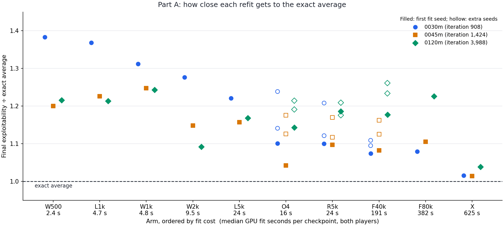
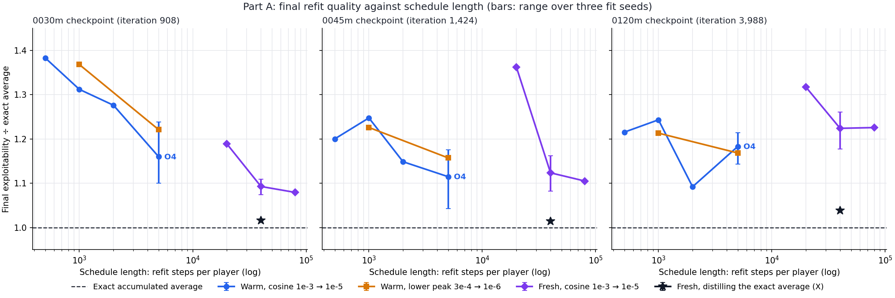
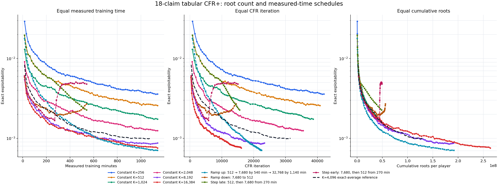
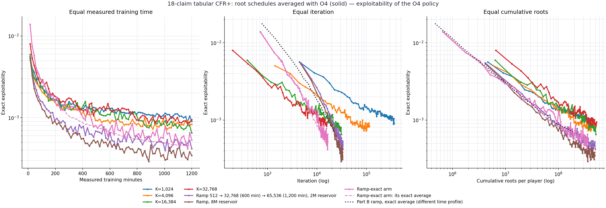

# 18-claim: average-fit schedules, traversal schedules and regret-fit noise

## Why these three together

Recent 18-claim results changed what limits neural CFR+:

- **The online average network was the largest error.** A warm refit at each checkpoint with a cosine learning-rate decay and large batches (**O4**: 5,000 steps per player, batch 16,384, cosine `1e-3` → `1e-5`, weighted cross-entropy) brought the average from about **5×** the exact average's exploitability to about **1.15×**. See the [optimizer and objective study](2026-10-01_00-58-40_18_claim_average_fit_optimizer_and_objective.md).
- **With exact averaging, more roots help a lot.** Sampled tabular regrets with 4,096 roots and an exact average (`exact4096`) reached 0.0028 by about 4,000 iterations and 0.0013 by 16,800. That matches exact full-tree CFR+ per iteration (0.00197 at 10,350). With 1,024 roots it was about 3× worse per iteration. Under the old online neural average, the two root counts looked the same. See the [discounting note](2026-09-30_00-55-09_18_claim_tabular_discounting.md) and the batched bridge controls.
- **With O4 averaging, the regret network is now the main neural cost.** At about 1,450 iterations with 4,096 roots, tabular regrets with an exact average scored 0.0044. Neural regrets with O4 scored 0.0090 ([neural O4 run](2026-10-01_07-56-40_18_claim_neural_o4_refit_cpu.md)). Allowing about 1.15× for O4 itself, the regret network costs roughly **1.75×**.

This experiment has three independent parts. All are evaluated **exactly**. They are designed to run unattended for several hours.

| Part | Question | Hardware |
| --- | --- | --- |
| A | Can the O4 refit be made cheaper or better, and is a fresh refit as good as a warm one? | GPU, offline, about 1–2 hours |
| B | Does increasing roots over training beat a constant root count at equal total samples? | CPU |
| C | Is the regret network limited by optimizer noise, as the average network was? | GPU, long training runs |

Lower exploitability is better throughout. All runs use the 18-claim game: `ranks=4, suits=4, hand_size=2`, claims `RankHigh`, `Pair`, `TwoPair`, `Trips`, with suit symmetry. **Reuse the existing runners and launch pattern** (resume-safe state files, rolling checkpoints, separate exact evaluators, dashboards). Extend them with options rather than writing new tooling.

## Part A: average-fit schedules (GPU, offline)

### What we know

- During O4's first ~2,500 steps the learning rate is still near `1e-3`. Over that stretch it behaves like O3 (constant `1e-3`, batch 16,384), whose exploitability **and training loss rise** after about 250 steps. That is an optimization problem, not overfitting.
- A plausible mechanism: the warm-started Adam state carries second-moment estimates from noisy batch-1,024 gradients. As those adapt to quieter large-batch gradients, over about 1,000 steps at β₂ = 0.999, Adam's normalised step grows and the parameters wander. The final anneal then has to undo this.
- A **fresh** O4 fit, with cosine over 20,000 steps, was still improving steeply at the end. It reached 0.0062 / 0.0060 / 0.0037 against warm O4's 0.0058 / 0.0046 / 0.0032. At 30 minutes its reach-weighted action distance to the exact average was lower than warm O4's (0.0057 against 0.0071).

### Arms

Use the three preserved `exact4096` checkpoints in `artifacts/cfr_plus_18_offline_average_study/` (iterations 908, 1,424 and 3,988) and the existing harness, [`run_cfr_plus_18_average_fit_optimizer_experiment.py`](../../../scripts/run_cfr_plus_18_average_fit_optimizer_experiment.py). Batch 16,384 and weighted cross-entropy throughout unless stated. Cosine schedules span each arm's full length.

| Arm | Start | Learning rate | Total steps per player | Purpose |
| --- | --- | --- | ---: | --- |
| W500 | Warm | cosine `1e-3` → `1e-5` | 500 | Short anneal |
| W1k | Warm | cosine `1e-3` → `1e-5` | 1,000 | Short anneal |
| W2k | Warm | cosine `1e-3` → `1e-5` | 2,000 | Medium anneal |
| L1k | Warm | cosine `3e-4` → `1e-6` | 1,000 | Lower peak |
| L5k | Warm | cosine `3e-4` → `1e-6` | 5,000 | Lower peak, O4 length |
| R5k | Warm weights, **fresh Adam state** | as O4 | 5,000 | Tests the second-moment explanation |
| F40k | Fresh | cosine `1e-3` → `1e-5` | 40,000 | Longer fresh fit |
| F80k | Fresh | cosine `1e-3` → `1e-5` | 80,000 | Longer fresh fit |
| X | Fresh | cosine `1e-3` → `1e-5` | 40,000 | **Distil the exact average** (see below) |

For **R5k**, also run it at **constant** `1e-3` for its first 1,000 steps and evaluate at 250 and 1,000 steps. If the rise seen in O3 after about 250 steps disappears when Adam starts fresh, the second-moment explanation is supported.

**Arm X: exact-average distillation.** Train on targets from the checkpoint's **exact average table** rather than the reservoir. Each training row is a (history, hand) information set with the exact average strategy as its target. Sample rows with probability proportional to the exact average's own reach times the hand's chance probability; equivalently, use that product as the row weight. Same network, loss and schedule as F40k.

- If X reaches about 1.0× exact, the remaining 1.1–1.2× gap of reservoir fits is **reservoir sampling noise**: rare information sets are represented by too few iterations. The fix is a larger reservoir, not a better optimizer.
- If X also stalls near 1.1×, the limit is the network or optimizer.

### Measurements

- Exact exploitability at each arm's end. For warm arms, also at 25%, 50% and 75% of their length. For fresh arms, also at 10k, 20k and 40k steps.
- **Loss on the whole reservoir**, a full deterministic pass, at every evaluated point. Per-batch losses in the logs are too noisy to separate instability from overfitting.
- Reach-weighted and uniform action distance to the exact average.
- Fit wall time on the GPU.
- Two extra minibatch seeds for the best warm arm and the best fresh arm, at all three checkpoints.

The listed milestones across three checkpoints plus the extra seeds require about 120 exact evaluations. The earlier 50-evaluation and 1–2-hour estimates were too low; read measured fit and evaluation time from the logs.

### How to read Part A

| Observation | Interpretation |
| --- | --- |
| W500/W1k or L1k match O4 | Use the cheaper refit. Each snapshot's average then costs seconds. |
| L5k beats O4 | The high-rate middle phase hurt. Use a lower peak. |
| R5k does not degrade after ~250 steps at constant `1e-3` | Stale Adam statistics caused the O3/O4 mid-run rise. Reset the optimizer state before refitting. |
| F40k/F80k match or beat warm O4 | Fit from scratch at snapshot time. Online average training can be removed. |
| X ≈ 1.0× exact, refits ≈ 1.1–1.2× | The residual gap is reservoir sampling. Next: a larger reservoir (the 16 GB GPU can hold 10–20 million records). |

## Part B: traversal schedules with exact averaging (CPU)

### Why

In `exact4096` and the bridge, regrets are **stored exactly in a table**; there is no regret network. Each iteration's regret increment at a visited information set is the mean sampled conditional advantage. More roots per iteration give:

1. **Less noise in that mean**, and therefore less upward bias when aggregate-then-clip clips it near zero. This appears to be the dominant effect.
2. **More coverage:** more information sets are visited and updated each iteration.

The exact average compiles the current strategy at **every** information set each iteration, including unvisited ones, whose table rows are unchanged. It adds that strategy weighted by own reach and by `t`. It is the true linear average.

Linear averaging gives late iterations the most weight, so their noise matters most. Spending more roots late should therefore beat spending them evenly. This part tests that cleanly, without a network.

### Design

Use seed 17, sampled tabular CFR+ (cumulative conditional mean, aggregate then clip), and exact linear averaging. Each of the **10 arms runs for 9 measured training hours**. There is no iteration limit or total-root budget: arms may complete different numbers of iterations and consume different root counts. Checkpointing and exact exploitability evaluation are outside the training-time budget. The trainer creates no regret or strategy networks, optimizer state, or neural average replay. Exploitability snapshots are scheduled every 15 measured training minutes. The historical `exact4096` run remains a reference, not a rerun.

| Arm | Roots per player | What it isolates |
| --- | --- | --- |
| Constant K=256, 512, 1,024, 2,048, 8,192, 16,384 | Fixed at the named K for every iteration | Sampling density and state coverage under equal training-time budgets. Iteration counts and total roots will differ. |
| Ramp up | K increases linearly from 512 to 7,680 over the 9-hour measured-training clock, rounded to multiples of 64 | Allocates more roots to later training time. |
| Ramp down | K decreases linearly from 7,680 to 512 over the same clock | Reverses the ramp-up order. |
| Step late | K=512 for the first 4.5 measured hours, then 7,680 | Allocates more roots to later training time. |
| Step early | K=7,680 for the first 4.5 measured hours, then 512 | Reverses the step-late order. |

Every arm starts from scratch with the same seed and exact average; checkpoints are resumable and evaluations run outside the training workers. The four dynamic arms choose K from elapsed measured training time, not iteration number. Their root totals are not constrained to match each other or a reference run: per-iteration costs vary with K, and each arm stops after nine measured training hours.

### Measurements

- Exact exploitability of the exact average every **15 measured training minutes**, including the endpoint at nine hours. Evaluations run in separate CPU worker processes; the training loop commits a policy snapshot and rolling checkpoint at each scheduled point.
- Plotted against **measured training minutes**, **iteration**, and **cumulative roots per player**. The time axis compares equal training budgets; iteration and cumulative roots show how much work each K choice completes in that time.
- Per-iteration visited-information-set count and rows per visited information set, to separate the noise and coverage effects.

### How to read Part B

| Observation | Interpretation |
| --- | --- |
| Higher constant K gives better exploitability after nine hours | Denser sampling may justify the lower iteration rate at this compute budget. Compare the iteration and cumulative-root plots to see the cost. |
| Ramp up beats ramp down after nine hours | Increasing K over training time may help later updates; check how their iteration counts and root totals differ. |
| Step late beats step early after nine hours | Allocating higher K later may help, but the arms need not use equal total roots. |
| Arms are similar by time but differ by iteration or roots | The result depends on wall-clock efficiency as well as per-iteration learning; the three x-axes separate these views. |

## Part C: regret-fit noise (GPU, long runs, O4 averaging)

### Hypothesis

The regret network is trained exactly as the average network used to be: constant learning rate `1e-3`, batch 1,024, 24 steps per player update, never annealed. Each update therefore ends at a noisy point. Unlike the average, the regret network's output **sets the current policy directly**, through `max(0, ·)`:

- noise around a true regret of zero becomes spurious positive regret;
- clipping turns that noise into a **systematic** upward bias, which iterations do not average away.

The earlier fit-steps sweep found no gain from more steps (24, 96 and 384 at the same learning rate). That is consistent with this hypothesis: more steps do not lower the noise floor; a lower rate or a larger batch does. That sweep was also averaged with the noisy online average network.

### Arms

All four arms run from scratch, seed 17, with:

- 4,096 roots per player;
- cumulative conditional `aggregate_then_clip` with plain MSE (`regret_positive_weight=0`);
- 512×512 regret networks and 256×256 strategy networks;
- six online strategy steps;
- 4,000,000-row regret buffer, 2,000,000-row strategy reservoir, linear averaging.

This is the recipe of `neural_o4_k4096`, moved to **CUDA**: [`run_cfr_plus_18_neural_o4_cpu.py`](../../../scripts/run_cfr_plus_18_neural_o4_cpu.py) selects CUDA for the four `c_*` arms. The CUDA guard already allows `aggregate_then_clip` for this spec. Only the regret fit differs:

| Arm | Regret learning rate per player update | Regret batch | Steps |
| --- | --- | ---: | ---: |
| C0 baseline | constant `1e-3` | 1,024 | 24 |
| C-batch | constant `1e-3` | 8,192 | 24 |
| C-anneal | cosine `1e-3` → `1e-4` **within each update**, restarting every update | 1,024 | 24 |
| C-low | constant `3e-4` | 1,024 | 24 |

C-anneal restarts the schedule every iteration. That ends each update at a low rate while still allowing large moves early in the update. The warm-started Adam state carries over as now.

**Averaging.** Every 30 measured minutes, freeze the strategy reservoir and online average network. Run an O4 refit, or the Part A winner if Part A finishes first, **on the GPU**: seconds, against about 15 minutes on CPU. Evaluate both the online and refitted averages exactly on CPU. Comparisons use the **refitted** average; the online value is recorded for continuity.

**Budget.** 8 measured hours per arm, all four concurrently on the one RTX 4060 Ti. Alone, this trainer took about 0.33 s per iteration on the card. Sharing it, expect perhaps 1–1.5 s per arm. That is still well over 10,000 iterations per arm, against about 9,000 in 10 hours for the CPU K=4,096 run. Compare arms **by iteration**: concurrent arms slow each other unequally (C-batch uses more GPU). Record each arm's standalone cost per iteration from a short isolated benchmark.

### Measurements

- Exact exploitability of the refitted and online averages every 30 minutes.
- **Current-policy** exploitability at the same snapshots. The regret network's noise should show up there first.
- At three points (about 2,000, 6,000 and the final iteration), the one-iteration regret-fit diagnostics from the [GPU schedules note](../../explainers/gpu_training_schedules.md):
  - held-out fit error on an independent traversal;
  - distance to the exact one-step target;
  - policy drift at unvisited information sets.

### How to read Part C

| Observation | Interpretation |
| --- | --- |
| C-batch, C-anneal or C-low beat C0 at matched iterations, and current-policy exploitability falls | The regret network was limited by optimizer noise. Adopt the cheapest winning setting; for C-batch, check its GPU cost. |
| Only current-policy exploitability improves | The noise affected iterate quality but averaging was already absorbing it. Check whether the refitted average gains later. |
| No arm beats C0 | Optimizer noise is not the regret bottleneck. Next suspects: interference at unvisited information sets (from the drift diagnostic), target noise (larger K, using Part B's schedule), or capacity (1,024-wide networks are affordable on the GPU). |
| Any arm approaches the tabular-plus-exact curve (`exact4096`: 0.0028 at 4,000, 0.0013 at 16,800 iterations) | The neural regret representation is nearly as good as a table here. Scaling to 30 claims is the next step. |

## Launch order and resources

1. **Before leaving: smoke-test all three parts.**
   - Part C: two CUDA iterations per arm, plus one 100-step GPU refit.
   - Part A: one short arm on one checkpoint.
   - Part B: the network-free stop/resume check passed before the full run was launched.
2. **Start Part C** on the GPU first; it is the main overnight job.
3. **Start Part A** concurrently on the GPU. It is short and offline. Its winner can replace O4 in Part C's later averages if the runner can reload the recipe at a snapshot boundary; otherwise keep O4 for consistency.
4. **Part B** uses ten CPU workers (8 threads each) plus four exact-evaluation workers. The launcher requires at least 16 GiB free before creating sessions. Each arm retains one rolling checkpoint. A shared lock serializes checkpoint rewrites so their temporary copies do not all coexist.
5. **Disk.** About 17 GB was free on 1 October. Budget:
   - Part C: four rolling checkpoints of about 0.7 GB, plus one transient frozen fit input per arm;
   - Part B: ten rolling tabular checkpoints; after startup they total about 4.5 GiB. They contain no neural weights, optimizers, or strategy replay. A shared lock serializes atomic checkpoint writes; policy snapshots and logs add further storage over the nine-hour runs.
   - Part A: policies only.

   That totals roughly 8–9 GB. Keep one rolling checkpoint per run and delete frozen fit inputs after use, as the current runner does. Every runner should refuse a checkpoint write when free space falls below 3 GB rather than fail midway.
6. **Monitoring.** The Part B arms appear in the existing port-8769 dashboard, alongside the historical K=4,096 reference.

## Results

### Part A: average-fit schedules

**Status: complete.** All ten arms ran at all three checkpoints, plus two extra fit seeds for R5k and F40k. Results are in `artifacts/cfr_plus_18_average_fit_schedules/main_20261001/` on the VM, with local copies in [`docs/data/cfr_plus_18_average_fit_schedules_20261001/`](../../data/cfr_plus_18_average_fit_schedules_20261001). O4, its seeds and the 20,000-step fresh fit come from the earlier [optimizer and objective study](2026-10-01_00-58-40_18_claim_average_fit_optimizer_and_objective.md) on the same checkpoints. [`plot_cfr_plus_18_average_fit_schedules.py`](../../../scripts/plot_cfr_plus_18_average_fit_schedules.py) regenerates both figures.

#### Summary

- **The remaining averaging gap is in the reservoir data, not the fit.** Distilling the checkpoint's exact average table (X) reaches **1.01–1.04×** the exact average. Every fit to the 2,000,000-record reservoir, warm or fresh, short or long, ends at about 1.1–1.2×.
- **Among reservoir fits, the schedule barely matters.** O4, R5k, F40k and F80k are tied within seed noise. Shorter warm anneals are slightly worse at the earliest checkpoint and indistinguishable later.
- **Keep O4** (about 20 GPU seconds). A fresh 40k fit is equally good at about 190 seconds, so the online averager could be dropped from training if that is ever useful.
- **The stale-Adam explanation for O3/O4's mid-fit rise is rejected.** A constant `1e-3` rate degrades even with a fresh Adam state (R1k), and resetting Adam before an annealed fit (R5k) changes nothing.

#### Final values

Final exploitability divided by the exact accumulated average from the same checkpoint (0.005249, 0.004408 and 0.002836). For O4, R5k and F40k, the value is the mean of three fit seeds. GPU seconds are the median total fit time per checkpoint, for both players.

| Arm | What it is | GPU s | 30 min | 45 min | 120 min |
| --- | --- | ---: | ---: | ---: | ---: |
| W500 | Warm, cosine `1e-3` → `1e-5`, 500 steps | 2.4 | 1.38 | 1.20 | 1.22 |
| L1k | Warm, cosine `3e-4` → `1e-6`, 1,000 steps | 4.7 | 1.37 | 1.23 | 1.21 |
| W1k | Warm, cosine, 1,000 steps | 4.8 | 1.31 | 1.25 | 1.24 |
| W2k | Warm, cosine, 2,000 steps | 9.5 | 1.28 | 1.15 | **1.09** |
| L5k | Warm, cosine `3e-4` → `1e-6`, 5,000 steps | 24 | 1.22 | 1.16 | 1.17 |
| O4 (3 seeds) | Warm, cosine, 5,000 steps | 16 | 1.16 | 1.12 | 1.18 |
| R5k (3 seeds) | Warm weights, fresh Adam, as O4 | 24 | 1.14 | 1.13 | 1.19 |
| F40k (3 seeds) | Fresh, cosine, 40,000 steps | 191 | **1.09** | 1.12 | 1.22 |
| F80k | Fresh, cosine, 80,000 steps | 382 | 1.08 | 1.10 | 1.23 |
| **X** | Fresh, 40,000 steps, **targets from the exact average table** | 625 | **1.02** | **1.01** | **1.04** |
| R1k (constant) | Fresh Adam, constant `1e-3`, 1,000 steps | 3.6 | 2.47 | 1.82 | 4.25 |

**Seed noise.** O4's three fit seeds span 1.04–1.24 at 45 minutes, and the spread is similar elsewhere. Single-seed differences below about 0.1 are not meaningful; W2k's 1.09 at 120 minutes is probably a lucky seed. GPU timings were measured while Part C shared the card, and O4's comes from the earlier study, so treat them as indicative.

*Each column is one arm, ordered by GPU fit time. Colours are checkpoints. Filled markers are the first fit seed; hollow markers are the two extra seeds. The dashed line is the exact accumulated average.*

*Each point is a separate fit, read at the end of its schedule; lines join schedules of different lengths. Bars span the three fit seeds where they exist (O4 at 5k, F40k at 40k). The dashed line is the exact accumulated average.*

How to read it:

- **Warm fits (blue, orange):** at 30 minutes, longer anneals help steadily, from 1.38× at 500 steps to 1.16× at 5,000. At 45 and 120 minutes, every warm schedule from 500 to 5,000 steps falls inside or near O4's seed range. A lower peak rate (orange) is never better by more than seed noise, and is slightly worse at 30 minutes.
- **Fresh fits (purple):** 20,000 steps is clearly too few; 40,000 reaches the warm level; 80,000 adds nothing.
- **X (star)** sits below every reservoir fit at every checkpoint, using the same network, optimizer and schedule as F40k.

Intermediate evaluations within each schedule were also recorded. They mostly show that a cosine fit is erratic while its learning rate is high (F80k is worse at 40,000 steps than at 20,000 at all three checkpoints) and only settles in the annealing tail. Only end-of-schedule values are meaningful, which is why they are not plotted.

#### Interpretation

1. **The remaining averaging gap is reservoir data.** X and F40k differ only in their targets: X samples (history, hand) rows from the exact average table, in proportion to own reach times chance; F40k samples the strategy reservoir. That difference includes both the reservoir's sampling noise (rare information sets represented by few iterations) and its coverage (information sets it never saw). This experiment does not separate the two.
2. **Reservoir loss is a poor guide.** The full-pass reservoir cross-entropy at 120 minutes is 0.1986–0.1989 (player 1) for every annealed arm, including X, while exploitability ranges from 0.0030 to 0.0035. Fitting the reservoir better does not mean fitting the exact average better.
3. **The optimizer recipe is settled.** No schedule beat O4 beyond seed noise, so more optimizer tuning is unlikely to pay.

#### Decisions

| Question from the plan | Answer |
| --- | --- |
| Can the refit be cheaper? | On the GPU, O4 already costs about 20 s. If a cheaper average fit is needed, W2k (about 10 s) is close; W500/W1k are slightly worse early in training. |
| Does a lower peak help? | No clear effect. Keep O4's `1e-3` peak. |
| Is stale Adam the cause of the mid-fit rise? | No. A constant `1e-3` is simply too high to settle at this batch size; the annealing tail fixes it. |
| Can a fresh fit replace the online averager? | Only in short runs. F40k ≈ O4 up to 4k iterations. On `exact4096`'s 31.5k-iteration checkpoint, F40k was 2.30× the exact average, against O4's 1.24× ([long-run check](2026-10-02_12-29-46_18_claim_average_fit_long_run_check.md)). Keep the online averager as the warm start. |
| Is the residual gap the reservoir? | Yes: its sampling noise or coverage, not the fit. |

**Next step for averaging:** test reservoir size. The preserved checkpoints only hold 2,000,000-record reservoirs, so this needs new trajectories: for example, `exact4096` reruns to about 1,500 iterations with 2M, 8M and 20M strategy records, each refit with O4 and compared with its exact average. The 16 GB GPU can hold 10–20 million records. At 30 and 69 claims no exact table exists to distil, so reservoir size, not distillation, is the lever that scales.

### Part B results

**Status: complete.** All ten arms ran 540 measured training minutes. All use seed 17, tabular cumulative conditional regrets, aggregate then clip, and an exact linear average. Exact exploitability was evaluated every 15 measured minutes. The dashed black reference is the separate K=4,096 exact-average control (`exact4096`), which continued to 1,080 minutes.

#### Summary

- **With a table, exploitability depends almost only on the total number of roots.** At matched cumulative roots per player, every constant K from 256 to 16,384 lands within about 15% of the others. Splitting the same samples into many small iterations or a few large ones makes little difference.
- **Higher K wins at equal time mainly because each iteration has a fixed cost.** The exact average costs about 1.4–1.8 s per iteration whatever K is. Traversal costs about 0.16 ms per root. At K=256, averaging is about 97% of each iteration.
- **The final result is set by the most recent K. Lowering K late is harmful, and quickly.** Within 505 iterations of dropping from K=7,680 to 512, step-early went from 0.00168 to 0.00301. By the end it had rejoined the constant K=512 curve.
- **Ramp-up was the best schedule per root, 1.2–1.4× better than any constant K** between 18M and 50M roots per player.
- **No K-dependent floor is visible.** Every table arm, K=256 included, still falls at a log-log slope of about −0.5 against iterations at the end of its run. That is the Monte Carlo rate, about 1/√(samples). Exact full-tree CFR+ falls at about −0.75.

*Each panel has a logarithmic exploitability axis. Left: equal measured training time. Middle: equal iteration count. Right: equal total roots per player. Solid lines are fixed K; dashed coloured lines change K over measured time. The dashed black line is the K=4,096 reference. Colours match the 8769 dashboard.*

| Arm | Iterations | Roots per player (millions) | Final exploitability |
| --- | ---: | ---: | ---: |
| Constant K=256 | 19,662 | 5.03 | 0.005299 |
| Constant K=512 | 19,246 | 9.85 | 0.003863 |
| Constant K=1,024 | 18,116 | 18.55 | 0.002805 |
| Constant K=2,048 | 16,723 | 34.25 | 0.001834 |
| Constant K=8,192 | 11,210 | 91.83 | 0.001153 |
| Constant K=16,384 | 7,767 | 127.25 | **0.001067** |
| Ramp up: 512 to 7,680 | 14,674 | 53.76 | 0.001190 |
| Ramp down: 7,680 to 512 | 14,494 | 56.00 | 0.002695 |
| Step late: 512, then 7,680 | 15,598 | 48.52 | 0.002265 |
| Step early: 7,680, then 512 | 15,068 | 49.43 | 0.004779 |

The step arms switched at 270 measured minutes: iteration 9,944 for step-late, 5,821 for step-early. The K=4,096 reference reached 0.001264 at 540 minutes (17,855 iterations) and 0.001005 at 1,080 minutes (31,538 iterations).

#### Samples, not iterations, set the result

Exploitability of the constant-K arms, interpolated at matched cumulative roots per player:

| Roots per player | 5M | 10M | 18M | 34M | 50M |
| --- | ---: | ---: | ---: | ---: | ---: |
| Range across constant K | 0.0045–0.0054 | 0.0033–0.0038 | 0.0026–0.0029 | 0.0018–0.0020 | 0.0015–0.0016 |
| Constant K included | 256–16,384 | 1,024–16,384 | 1,024–16,384 | 2,048–16,384 | 8,192–16,384 |
| Ramp up | 0.0045 | 0.0031 | 0.0022 | 0.0015 | 0.0012 |

Across this range, exploitability falls roughly as (total roots)^−0.55, whatever K is. That is what pure sampling noise would predict: the table averages away the noise in its increments, and only the number of samples matters.

**What this means for the time panel.** Because samples are interchangeable, the best K is set by fixed per-iteration costs. In this run that cost is the exact average. In a neural run it is the regret fit plus the average fit. With the fixed cost removed, K=256 would run about 30 times more iterations and match the high-K arms. The left panel's ordering therefore says more about the exact averager's cost than about sampling.

#### Order matters: the average forgets old phases quickly

Exploitability is convex in the average strategy. With linear weights, the iterates before t₀ hold a fraction (t₀/T)² of the average at T. Writing E for exploitability, with "earlier" and "later" meaning the averages over iterates before and after t₀, this gives a lower bound on how bad the new iterates must be:

E(later) ≥ [E(at T) − (t₀/T)² · E(earlier)] / [1 − (t₀/T)²]

- **Step-early, 7,680 → 512.** From iteration 5,820 (0.00168) to 6,325 (0.00301), the old iterates still held 85% of the weight. The 505 new iterates must therefore average **at least 0.010**. By iteration 15,000 the arm sits on the constant K=512 curve (0.0048 against 0.0045). The 5,800 high-K iterations are effectively erased.
- **Step-late, 512 → 7,680.** After its switch it fell from 0.00515 to 0.00227. That is roughly the rate at which new iterates dilute the old ones. It ended well above constant K=8,192, because the K=512 phase still held about 40% of the weight.
- **Ramp-down** began rising at about 285 minutes, while K was still about 3,900. By the end it was back at 0.0027.

The average mainly reflects roughly the last third of training. **K schedules should never decrease.** Cheap noisy iterations early cost little, because they end up with little weight.

#### Ramp-up

Ramp-up is the only schedule that beats the constant-K curve at matched roots: by 1.2–1.4× from 18M to 50M roots (table above). That follows from the previous point. Early iterations are cheap and noisy but end up with little weight; late iterations are clean and carry most of it. This is one seed, so the best ramp shape is still open.

#### A yardstick for the regret network

Neural regrets averaged with O4 ([neural O4 run](2026-10-01_07-56-40_18_claim_neural_o4_refit_cpu.md)), divided by about 1.15 for O4 against an exact average, sit between the K=1,024 and K=2,048 tables at matched iterations:

| Iteration | Neural K=4,096, exact-equivalent | Table K=1,024 | Table K=2,048 | Table K=4,096 |
| ---: | ---: | ---: | ---: | ---: |
| 4,000 | 0.0046 | 0.0057 | 0.0040 | 0.0028 |
| 8,000 | 0.0035 | 0.0043 | 0.0027 | 0.0021 |
| 12,000 | 0.0028 | 0.0034 | 0.0022 | 0.0016 |

Over this range, the regret network costs about as much as cutting a table's roots from 4,096 to about 1,500.

#### Caveats

- One seed per arm.
- All of this is tabular. A neural run might trade K against iterations differently, because each iteration also carries fitting error.
- The step arms used K=512 and 7,680, the same endpoints as the ramps. Earlier drafts of this plan said 1,024 and 7,168.

#### Next steps

- **A neural run with a ramp-up schedule**, compared with neural K=4,096 using the same O4 averaging. Queue it after the regret-network diagnosis in Part C, because a ramp would help without explaining the network's cost.
- **For tables, no further K work is needed.** Use a ramp or a large constant K, and keep the exact average's fixed cost in mind when comparing by time.

The metrics and final summaries are in [`cfr_plus_18_root_schedules_20261002`](../../data/cfr_plus_18_root_schedules_20261002). [`plot_cfr_plus_18_root_schedules.py`](../../../scripts/plot_cfr_plus_18_root_schedules.py) regenerates the figure.

### Follow-up: 10-hour continuation

On 2 October, the six fixed-K arms and the ramp-up arm were resumed from their 540-minute rolling checkpoints for **another 600 measured training minutes each**. The K=4,096 historical reference and the other three dynamic schedules are not resumed. The fixed arms keep their original K; evaluation remains every 15 measured minutes and uses the same exact-average evaluator queue.

The ramp-up preserves its original path from K=512 to K=7,680 over minutes 0–540. It then increases linearly from K=7,680 at minute 540 to K=32,768 at minute 1,140, rounded to multiples of 64. This avoids rescaling the completed part of the run or dropping K at the continuation boundary. The continuation reuses each arm's checkpoint and appends to its training/evaluation logs and plot series. See [`continue_cfr_plus_18_root_schedules.sh`](../../../scripts/continue_cfr_plus_18_root_schedules.sh) for the launcher.

**Status: complete (3 October).** All seven arms reached 1,140 measured minutes. The figure above now includes the continuation. The ramp-up's legend gives its full schedule.

| Arm | At 540 min | At 1,140 min | Iterations | Roots per player (millions) |
| --- | ---: | ---: | ---: | ---: |
| Constant K=256 | 0.00530 | 0.00359 | 42,012 | 10.8 |
| Constant K=512 | 0.00386 | 0.00258 | 40,746 | 20.9 |
| Constant K=1,024 | 0.00281 | 0.00175 | 38,646 | 39.6 |
| Constant K=2,048 | 0.00183 | 0.00125 | 35,523 | 72.8 |
| Constant K=8,192 | 0.00115 | 0.00087 | 23,368 | 191.4 |
| Constant K=16,384 | 0.00107 | 0.00076 | 16,083 | 263.5 |
| **Ramp: 512 → 7,680 → 32,768** | 0.00119 | **0.00071** | 22,507 | 191.7 |

The K=4,096 reference (`exact4096`) reached 0.00100 at 1,080 minutes.

#### What the continuation shows

**1. The constant-K arms show no floor.** Every arm kept falling at about the Monte Carlo rate over twice as many iterations. Log-log slopes against iteration over the second half of the continuation:

| K=256 | K=512 | K=1,024 | K=2,048 | K=8,192 | K=16,384 | `exact4096` (24k–31.5k) |
| ---: | ---: | ---: | ---: | ---: | ---: | ---: |
| −0.51 | −0.54 | −0.71 | −0.56 | −0.27 | −0.55 | −0.27 |

K=256 reached 0.0036, below the roughly 0.004 where a floor scaling as 1/√K (calibrated on `exact4096`) would have stopped it. `exact4096` and K=8,192 did slow down near 0.0009–0.0010. But K=16,384 and the ramp went straight through that level (0.00076 and 0.00071), so it is not a shared floor. These were probably temporary shelves. Any floor is weak, and below what these runs resolve.

**2. Exploitability still depends almost only on total roots.** Constant-K arms at matched cumulative roots per player:

| Roots per player | 20M | 70M | 130M | 190M |
| --- | ---: | ---: | ---: | ---: |
| Range across constant K (and `exact4096`) | 0.0024–0.0027 | 0.00124–0.00137 | 0.00098–0.00108 | 0.00087–0.00090 |
| Ramp | 0.00205 | 0.00105 | 0.00080 | 0.00071 |

From 10M to 260M roots, the constant arms follow about (total roots)^−0.5 to within roughly 15%.

**3. The ramp is the best schedule by every measure.**
- **Per root:** 1.15–1.3× better than any constant K, at every roots level.
- **At equal time:** best at 1,140 minutes.
- **By iteration:** it fell at about −1.2 in log-log during the continuation, faster than exact full-tree CFR+ (about −0.75). That follows from point 2. With K growing in proportion to elapsed time, total roots grow roughly like t², so exploitability ∝ 1/√roots gives about 1/t.

**Rule for choosing K:** increase K roughly in proportion to training progress, and never decrease it. The upper limit is set by what one iteration can afford.

### Follow-up: Part B with O4 averaging (running)

**Status: complete (4 October).** All seven arms ran to 1,200 measured minutes (600, then extended to 1,200). Results below.

#### Results (complete: 1,200 measured minutes, 4 October)

All seven arms ran 600 measured minutes, then were extended to 1,200. In the extension, the ramps continued from K=32,768 at minute 600 to K=65,536 at minute 1,200; constant arms kept their K. Data: [`cfr_plus_18_root_o4_followup_20261003`](../../data/cfr_plus_18_root_o4_followup_20261003). Figure: [`plot_cfr_plus_18_root_o4_followup.py`](../../../scripts/plot_cfr_plus_18_root_o4_followup.py). Colours follow the 8772 dashboard.

*Solid lines: exact exploitability of the O4 policy at each 15-minute snapshot. Pink dashed: the ramp-exact arm's own exact average. Black dotted: Part B's exact-average ramp, which followed a different time profile, so it is a rough reference only.*

| Arm | Iterations | Roots per player | O4, mean of last hour | O4 at 1,200 min | Online at 1,200 min |
| --- | ---: | ---: | ---: | ---: | ---: |
| K=1,024 | 364,997 | 374M | 0.00100 | 0.00090 | 0.0063 |
| K=4,096 | 116,048 | 475M | 0.00086 | 0.00083 | 0.0044 |
| K=16,384 | 31,121 | 510M | 0.00076 | 0.00065 | 0.0059 |
| K=32,768 | 16,041 | 526M | 0.00088 | 0.00094 | 0.0077 |
| Ramp, 2M | 33,517 | 496M | 0.00049 | 0.00042 | 0.0039 |
| **Ramp, 8M** | 33,119 | 486M | **0.00034** | **0.000345** | 0.0028 |
| Ramp-exact | 16,608 | 359M | 0.00054 | 0.00054 (exact average 0.00045) | 0.0078 |

O4 by cumulative roots per player (log-interpolated):

| Arm | 50M | 100M | 200M | 300M | 400M |
| --- | ---: | ---: | ---: | ---: | ---: |
| K=1,024 | 0.00180 | 0.00147 | 0.00121 | 0.00107 | – |
| K=4,096 | 0.00191 | 0.00129 | 0.00093 | 0.00085 | 0.00076 |
| K=16,384 | 0.00210 | 0.00144 | 0.00119 | 0.00102 | 0.00088 |
| K=32,768 | 0.00271 | 0.00168 | 0.00148 | 0.00125 | 0.00101 |
| Ramp, 2M | 0.00129 | 0.00091 | 0.00066 | 0.00057 | 0.00051 |
| **Ramp, 8M** | **0.00105** | **0.00073** | **0.00050** | **0.00043** | **0.00035** |

**1. The ramp wins clearly, and keeps improving.**
- At 1,200 minutes, the ramps are at 0.00034–0.00049 (last-hour means), against 0.00076–0.00100 for every constant K.
- At matched roots they are 1.4–2.2× better than the best constant K. Under exact averaging in Part B, the margin was 1.15–1.3×.
- The 8M ramp fell from 0.00048 to 0.00034 between 600 and 1,200 minutes. That is **the best 18-claim result so far**, about 3× below `exact4096`'s exact average at 31.5k iterations (0.0010).

**2. The 8M reservoir is consistently better.** After 600 minutes, the 8M ramp is below the 2M ramp in **39 of 41** snapshots, at a median of **0.79×**. At matched roots it is 0.7–0.8× throughout.

**3. With O4 averaging, constant K no longer orders by time, and extremes are worse per root.**
- At equal time the constant arms end within 0.00076–0.00100 of each other.
- Per root, K=4,096 is best of the constants. K=1,024 and K=32,768 trail it: at 200M roots, 0.00121 and 0.00148 against 0.00093.
- With exact averaging (Part B), roots set the result almost regardless of K. So the averaging step is what penalises very small and very large K.
- **Why very large K is penalised is not settled.** O4 starts from the online network, which gets six steps per iteration, so fewer, larger iterations mean fewer steps per record. Alternatively, it could be the reservoir's composition: few iterations, each represented by many records. These runs don't separate the two.

**4. O4 against the exact average, measured directly in the ramp-exact arm:**

| Minutes | 0–120 | 120–240 | 240–360 | 360–480 | 480–600 | 600–720 | 720–840 | 840–960 | 960–1,080 | 1,080–1,200 |
| --- | ---: | ---: | ---: | ---: | ---: | ---: | ---: | ---: | ---: | ---: |
| O4 ÷ exact (geometric mean) | 0.99 | 1.03 | 1.22 | 1.29 | 1.01 | 1.15 | 1.18 | 1.21 | 1.21 | 1.19 |

With a 2M reservoir, O4 sits about 1.2× above the exact average for most of a long ramped run, much as at fixed checkpoints in Part A. **This corrects the interim reading.** O4 only matched or beat the exact average in the first few hours; it does not beat it in general.

The 8M ramp's O4 (0.00043 at 300M roots, 0.00035 at 400M) is roughly equal to the ramp-exact arm's exact average at similar roots (0.00045 at 359M). The trajectories differ, so this is only indicative. A larger reservoir appears to close most of O4's remaining gap to exact.

**5. Why the ramp-exact arm looks so good by iteration.** Its ramp follows measured time, and its exact average makes each iteration slower. So at a given iteration it is much further along its schedule, at much higher K:

| Iteration | K, plain ramp | K, ramp-exact | Roots so far, plain ramp | Roots so far, ramp-exact |
| ---: | ---: | ---: | ---: | ---: |
| 2,500 | 896 | 3,712 | 1.7M | 5.1M |
| 5,000 | 1,408 | 8,064 | 4.5M | 19.5M |
| 10,000 | 3,008 | 22,400 | 15M | 92M |

By roots, its exact average lies on Part B's exact-average ramp (0.00302 against 0.00309 at 10M roots, 0.00084 against 0.00088 at 100M). This also confirms that the new runner's regret tables behave like Part B's.

**6. Weighting under a ramp.**
- Each strategy record carries weight t, and an iteration contributes records in proportion to its K. So in O4's objective, iteration t's total weight is proportional to t·K_t, not t. With K growing over training, this leans towards later iterations.
- The interim results suggested this might let O4 beat the exact linear average. The final ramp-exact ratios (about 1.2×) don't support that strongly.
- A CPU-only test with an exact-average ramp weighted by t·K_t would settle it, but it is now low priority.

**7. The online network alone stays poor:** 4–20× worse than O4, as before.

**What it means for 30 claims.**
- **Ramp K, and never decrease it.**
- **Use the largest reservoir available.** 8M beat 2M in nearly every late snapshot. At 30 claims the stream is about 100× larger relative to the reservoir, so the second 30-claim run should hold the reservoir in CPU RAM, packed.
- **Expect O4 to cost about 1.2× against exact averaging with a small reservoir, and less with a large one.**
- **Avoid very large constant K with O4 averaging.** Whether scaling the online network's steps with K fixes this is untested.

## Implementation and launch status (2 October)

The three parts now use the existing training and evaluation formats:

- **A:** [`run_cfr_plus_18_average_fit_optimizer_experiment.py`](../../../scripts/run_cfr_plus_18_average_fit_optimizer_experiment.py) with `--schedules` runs W500 through X on the three preserved checkpoints. It saves a model and exact evaluation at each listed milestone, a deterministic full-reservoir loss, action-distance metrics, and two extra seeds for the best warm and fresh recipes. X samples the exact average table by own reach and hand chance. Launch with [`launch_cfr_plus_18_average_fit_schedules.sh`](../../../scripts/launch_cfr_plus_18_average_fit_schedules.sh).
- **B:** [`run_cfr_plus_18_root_schedules.py`](../../../scripts/run_cfr_plus_18_root_schedules.py) runs six constant-K arms (256 through 16,384) and four dynamic arms for nine measured training hours each. There is no iteration or root-count cap. It uses a tabular regret table and exact average only; the dynamic schedules follow measured-time progress. The launcher checks for 16 GiB free and serializes checkpoint writes. It snapshots and queues exact exploitability every 15 measured training minutes, independently of iteration count; evaluation runs in separate CPU workers and removes each dense policy after evaluation. The historical K=4,096 series stays on the dashboard as a reference, not a duplicate run.
- **C:** [`run_cfr_plus_18_neural_o4_cpu.py`](../../../scripts/run_cfr_plus_18_neural_o4_cpu.py) now accepts four CUDA arms. The regret fit has its own batch size and per-update learning-rate schedule; the six online average steps retain their original settings. One GPU worker serializes O4 fits from frozen reservoirs; a CPU worker evaluates online, O4, and compact neural current-policy snapshots. A separate CPU worker runs the exact-target and unvisited-state audits at about 2,000, 6,000, and final iterations, including an independent held-out traversal. Launch with [`launch_cfr_plus_18_regret_noise.sh`](../../../scripts/launch_cfr_plus_18_regret_noise.sh); set `SMOKE=1` for a separate short run or `BENCHMARK=1` to measure each arm alone.

The updated [monitor](../../../scripts/monitor_cfr_plus_18_tabular_discount.py) is configured for VM port 8769 and shows the historical K=4,096 reference. Its Part B panel plots exploitability by measured minutes, iteration, and cumulative roots. The ten-arm run omitted neural model, optimizer, and strategy-replay state. The seven continuation arms now target 19 total measured training hours; the other three remain at their original nine-hour endpoint. Evaluations remain every 15 measured training minutes. Neither iteration count nor root count is a stopping condition.

Before launch, the smoke checks passed for the three parts. Part B's stop/resume smoke verified checkpoint recovery; the full ten-arm run has since completed. The launch commands above describe how to reproduce the work, not pending steps.
