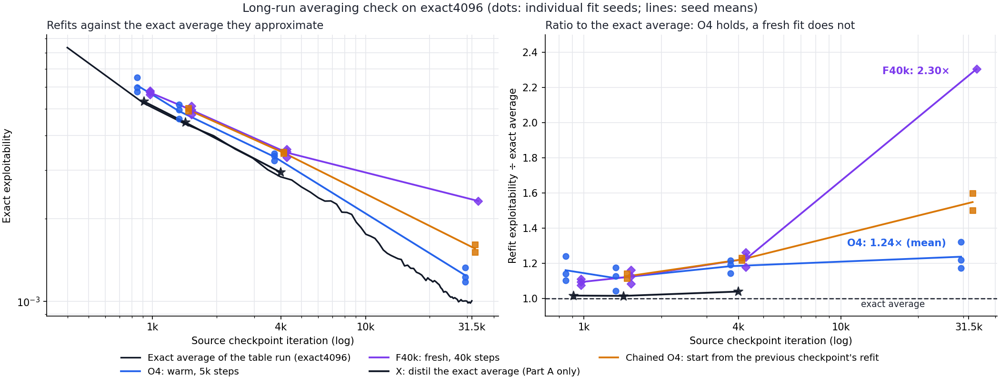
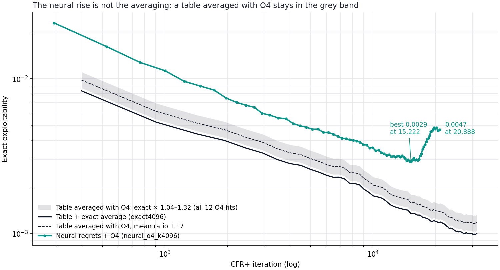

# 18-claim: does O4 averaging hold on a long run?

**Status: complete (2 October 2026).** One GPU job of about 15 minutes, on a checkpoint that already existed.

## Summary

- **O4 still averages a long run well.** On `exact4096`'s final checkpoint (31,538 iterations), three O4 fit seeds scored **1.17–1.32× the exact average, mean 1.24×**. In Part A, at 908–3,988 iterations, the range was 1.04–1.24×. The ratio may creep up slightly, but stays within seed noise.
- **So the neural run's late rise is not the averaging.** `neural_o4_k4096` went from 0.0029 (iteration 15,222) to 0.0047 (20,888). A table averaged with O4 stays within 1.04–1.32× of its exact average throughout. The rise has to come from the policies the regret network produced.
- **A fresh fit, however, breaks down on a long run.** A 40,000-step fit from fresh weights scored **2.30×** (one seed). In Part A it scored 1.09–1.22×. A fresh fit sees only the 2,000,000-record reservoir. The warm start also inherits the online average network, which trained on everything that passed through the reservoir during the run, including the many records evicted since. In a long run the reservoir alone is no longer enough.
- **Consequences.**
  - Keep the online averager, because it is O4's warm start.
  - Part A's "a fresh fit could replace the online averager" holds only for short runs.
  - Reservoir size becomes a real question for long 30-claim runs.

## Question

Part A validated O4 on three `exact4096` checkpoints at 908, 1,424 and 3,988 iterations. The neural K=4,096 run, averaged with O4, bottomed at iteration 15,222 and then rose 60% by 20,888. Two explanations were open:

1. **Averaging.** O4 degrades as runs get longer. The reservoir is fixed at 2M records while the trajectory keeps growing.
2. **Regret network.** The network's later iterates really are worse.

The table run `exact4096` has an exact average and the same 2M-record reservoir and online average network. Fitting O4 to its final checkpoint shows what O4 does on a long run when the true answer is known.

## What was run

- **Source:** `artifacts/cfr_plus_18_batched_bridge_controls/main_20260930/exact4096/latest_checkpoint.pt` on the VM. That is iteration 31,538, after 1,080 measured minutes, with an exact average of 0.001005. It was read only.
- **Harness:** `fit_one_arm` from [`run_cfr_plus_18_average_fit_optimizer_experiment.py`](../../../scripts/run_cfr_plus_18_average_fit_optimizer_experiment.py), the same code as Part A, driven by [`check_cfr_plus_18_o4_long_run.py`](../../../scripts/check_cfr_plus_18_o4_long_run.py).
- **Fits**, all with batch 16,384, weighted cross-entropy and a cosine learning rate from `1e-3` to `1e-5`:

| Arm | Start | Steps per player | Fit seeds | GPU fit time |
| --- | --- | ---: | --- | ---: |
| O4 | Warm: online average network and its Adam state | 5,000 | 17031, 17032, 17033 | about 17 s each |
| F40k | Fresh weights | 40,000 | 17031 | about 120 s |

Each fit was evaluated exactly, about 16 s per evaluation. The GPU was otherwise idle. Results are in [`cfr_plus_18_average_fit_long_run_check_20261002`](../../data/cfr_plus_18_average_fit_long_run_check_20261002). The full outputs, including policies, are on the VM in `artifacts/cfr_plus_18_average_fit_long_run_check/main_20261002/`.

## Results

Refit exploitability divided by the exact average from the same checkpoint. The first three columns are from Part A.

| Fit | 908 | 1,424 | 3,988 | **31,538** |
| --- | ---: | ---: | ---: | ---: |
| Exact average | 0.005249 | 0.004408 | 0.002836 | **0.001005** |
| O4, three seeds | 1.10 / 1.14 / 1.24 | 1.04 / 1.13 / 1.18 | 1.14 / 1.19 / 1.21 | **1.22 / 1.17 / 1.32** |
| O4, mean | 1.16 | 1.12 | 1.18 | **1.24** |
| F40k, fresh (mean of three seeds in Part A) | 1.09 | 1.12 | 1.22 | **2.30** (one seed) |
| X: distil the exact average (Part A only) | 1.02 | 1.01 | 1.04 | n/a |

*Left: absolute exploitability. The black line is the run's exact average and the markers are refits of its checkpoints. Right: the same refits as a ratio to the exact average. Dots are individual fit seeds; lines join seed means.*

- **O4 (blue)** follows the exact average down by an order of magnitude and stays about 1.1–1.25× above it. Its 31.5k-iteration seeds overlap Part A's.
- **F40k (purple)** matched O4 early, was already drifting upward by 4k iterations (1.09 → 1.12 → 1.22), and is at 2.30× by 31.5k. In absolute terms it barely improved between 4k and 31.5k iterations (0.0033 → 0.0023), while the exact average fell from 0.0028 to 0.0010.

**Reach-weighted distance to the exact average** (total variation, weighted by own reach):

| Fit | 908 | 1,424 | 3,988 | 31,538 |
| --- | ---: | ---: | ---: | ---: |
| O4 (first seed) | 0.0071 | 0.0052 | 0.0025 | **0.0008** |
| F40k (first seed) | 0.0043 | 0.0037 | 0.0029 | **0.0020** |
| X | 0.0027 | 0.0023 | 0.0018 | n/a |

O4's distance shrinks steadily with the run. F40k's shrinks much more slowly, and by 31.5k it is 2.7× O4's.

## Interpretation

### 1. The neural rise is in the regret network, not the averaging

*Grey band: the table's exact average multiplied by the lowest and highest ratios seen in all 12 O4 fits (1.04–1.32×). Dashed line: the mean ratio. Teal: the neural run's O4 averages.*

If O4 were the cause, the table averaged with O4 would also have to rise towards 31.5k iterations. It doesn't. All three 31.5k fits fall within the band set at 4k iterations or earlier.

The neural run's rise must therefore come from its iterates. With linear weights, exploitability is convex in the average, so the iterates after 15,222 must average at least

[0.004685 − (15,222/20,888)² × 0.002916] ÷ [1 − (15,222/20,888)²] ≈ **0.0067**

on O4's scale. That is worse than the run's average at any point since about 4,000 iterations. The [N/T experiment](2026-10-02_13-54-39_18_claim_regret_bootstrap_vs_teacher_forced.md) tests why.

### 2. In long runs the reservoir alone is not enough

The two fits share the reservoir and the schedule shape. They differ in where they start:

- **F40k** starts from random weights, so everything it knows comes from the 2M reservoir records.
- **O4** starts from the online average network. Each iteration, that network took six gradient steps on batches drawn from the reservoir as it was at that moment. New records enter the reservoir with probability of about 2M ÷ records seen so far, each replacing a random old one. Over the run, the online network has therefore trained on every record that was ever in the reservoir, far more than the 2M that remain at the end.

On its own the online network is a poor average (2–5× the exact average). But it seems to hold information the reservoir lacks, and O4's annealed fit keeps that information while removing the online network's noise.

The likely reason the reservoir falls behind: the target gets more precise as the run continues (the exact average falls from 0.0028 to 0.0010 between 4k and 31.5k iterations), while the reservoir's sampling noise stays fixed at 2M records. So a fit to the reservoir alone stops improving once that noise dominates. F40k's absolute exploitability matches that picture: 0.0033 at 4k, only 0.0023 at 31.5k.

**Not excluded:** a fresh fit might need more than 40,000 steps for a long trajectory. Part A found no gain from 80,000 steps at 4k iterations, but that wasn't tested here. F40k at 31.5k is one seed. Its mid-schedule evaluation at 20,000 steps (0.0126) was taken while the learning rate was still high, and isn't meaningful.

### 3. Follow-up: chaining refits does not beat O4

**Idea.** O4 always warm-starts from the online average network, which on its own is 2–5× worse than exact. Would it be better to start each refit from the **previous snapshot's refit**, which is already a well-settled average? Late in a run the average barely changes between snapshots, so a short anneal might be enough.

**Test (3 October, about 20 GPU minutes).** The chain starts from Part A's O4 fits at 908 iterations and continues 1,424 → 3,988 → 31,538. Each link starts from the previous link's weights and Adam state and anneals on the new checkpoint's reservoir. There are three recipes and two fit seeds each. Driver: [`check_cfr_plus_18_o4_chain.py`](../../../scripts/check_cfr_plus_18_o4_chain.py). Results: [`cfr_plus_18_average_fit_chain_check_20261003`](../../data/cfr_plus_18_average_fit_chain_check_20261003).

Ratio to the exact average, mean of two seeds (plain O4: mean of three):

| Refit | 1,424 | 3,988 | 31,538 |
| --- | ---: | ---: | ---: |
| **Plain O4** (warm from the online network, 5k steps) | **1.12** | **1.18** | **1.24** |
| Chained, cosine `1e-3` → `1e-5`, 5k steps | 1.13 | 1.22 | 1.55 |
| Chained, cosine `1e-3` → `1e-5`, 2k steps | 1.14 | 1.28 | 1.72 |
| Chained, cosine `1e-4` → `1e-6`, 2k steps | 1.22 | 1.38 | 1.95 |

The orange squares in the first figure are the chained 5k-step fits.

- **Chaining never beats plain O4.** It ties at 1,424 iterations, is slightly worse at 3,988, and is clearly worse after the long jump to 31,538 (1.55–1.95 against 1.24).
- **The pattern matches the fresh fit, in milder form.** A chained fit carries information from the online network only up to its first link. Everything after that reaches it only through the 2M reservoir. Over the long gap from 3,988 to 31,538 it therefore sits between O4 (1.24) and a fresh fit (2.30).
- **A lower peak learning rate is worse.** The fit cannot move far enough from its stale start.

**Caveat.** These checkpoints are far apart. Snapshots 15 minutes apart would be a gentler test, but nothing here suggests chaining would win there. The result reinforces point 2: **the online network's continuous view of the reservoir throughout the run is what makes O4 work**, so it should be kept (and possibly improved) rather than bypassed.

## Consequences

| Question | Answer |
| --- | --- |
| Is O4 trustworthy late in a run? | Yes, at least to 31.5k iterations: about 1.2× exact, as early. |
| Is the neural late rise an averaging artefact? | No. It is in the regret network's iterates. |
| Can a fresh fit replace the online averager? | Only in short runs. Keep the online averager as O4's warm start. Part A's decision table has been updated. |
| Should refits chain from the previous refit instead? | No. Chaining tied or lost at every checkpoint (1.55× against O4's 1.24× at 31.5k iterations). |
| What matters for 30 claims? | Reservoir size for long runs. Warm O4 hides the reservoir's thinning for now, but it relies on the online network carrying the extra information. Testing 8M and 20M reservoirs on a long run is the direct check. |

## Files

- Driver: [`check_cfr_plus_18_o4_long_run.py`](../../../scripts/check_cfr_plus_18_o4_long_run.py). On the VM it is in `/root/liars_poker/scripts/`. It ran in tmux session `cfr18_o4_long_run_check`, which has exited.
- Results: [`docs/data/cfr_plus_18_average_fit_long_run_check_20261002/`](../../data/cfr_plus_18_average_fit_long_run_check_20261002), copied from the VM.
- Figures: [`plot_cfr_plus_18_average_fit_long_run_check.py`](../../../scripts/plot_cfr_plus_18_average_fit_long_run_check.py).
