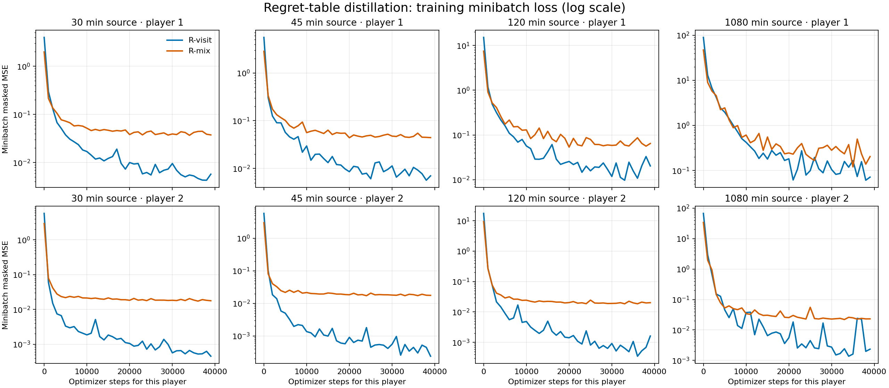

# 18-claim: can a network hold the regret table? (distillation)

**Status: concluded (3 October 2026).** Ten fits completed: R-visit and R-mix at all four sources, and P-visit at the 30- and 1,080-minute sources. The remaining P-visit and R-large fits were not run; the verdict below does not need them.

## Verdict

- **A 512×512 network has the capacity to hold the table's policy wherever traversal visits.** With policy targets (P-visit), every information set expected at least 0.1 times per iteration is matched essentially exactly, even at 31.5k iterations: a policy gap of 0.000–0.001.
- **Fitting raw cumulative regrets with MSE was a large part of the failure.** Regret matching turns small errors near zero into large policy errors. MSE weights sets by the size of their regrets, so sets with small regrets are fitted relative to the wrong scale. Late in training, R-visit's current policy was 31× the table's exploitability, R-mix's 16.5×, and P-visit's 4.65×.
- **Rarely visited information sets are the remaining problem, under every objective.** Below 0.1 expected visits per iteration (about 1.2M of the roughly 1.3M sets per player), all arms differ from the table by 0.12–0.21 in policy. Best responses aim at exactly these sets, and they account for P-visit's remaining 4.65×.
- **This is a pessimistic setting compared with training.** These networks start from scratch. In the [N/T run](2026-10-02_13-54-39_18_claim_regret_bootstrap_vs_teacher_forced.md), the bootstrapped online network's late current policy was 0.03–0.05 against the table's 0.027, and its rare-set policy gap was small. Rare sets that are hardly ever updated barely move from where they started.
- **Decision.** Stop here. Neither finding changes the 30-claim plan. If the regret network becomes the bottleneck at 30 claims, the first change to try is regret targets normalised per information set: predict the shape R/ΣR and the scale separately.

## Summary

- **Question.** Take an exact cumulative regret table from a good tabular CFR+ run and fit a fresh regret network to it, with plenty of steps and good data. Is the network's regret-matched policy as good as the table's? This tests **capacity and precision alone**, with no bootstrapping, no partial fits and no sampling noise in the targets.
- **Why it matters.** The [N/T experiment](2026-10-02_13-54-39_18_claim_regret_bootstrap_vs_teacher_forced.md) separates accumulation from reading error. This experiment says whether reading error has a floor set by the network itself, and whether that floor worsens late in training, when the regret structure is finer. It also sizes the regret network for 30 claims.
- **Precedent.** Arm X in [Part A](2026-10-01_10-25-57_18_claim_average_fit_traversal_schedule_regret_noise.md#part-a-average-fit-schedules) did the same for the **average** policy. A 256×256 network fitted to the exact average table reached 1.01–1.04× the table's exploitability. So the average network has enough capacity. Nothing equivalent exists yet for the regret network.
- **Cost.** Four workers process one source checkpoint each. The 512-wide fits use 40,000 updates per player; two late checkpoints also get the 1,024×1,024×1,024 capacity arm. Runtime is being measured on the CPU VM rather than inferred from the old GPU estimate.

## Sources

The `exact4096` run (table regrets, K=4,096, exact linear average, seed 17). Each checkpoint stores the regret table and the exact average.

| Checkpoint | Iteration | Path on the VM |
| --- | ---: | --- |
| 30 min | 908 | `artifacts/cfr_plus_18_offline_average_study/exact4096_0030m_checkpoint.pt` |
| 45 min | 1,424 | `artifacts/cfr_plus_18_offline_average_study/exact4096_0045m_checkpoint.pt` |
| 120 min | 3,988 | `artifacts/cfr_plus_18_offline_average_study/exact4096_0120m_checkpoint.pt` |
| 1,080 min | 31,538 | `artifacts/cfr_plus_18_batched_bridge_controls/main_20260930/exact4096/latest_checkpoint.pt` |

The last is the run's only rolling checkpoint. **Read it; never write to it.** Copy it first if any tool might open it for writing.

## Arms

Every fit starts from fresh weights. It uses 40,000 steps per player at batch 16,384 with a cosine learning rate from `1e-3` to `1e-5`, which is X's recipe. Rows are (history, hand) information sets drawn from the checkpoint's table.

| Arm | Network | Target | Loss | Rows drawn by |
| --- | --- | --- | --- | --- |
| **R-visit** | 512×512 (as trained) | clipped cumulative regrets R⁺(I, ·) | masked MSE, as in training | **visit distribution**: chance × opponent reach under the table's current policy, the distribution traversal produces |
| **R-mix** | 512×512 | R⁺(I, ·) | masked MSE | 50% visit distribution, 50% uniform over all legal sets |
| **P-visit** | 512×512 | the table's regret-matched **policy** | weighted cross-entropy | visit distribution |
| **R-large** | 1,024×1,024×1,024 | R⁺(I, ·) | masked MSE | the better of R-visit and R-mix |

R-visit, R-mix and P-visit run at all four checkpoints. R-large runs at 3,988 and 31,538 only. That is 14 fits.

**Why these arms.**
- **R-visit** is the closest offline analogue of what the trainer must do: hold raw cumulative regrets, with rows weighted as traversal weights them.
- **R-mix** checks whether information sets that traversal rarely reaches matter. Best responses steer play into exactly those sets.
- **P-visit** fits the policy instead of the regrets. Regret matching depends only on ratios within an information set, so a network could get the policy right while getting the raw values wrong. If P-visit is good and R-visit poor, the problem is precision in absolute regret values, not representing the strategy.
- **R-large** checks whether more capacity closes any gap. A bigger network is cheap on the GPU at 30 claims.

## Measurements

At each checkpoint, also evaluate the **table itself**: the exact exploitability of its regret-matched current policy. That is the reference every fit is compared with.

For each fit:

| Quantity | What it shows |
| --- | --- |
| Exact exploitability of the network's regret-matched policy ÷ the table's | **Headline.** Close to 1 means the network holds the table. |
| Reach-weighted and uniform total variation between the network's and the table's policies, by expected-visit bin (<0.1, 0.1–1, 1–10, ≥10 per iteration) | Where the error sits |
| Relative regret error: reach-weighted Σₐ \|R̂ − R⁺\| ÷ Σₐ R⁺ | Precision in regret units, comparable with the N/T diagnostics |
| Full-pass loss on the training distribution | Fit quality, separately from policy quality |

**Yardstick for "small".** In the Part C audits, one CFR+ update moved the policy by about 0.002–0.003 in reach-weighted total variation. If a distilled network differs from the table by much less than that, its error is smaller than a single iteration's step and should not matter. Errors comparable to a step or larger are material.

## How to read the results

| Observation | Interpretation | Consequence |
| --- | --- | --- |
| R-visit ≈ table (≤1.1×) at all four checkpoints | **Capacity is fine**, even late. The neural gap is in the online process. | Act on N/T's answer. Keep 512×512 for 30 claims, scaled with the game. |
| Good at 908–3,988 but clearly worse at 31,538 | The network's precision runs out as the regret structure gets finer. This would contribute to the late rise. | Larger networks for long runs; check whether R-large fixes it. |
| P-visit good, R-visit poor | Policy is representable but raw values are not, at the needed precision. | Rescale or normalise targets (for example, predict regrets divided by a per-set scale), or change the output parametrisation. |
| R-mix clearly beats R-visit on exploitability | Rarely visited sets matter, and visit-proportional training under-serves them. | Supports one-row-per-set training, extra player-2 roots, or deliberately sampling off-path rows in the trainer. |
| R-large fixes what 512×512 cannot | Capacity-bound. | Use bigger regret networks; cheap on the GPU. |

**Relation to N/T.** If T ends close to the table, this experiment mainly confirms the result and sizes the network. If T trails the table, this experiment says whether the network's capacity explains that gap or whether the per-iteration fit does.

## Run and implementation

`scripts/run_cfr_plus_18_regret_table_distillation.py` reads the existing compact regret checkpoints without modifying them. Each fit writes its own manifest, progress log, atomic `fit_state.pt` (every 500 steps), result and policy under:

```text
artifacts/cfr_plus_18_regret_table_distillation/main_20261002/<source>/<arm>/
```

`--source` selects one of four independent workers. `CUDA_VISIBLE_DEVICES` is empty for all of them. `scripts/monitor_cfr_plus_18_regret_diagnostics.py` serves the dedicated dashboard on VM port 8770; the existing VM overview on 8765 discovers these runs from their `training.jsonl` files.

**Loading the table.** `ExactAverageTabularDiscountTrainer.load_fork_checkpoint` restores the table. Its `current_policy_exact_dense()` gives:
- the table's current policy, which is the P-visit target and the reference to evaluate;
- `L_pid0` and `L_pid1` (own reach per player), from which opponent reach for the visit distribution follows.

Rows are indexed by (history, rank-count hand) in the table, and by (history, physical hand) in the dense policy. Map between them the way `current_policy_exact_dense` does.

**Evaluating a regret network.** Compile its regret-matched policy densely (`DeepCFRPlusTrainer.current_policy_dense`, or the equivalent batched compile on the GPU), then use the same exact evaluator as Part A.

Each fit reports exact exploitability and the ratio to its source table, uniform and own-reach-weighted policy TV, reach-weighted relative regret error for regret-regression arms, TV by expected-visit bin, and the training loss. P-visit has no meaningful regret-unit error because its target is a policy.

### Smoke check

The 30-minute source was loaded and all three 8-step CPU fit paths (R-visit, R-mix, P-visit) completed, including exact policy evaluation and metric serialization. The measured network exploitabilities were around 0.89–0.92 against a 0.078 table reference. **These are plumbing results only:** eight fit steps are far below the planned 40,000 and must not be read as evidence about capacity or convergence.

### Results so far

Four eight-thread CPU workers started on 2 October 2026. They completed R-visit and R-mix at every source, then were stopped while working on P-visit. Logs and resumable fit states remain under `artifacts/cfr_plus_18_regret_table_distillation/main_20261002/`. Smoke outputs under `smoke4_20261002/` are excluded.

The first evaluation used `compile_neural_to_dense`, which applied softmax to the R networks' outputs. Those networks predict regrets; their policy uses clipped regret matching. The first evaluation therefore measured the wrong policy. It also put the other player's histories into each player's lowest expected-visit bin. Both errors have been corrected. The original `result.json`, `evaluations.jsonl`, and `summary.json` were copied to `.legacy_softmax` files before the corrected metrics were published. The eight trained networks were **re-evaluated, not retrained**.

An exact-table lookup passed through the corrected compiler reproduced the table policy to a maximum probability error of `2.4e-7` and gave exactly the same exploitability. Sampled dense probabilities also matched each saved model's playable policy API to within `1.4e-5`; the small difference comes from single-row versus batched float32 inference.

| Source | Table current | R-visit | R-mix | P-visit |
| --- | ---: | ---: | ---: | ---: |
| 30 min | 0.0783 | 0.4190 (5.4×) | 0.1057 (1.35×) | **0.1114 (1.42×)** |
| 45 min | 0.0506 | 0.4487 (8.9×) | 0.1857 (3.7×) | not run |
| 120 min | 0.0641 | 0.6125 (9.6×) | 0.1598 (2.5×) | not run |
| 1,080 min | 0.0272 | 0.8417 (31×) | 0.4493 (16.5×) | **0.1268 (4.65×)** |

Policy gap to the table at the 1,080-minute source (uniform total variation, player 1 / player 2), by expected visits per iteration:

| Arm | <0.1 | 0.1–1 | 1–10 | ≥10 |
| --- | ---: | ---: | ---: | ---: |
| R-visit | 0.138 / 0.212 | 0.049 / 0.021 | 0.017 / 0.008 | 0.005 / 0.001 |
| R-mix | 0.123 / 0.172 | 0.054 / 0.024 | 0.019 / 0.011 | 0.009 / 0.003 |
| P-visit | 0.129 / 0.214 | 0.001 / 0.000 | 0.000 / 0.000 | 0.000 / 0.000 |

These are exact exploitabilities of the **current policies**. R-mix consistently beats R-visit, but neither closely reproduces the later tables. The corrected bin metrics show that high-visit sets are fitted much more accurately than rare sets. At the 30-minute source, R-visit's uniform policy TV is about `0.0013` for player 1's sets expected at least ten times per iteration, versus `0.144` for sets expected less than 0.1 times. R-mix reduces the latter to `0.129`. The late source still has appreciable error at moderately visited sets.



The plotted values are **training minibatch masked MSE**, recorded every 1,000 optimizer steps. They fall rapidly and mostly flatten. R-visit has lower loss than R-mix for both players at every source, yet its policy is much worse. The two losses use different row distributions: R-visit concentrates on likely visits, while R-mix spends half its batches on uniformly selected legal sets. Their heights therefore do not rank policy quality. Losses also rise at later sources as regret magnitudes change; this graph alone does not establish that later policies are harder to represent. There are no saved intermediate policy evaluations for a policy-quality-versus-fit-steps curve. Parsed loss points are in `docs/data/cfr_plus_18_regret_table_distillation_20261002/loss_points.csv`.

The original 1.2–1.8% regret error is a global, visit-weighted ratio. It does not establish small *policy* error at each set: large regrets and frequent sets dominate its denominator. This experiment now points to coverage and target scaling as possible causes of the remaining gap. P-visit is the most direct next discriminator: if it succeeds, raw regret regression is the issue; R-large can then test capacity at the late sources.

The paused P-visit fits have resumable states, but the runner now saves them as `NeuralPolicy` because their outputs are strategy logits. The not-yet-started R-large fits will use the 50/50 visit/uniform row mix, consistent with the table above and the observed advantage of R-mix. The future-fit bin calculation now excludes histories owned by the other player.

**P-visit results (3 October).** P-visit was run on the GPU at the 30- and 1,080-minute sources. It answers the question the regret arms left open. Policy targets fit every information set visited at least 0.1 times per iteration essentially exactly, so raw regret regression, not capacity, caused those sets' errors. At rarely visited sets, P-visit is no better than the regret arms. See the verdict at the top.
