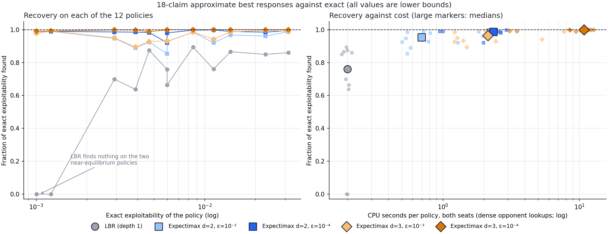

# 18-claim: calibrating approximate best responses

**Status: first pass complete (3 October 2026).** LBR and depth-limited expectimax ran on all 12 policies, on CPU. Verdict: use expectimax with exact beliefs (d=3, ε=10⁻⁴; d=2 as a cheaper screen). The fitted-return baseline, MCTS and extrapolation were deferred. A lazy-query re-run and a 30-claim trial come next.

## Summary

- **Why.** At 30 claims there are 2³⁰ public histories, so exact exploitability is out of reach. Without a trustworthy approximate best response (BR), we cannot tell whether a 30-claim run is improving or which recipe is better. This is the main blocker for 30 claims.
- **What.** Run several approximate BR methods on about a dozen 18-claim policies whose exact exploitability is known, spanning 0.001–0.03. Measure:
  - how much of the exact value each method finds;
  - whether it ranks policies correctly;
  - what it costs.
- **Candidates.** All come from the [non-exact BR note](../../explainers/non_exact_best_response_methods.md), which explains each in detail:
  - local best response (LBR);
  - depth-limited expectimax with exact beliefs and exact enumeration;
  - Monte Carlo tree search (MCTS);
  - the existing fitted-return responder as a baseline.
- **What it decides.** The evaluator for 30 claims, at a known cost per policy, and how far its numbers can be trusted.

## Background in brief

Against a fixed policy σ, the only hidden information is the opponent's hand. The responder's belief over it is **exact** and cheap to compute: one batched query of σ per opponent decision, over all opponent hands (10 hand types at 18 claims, 35 at 30). So a BR is a single-agent planning problem with a known belief.

Every method below plays an actual responder strategy. Its value against σ is therefore a **lower bound** on each seat's BR value, and so on exploitability. The methods differ in how far ahead they plan:

| Method | What it does | Dial that converges to the exact BR |
| --- | --- | --- |
| M0: fitted-return responder (existing) | GPU-trained responder; value estimated from random games | Training time (no convergence guarantee) |
| M1: LBR | At each decision: call now, or make a claim and then call at the next turn. All values exact under the belief. | None (depth 1) |
| M2: depth-limited expectimax | The exact recursion to depth d of the responder's own decisions, with LBR values at the leaves. Opponent responses below probability ε are pruned. | Depth d (exact once d covers the game); ε → 0 |
| M3: MCTS | Upper-confidence tree search over the responder's information states; opponent hands sampled from the belief | Simulations per move |
| M5: extrapolation | Fit e(c) = e∞ − A·c^(−α) across a dial's settings | Estimate only, not a bound |
| M6: per-seat maximum | The best method for each seat, confirmed on fresh games or by enumeration | Tightest bound available |

**M2 has no Monte Carlo noise in this experiment.** The responder chooses actions using depth-limited search. Search may skip rare opponent claims, but the chosen receding-horizon strategy is then evaluated against **all** opponent responses. The reported value is an exact value of that strategy and therefore a lower bound on the true best response. Pruned mass during search is diagnostic only; it is not an error bound on the reported value.

The raw two-seat score `p_first + p_second - 1` can be negative for a weak approximate responder. The usable exploitability lower bound is `max(0, raw score)`. We retain the raw score to show when a method fails.

## Calibration set

These policies are all saved on the VM with exact exploitability already measured. Neural policies are in `artifacts/cfr_plus_18_neural_o4_cpu/main_20261001/<arm>/policy_snapshots/<minute>/{average_policy, online_policy}`, where `average_policy` is the O4 refit.

| # | Policy | Exact exploitability | Why include it |
| ---: | --- | ---: | --- |
| 1 | K=4,096 O4, 15 min | 0.0230 | Early, poor |
| 2 | K=4,096 online, 15 min | 0.0313 | Worst in the set |
| 3 | K=4,096 O4, 60 min | 0.0113 | |
| 4 | K=4,096 O4, 180 min | 0.0060 | |
| 5 | K=4,096 online, 180 min | 0.0142 | Same trajectory as #4, 2.4× worse |
| 6 | K=4,096 O4, 450 min | 0.0039 | |
| 7 | K=4,096 O4, 795 min | 0.0029 | Best neural policy |
| 8 | K=4,096 O4, 1,140 min | 0.0047 | After the late rise: must rank below #7 |
| 9 | K=4,096 online, 1,140 min | 0.0085 | |
| 10 | K=1,024 O4, 600 min | 0.0060 | Different recipe, same level as #4 |
| 11 | `exact4096` O4 refit, 1,080 min (`artifacts/cfr_plus_18_average_fit_long_run_check/main_20261002/1080m/O4/warm_05000`) | 0.0012 | Near the best policies available |
| 12 | `exact4096` exact average, 1,080 min (dense table, built from the checkpoint's average) | 0.0010 | Best policy available; a table rather than a network |

**Pairs that test ranking.** Each comes with the ratio of their exact values:

| Pair | Ratio | Why it matters |
| --- | ---: | --- |
| #2 vs #1, #5 vs #4, #9 vs #8 | 1.4–2.4× | Online against O4: the averaging effect we rely on |
| #8 vs #7 | 1.6× | Detecting a late rise in a run |
| #4 vs #10 | 1.0× | A tie: the method should not separate them confidently |
| #6 vs #7 | 1.35× | A small gain within a run |
| #12 vs #11 | 1.2× | Fine differences among the best policies |
| #3 vs #4 vs #6 | about 1.9× and 1.5× steps | A run's progress over time |

## Arms and settings

Run each method on all 12 policies, for both seats.

| Method | Settings | Value estimated by |
| --- | --- | --- |
| M1 LBR | none | Exact enumeration |
| M2 expectimax | d = 2, 3; ε = 10⁻³ and 10⁻⁴ | Exact enumeration of the selected strategy against full opponent support |

We compare each result with the saved policy's exact exploitability. Other methods can be added after this calibration if shallow search does not recover enough.

**Running order.** For each policy: M1, M2 at depth 2, then M2 at depth 3. Each completed setting is saved immediately, so rerunning the launcher resumes unfinished settings.

## Measurements

For every (method, setting, policy):

- **Recovery:** discovered ÷ exact, per seat and total.
- **Cost:** CPU core-hours (GPU minutes for M0), and policy queries per decision.
- **Pruned search branches** (M2): a measure of search approximation, not a value error bound.

Across policies:

- **Ranking fidelity:** for the pairs above, whether the method orders them as exact evaluation does. Also report the rank correlation across all 12.
- **Recovery against policy quality:** does the fraction found fall as policies improve? This matters, because 30-claim policies will sit near 0.01–0.05, where 18-claim policies were early in training.

## Results

**Status of this pass.** M1 (LBR) and M2 (expectimax) ran at depths 2 and 3, with ε = 10⁻³ and 10⁻⁴, on all 12 policies: 60 runs on CPU. The fitted-return baseline (M0), MCTS (M3) and extrapolation (M5) were deferred. Costs exclude the one-time compilation of each policy to a dense table and the exact best-response reference.

**Sanity check: every value is a valid lower bound.** No seat value exceeds its exact best response by more than 1.5×10⁻⁸, which is floating-point rounding. A responder that cheated, for example by seeing the opponent's hand, would exceed the exact value.

*Left: fraction of exact exploitability found, for each policy and setting. Right: the same against CPU seconds per policy; large markers are each setting's medians. All values are lower bounds.*

### Recovery

Discovered exploitability divided by exact. LBR scores below zero are counted as 0, since an exploitability lower bound cannot be negative.

| # | Policy | Exact | LBR (d=1) | d=2, ε=10⁻³ | d=2, ε=10⁻⁴ | d=3, ε=10⁻³ | d=3, ε=10⁻⁴ |
| ---: | --- | ---: | ---: | ---: | ---: | ---: | ---: |
| 2 | K=4,096 online, 15 min | 0.0314 | 0.86 | 0.99 | 0.99 | 0.99 | **1.00** |
| 1 | K=4,096 O4, 15 min | 0.0230 | 0.85 | 0.96 | 0.99 | 1.00 | **1.00** |
| 5 | K=4,096 online, 180 min | 0.0142 | 0.87 | 0.97 | 0.99 | 0.99 | **1.00** |
| 3 | K=4,096 O4, 60 min | 0.0113 | 0.76 | 0.92 | 1.00 | 0.94 | **1.00** |
| 9 | K=4,096 online, 1,140 min | 0.0085 | 0.89 | 0.99 | 1.00 | 0.99 | **1.00** |
| 4 | K=4,096 O4, 180 min | 0.0060 | 0.66 | 0.93 | 0.98 | 0.93 | **1.00** |
| 10 | K=1,024 O4, 600 min | 0.0060 | 0.76 | 0.85 | 0.92 | 0.93 | **1.00** |
| 8 | K=4,096 O4, 1,140 min | 0.0047 | 0.88 | 0.93 | 0.98 | 0.93 | **0.99** |
| 6 | K=4,096 O4, 450 min | 0.0039 | 0.64 | 0.89 | 0.99 | 0.89 | **1.00** |
| 7 | K=4,096 O4, 795 min | 0.0029 | 0.70 | 0.95 | 0.99 | 0.95 | **1.00** |
| 11 | `exact4096` O4, 1,080 min | 0.0012 | **0** | 0.99 | 0.99 | 0.99 | **0.99** |
| 12 | `exact4096` exact average, 1,080 min | 0.0010 | **0** | 0.98 | 0.99 | 0.98 | **0.99** |
| | **Median** | | 0.76 | 0.95 | 0.99 | 0.97 | **1.00** |
| | **Median CPU seconds per policy** | | 0.2 | 0.7 | 2.4 | 2.1 | 10.8 |

- **Depth-limited expectimax with tight pruning is essentially exact at 18 claims.** At d=3, ε=10⁻⁴, every policy is at 0.99–1.00. At d=2, ε=10⁻⁴, every policy is at 0.92 or above, with median 0.99.
- **Pruning matters more than depth.** Going from ε=10⁻³ to 10⁻⁴ helps far more than going from depth 2 to 3. At ε=10⁻³, depth 3 is barely better than depth 2. The responder's best lines often run through opponent responses with probability between 10⁻⁴ and 10⁻³, so the coarser setting cuts them off.
- **LBR is not good enough.** It finds 64–89% on mid-range policies and **nothing** on the two near-equilibrium policies (#11 and #12), whose raw LBR score is negative. A one-step lookahead cannot find the multi-step lines that remain against good policies.

### Ranking

Ratios of discovered exploitability for the pairs in the plan, against the exact ratio:

| Pair | Exact ratio | LBR | d=2, ε=10⁻³ | d=2, ε=10⁻⁴ | d=3, ε=10⁻⁴ |
| --- | ---: | ---: | ---: | ---: | ---: |
| #2 / #1 (online / O4, 15 min) | 1.37 | 1.38 | 1.40 | 1.38 | 1.37 |
| #5 / #4 (online / O4, 180 min) | 2.38 | 3.10 | 2.48 | 2.40 | 2.38 |
| #9 / #8 (online / O4, 1,140 min) | 1.82 | 1.86 | 1.94 | 1.85 | 1.84 |
| #8 / #7 (late rise / best) | 1.61 | 2.01 | 1.57 | 1.60 | 1.59 |
| #6 / #7 (small gain within a run) | 1.33 | 1.21 | 1.25 | 1.33 | 1.33 |
| #12 / #11 (exact average / O4, best policies) | 0.82 | undefined (both 0) | 0.81 | 0.82 | 0.82 |
| #4 / #10 (a tie between recipes) | 1.00 | 0.88 | 1.09 | 1.07 | 1.00 |

- **Every expectimax setting orders every pair correctly**, including the 1.2× difference among the best policies and the 1.33× gain within a run. At ε=10⁻⁴, the ratios also come out at the right size.
- **Ties are the weak spot at depth 2.** Policies #4 and #10 have equal exact exploitability (0.00599 and 0.00598), but d=2 makes #4 look 7–9% worse. Only d=3, ε=10⁻⁴ shows them tied. Differences below about 10% at depth 2 should therefore be treated as unresolved.
- **LBR distorts sizes.** It gets the online-versus-O4 gap at 180 minutes as 3.1× against 2.4×, and the late rise as 2.0× against 1.6×. It cannot rank the two best policies at all.

### Cost

Medians per seat. "Branches" counts opponent responses and responder options examined in the search.

| Setting | Search branches per seat | Max | CPU seconds per policy |
| --- | ---: | ---: | ---: |
| LBR | 17k | 32k | 0.2 |
| d=2, ε=10⁻³ | 107k | 318k | 0.7 |
| d=2, ε=10⁻⁴ | 161k | 430k | 2.4 |
| d=3, ε=10⁻³ | 314k | 1.5M | 2.1 |
| d=3, ε=10⁻⁴ | 600k | 1.8M | 10.8 |

These times are cheap because each opponent policy was first compiled to a **dense table**, so every policy query was a lookup. That is impossible at 30 claims, where 2³⁰ histories rule out a dense table. There, each search branch needs the opponent network's output for every opponent hand (35 hand types). Expect cost to be set by network queries and by how well they cache, not by these timings.

## Lazy neural-query follow-up (3 October 2026)

The same 12 policies were rerun at depths two and three with exact beliefs and **lazy batched neural queries**, so no dense policy was compiled. All 24 runs completed. The maximum per-seat difference from the dense-query values was **1.5×10⁻⁸**. Median runtime per policy was **9.0 s** at depth two and **30.9 s** at depth three; median network-query counts were 34,913 and 106,974. The raw results are in [`cfr_plus_18_approx_br_lazy_20261003`](../../data/cfr_plus_18_approx_br_lazy_20261003).

This validates the lazy query implementation at 18 claims, but it does not establish an affordable 30-claim evaluator. The first 30-claim depth-two full-tree evaluation took more than 20 CPU minutes without a result. A full-game Monte Carlo scorer, keeping exact beliefs for the responder's choices, matched an 18-claim exact value within its sampling interval (0.01886 ± 0.00618 versus 0.02261 exact with 100,000 games per seat). The 30-claim run therefore uses Monte Carlo scoring and reports its uncertainty. Its first 100-game depth-two smoke took about 54 seconds on a nearly untrained policy, so hourly evaluations run on separate CPU workers and may lag training.

## Verdict

- **Use depth-limited expectimax with exact beliefs as the evaluator.** At 18 claims, d=3 with ε=10⁻⁴ is exact for practical purposes, ranks every pair correctly including ties, and costs about 11 CPU-seconds per policy. d=2 with ε=10⁻⁴ is a cheaper screen (0.92–1.00), but can mis-rank near-ties by up to about 10%.
- **Drop LBR** except as a quick sanity check. It misses everything near equilibrium.
- **This does not yet show it works at 30 claims.** Two things change:
  1. **Games are longer.** With 30 claims there are more raises per game, so a fixed depth covers less of the remaining game. At 18 claims, depth 3 already reached the exact value. At 30 claims, check convergence directly: if d=3 adds little over d=2, and d=4 (where affordable) adds little over d=3, the search has converged.
  2. **Opponent queries cost more.** Each needs a network evaluation over 35 hand types instead of a table lookup. Caching by (public history, opponent hand) is essential.

### Next steps

1. **Lazy opponent queries: completed.** Batched cached neural queries matched the dense results on all 12 policies at depths two and three; see the follow-up above.
2. **30-claim trial: running.** The first full-tree score was too slow, so the [30-claim first run](../30_claim/2026-10-03_05-12-43_30_claim_first_run.md) evaluates depth-two and deeper responder policies by complete-game Monte Carlo. June policies are included for comparison; the fitted-return BR remains an independent lower-bound check.
3. **Deferred methods.** The fitted-return baseline, MCTS and extrapolation are only needed if 30-claim depth search fails to converge at an affordable cost.

**A check on extrapolation (M5) using the existing runs.** Assume each extra depth closes a fixed fraction of the remaining gap, and solve for the limit from depths 1, 2 and 3 at ε=10⁻⁴.
- For 11 of the 12 policies, the estimated limit lands within 1% of exact. But it is barely different from depth 3 itself, because depth 3 has already converged at 18 claims.
- For policy #10, it **overshoots to 1.07× exact**. Depth 2 found 0.92 and depth 3 found 0.999, so the gaps don't shrink by a steady fraction, and the formula extrapolates past the truth.
- The remaining shortfall of about 1% on #8, #11 and #12 comes from pruning (ε), which more depth cannot recover.

Extrapolation is therefore untestable here and can overshoot. At 30 claims, use it only if depth search fails to converge, and report it alongside the measured lower bounds, never instead of them.

The [summary CSV](../../data/cfr_plus_18_approx_br_calibration_20261003/summary.csv) and per-setting JSON files hold exact values, discovered values, seat values, costs and search-node counts. [`plot_cfr_plus_18_approx_br_calibration.py`](../../../scripts/plot_cfr_plus_18_approx_br_calibration.py) regenerates the figure. The VM dashboard is on port 8772.

## How to read the results

**Choose the cheapest method that:**
1. recovers at least 85–90% of exact exploitability on policies above 0.004;
2. orders every pair with a ratio of 1.3× or more correctly;
3. projects to an affordable cost at 30 claims, using its measured policy queries per decision and the larger branching (30 claims, 35 hand types).

| Observation | Consequence |
| --- | --- |
| LBR already meets 1–2 | A cheap screening evaluator for 30 claims; check periodically with a deeper search |
| Expectimax at d=2–3 meets 1–3 | The main 30-claim evaluator, as the note expects |
| Only MCTS or deep search reaches the bar | Use simulations as the dial, and add extrapolation (M5) |
| Every method falls short on the best policies | Add M4: the trained responder as leaf values for search |
| M0 ranks well but recovers less | Keep it as an independent check at 30 claims |

## Implementation notes for Codex

- **Reuse:**
  - the belief and payoff logic in the exact dense evaluator ([`br_exact_dense_to_dense.py`](../../../liars_poker/algo/br_exact_dense_to_dense.py)) for CALL resolution and deal probabilities with blockers;
  - `liars_poker.serialization` for loading neural and dense policies;
  - [`run_cfr_plus_snapshot_brs.py`](../../../scripts/run_cfr_plus_snapshot_brs.py) and `liars_poker/training/br_runs.py` for M0.
- **New code:** [`br_limited_dense.py`](../../../liars_poker/algo/br_limited_dense.py) implements M1 and M2 against a compiled dense opponent on the 18-claim game. M1 is M2 with d=1. The compilation is feasible here; applying the method at 30 claims will require lazy policy queries rather than a full dense table.
- **Speed:**
  - cache σ by (public history, opponent hand);
  - batch queries over opponent hands;
  - split work across responder hands and seats. Each is an independent job, so all CPU cores can be used.
- **Validation before the full sweep:** on a 6-claim game, M2 with d = the full game length and ε = 0 reproduced both seat values from the exact BR solver to within 3×10⁻⁸ for uniform and nonuniform opponents. On the first real 18-claim policy, M1 found 0.01950 versus 0.0230 exact, and depth 2 found 0.02207–0.02261.
- **Outputs:** `artifacts/cfr_plus_18_approx_br_calibration/main_20261003/`, one atomic JSON file per policy and setting plus the exact policy value. The live monitor is served on VM port 8772 (local tunnel port 18772).
