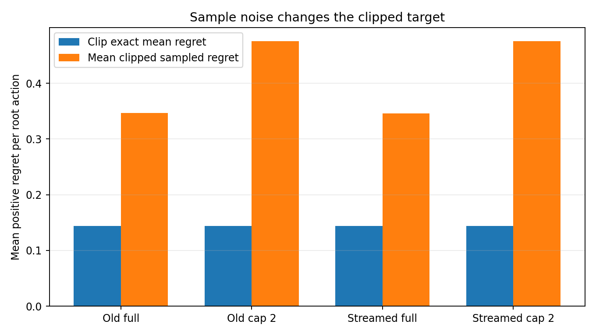
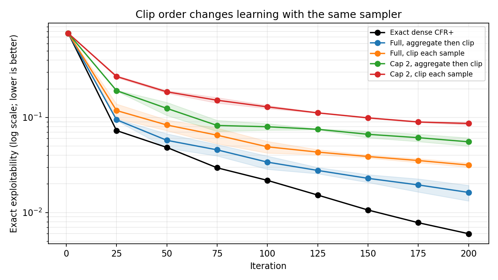

# Experiment: sampled regret targets in CFR+

**Purpose.** Check two links in the neural CFR+ update: whether traversal estimates an action's value correctly *before* clipping, and whether clipping each noisy estimate changes what the regret learner sees. The game has six claims: `GameSpec(ranks=3, suits=2, hand_size=1, claim_kinds=("RankHigh", "Pair"), suit_symmetry=True)`. Exact CFR+ and exact best responses fit in memory here. [The exact-to-neural guide](../explainers/neural_cfr_plus_from_exact.md) explains the update being tested.

In this game, **exploitability is evaluated exactly**: zero is an equilibrium and lower is better. The first graph below measures *positive regret targets*, not exploitability. The second graph measures exploitability over training iterations.

## 1. Freeze the policy and check the actual traverser

**Question.** Is the sampled action-value estimator wrong, or does the nonlinear clip change an otherwise sound estimator?

**What different results would mean.** If sample means stayed far from exact action values, that would point toward a traversal, sampling, or importance-correction bug. If sample means agreed but positive sampled regrets exceeded positive exact regrets, the clip would be changing the supervised target even when action values were unbiased. Agreement between old and streamed traversal would narrow down path-specific bugs; disagreement would suggest one implementation needs inspection.

**Method.** Use a frozen uniform continuation policy and 4,096 root deals per configuration. The old breadth-first and streamed production traversers run on CPU with full claim expansion or a two-claim cap. At a traverser's decision, cap 2 samples at most two claim actions when more are legal; `CALL` is handled separately. An exact enumerator supplies the root action values conditional on the acting player's private rank.

Run:

```powershell
.\.venv\Scripts\python.exe -u scripts/diagnose_neural_cfr_plus_cpu.py --samples 4096 --batch-size 256 --output docs/data/frozen_uniform_root_4096.json
```

Root action values are reconstructed by replaying the same Torch random stream with a one-hot root strategy. A separate run checks the actual first-iteration regret records. The exact enumerator agrees with the first update of `CFRPlusDense` to machine precision after accounting for five physical opponent cards.

**Results.**



**How to read the graph.** Each pair of bars averages over root actions and private hands. Blue first averages the action values over possible deals and continuations, computes regret, then clips negative regret to zero. Orange clips each *sampled* regret to zero first and then averages. Orange above blue means that random positive spikes survive while negative spikes are discarded. The y-axis is regret in payoff units, **not exploitability or neural-network loss**. The old and streamed pairs check whether the two traversal implementations behave similarly.

| Traverser | Fraction of claim edges sampled | Largest root value error | Largest absolute value z-score | Orange minus blue | Record reconstruction error |
| --- | ---: | ---: | ---: | ---: | ---: |
| Old, full expansion | 1.000 | 0.0364 | 1.67 | 0.2032 | 5.5e-8 |
| Old, cap 2 | 0.425 | 0.0891 | 2.46 | 0.3320 | 7.9e-8 |
| Streamed, full expansion | 1.000 | 0.0295 | 1.36 | 0.2025 | 5.5e-8 |
| Streamed, cap 2 | 0.426 | 0.0891 | 2.03 | 0.3314 | 7.9e-8 |

The *root value error* compares the **pre-clipping** sample mean for one private-rank/action pair with its exactly enumerated value; the table reports the largest of 18 such errors. The z-score divides each difference by that sample mean's estimated standard error. None of the 18 pairs in a case is more than 2.5 standard errors away. That is consistent with sampling noise, so this test does not reveal a large root-level value bias. It does not check every depth, history, or 69-claim packed-history operation. The final column only checks that the production code stored the target implied by its sampled values; it does **not** compare that target with the exact one.

Blue averages 0.1438 in all cases. Orange is 0.3470 with old full expansion and 0.4758 with old cap 2, giving gaps of 0.2032 and 0.3320. Full expansion still samples private deals and opponent actions, so its orange bar is also high. This isolates a difference in the target **before neural fitting**. It does not establish whether that difference harms long-run play.

## 2. Remove neural fitting and vary clip order

**Question.** Does clipping each noisy record before regression harm policy quality when network capacity and optimizer error are removed?

**What different results would mean.** If clip order had little effect, the large one-step clipping gap might wash out during play. If aggregating samples before clipping helped under otherwise matched sampling, the target construction would deserve a production-scale test. If both methods failed similarly, sampling or some other approximation would remain a candidate.

**Method.** Keep a tabular policy and tabular regret state, but generate regret data through sampled deals and opponent actions. Compare two update orders, at full expansion and cap 2. Use 32 root traversals per player per iteration, two seeds, and exact best-response evaluation through 200 iterations.

Run:

```powershell
.\.venv\Scripts\python.exe -u scripts/compare_sampled_cfr_plus_tabular_cpu.py --iterations 200 --traversals 32 --eval-every 25 --seeds 17,23 --output docs/data/tabular_conditional_regression_200.json
```

This **tabularized conditional-regression model** is not the production trainer or standard Monte Carlo CFR+. The `before` version averages individually clipped targets, modeling infinite-capacity supervised fitting under ordinary squared error. The `after` version aggregates raw updates at each visited infoset and clips once. The production trainer's extra positive-target loss weight is omitted to isolate clip order. Cap 2 uses inverse-inclusion corrections. Comparing full with cap 2 also changes computation per traversal; the clean clip-order comparison is *within* each cap.

**Results.** The y-axis below is logarithmic: moving down by the same vertical distance means roughly the same *multiplicative* improvement, such as 0.1 to 0.01. Lower is better. Each coloured line is the mean of two seeds; shading spans those two results and is not a confidence interval.



**How to read the graph.** Compare blue with orange to isolate clip order under full expansion. Compare green with red to isolate clip order under cap 2. Black is exact dense CFR+ without sampling, included as a reference rather than a matched-compute competitor. All lines start at the same weak uniform-policy value, about 0.768, and move down as their average strategies improve.

| Method | Exact exploitability at iteration 200, seed 17 | Seed 23 | Mean |
| --- | ---: | ---: | ---: |
| Exact dense CFR+ | 0.00598 | 0.00598 | 0.00598 |
| Full expansion, clip after aggregation | 0.01929 | 0.01323 | 0.01626 |
| Full expansion, clip each sample before aggregation | 0.02993 | 0.03318 | 0.03156 |
| Cap 2, clip after aggregation | 0.04994 | 0.06091 | 0.05543 |
| Cap 2, clip each sample before aggregation | 0.08932 | 0.08325 | 0.08628 |

At iteration 200, full expansion reached mean exploitability **0.0163** when samples were aggregated before clipping versus **0.0316** when each was clipped first: about a twofold gap. Under cap 2 the corresponding values were **0.0554** and **0.0863**. The clip-order ranking held for both seeds within each cap. Comparing cap 2 directly with full expansion also changes the number of evaluated action edges, so it is not an equal-compute comparison. All sampled curves were still improving at 200 iterations; this experiment did **not** reproduce late regression. Two seeds and a six-claim game cannot settle what happens at 69 claims.

## Next question

The next CPU test follows the **actual neural trainer** with an independent exact regret ledger. It compares the learned average network to the exact reach-weighted average of that neural run's current policies. This can reveal average-network error separately from problems in regret learning. The shadow ledger can also show whether the neural current policy tracks exact accumulated regret on the same policy trajectory. That experiment is documented separately.

Recreate the figures with `python scripts/plot_cfr_plus_cpu_experiments.py`. The [frozen-policy results](../data/frozen_uniform_root_4096.json) and [tabular learning curves](../data/tabular_conditional_regression_200.json) are stored with this note.

## Conclusions and takeaways

- The production traverser's root **pre-clipping** action-value estimates agreed with exact values within the measured sampling error, for both old and streamed paths. This is a root check, not a proof about deeper histories.
- Averaging individually clipped sampled updates produced a larger positive target than clipping their mean. The gap was present even with full traverser-action expansion because private deals and opponent continuations were still sampled.
- In the tabular conditional-regression model, aggregate-then-clip gave lower exact exploitability than clip-each-sample for both seeds at both action caps. The strongest next test is to change that order inside the **actual neural trainer**, since finite network fitting and its positive-target loss were absent here.
- These results identify a plausible target-construction problem. They do not show that it causes the late 18- or 69-claim regression, or that increasing the action cap alone fixes it.
