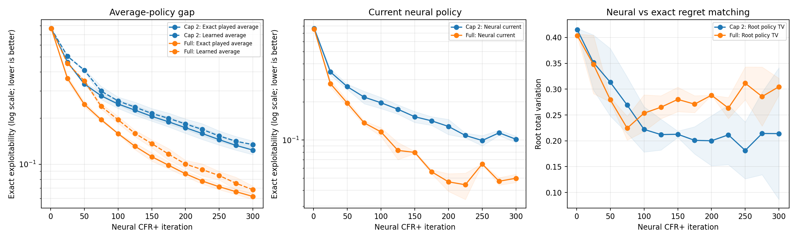
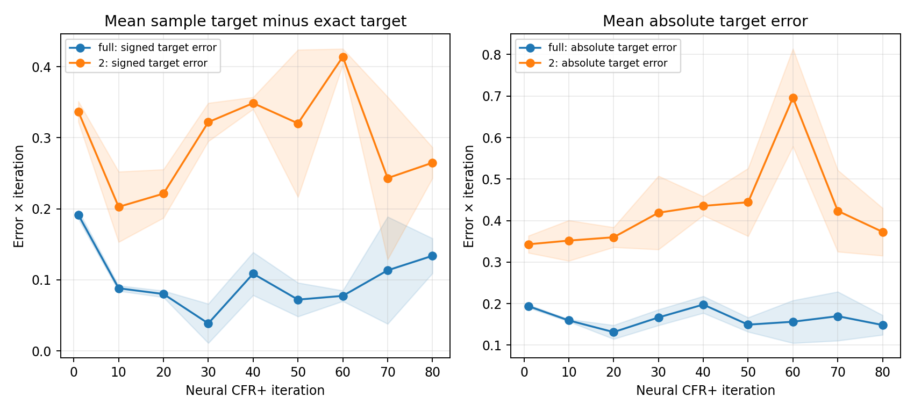

# Experiment: exact shadow ledger for a neural CFR+ run

**Purpose.** Find out where a neural CFR+ run first departs from its exact counterpart. The trainer has regret networks that choose a *current* strategy and strategy networks that approximate the *average* of past current strategies. This experiment measures those two policies separately and checks the sampled targets used to fit regret. It uses the same six-claim game as [the sampled-target experiment](2026-09-27_23-28-05_cfr_plus_sampled_targets_cpu.md), so exploitability can be measured exactly. **Lower exploitability is better; zero is equilibrium.**

## What the outcomes would mean

| Possible observation | Interpretation |
| --- | --- |
| The learned average is much worse than the exact average of the *same* neural current policies | Strategy distillation is losing a useful policy; changing regret learning alone may not fix the deployed average. |
| Both averages are poor, while the current policy is much better | The run may still be catching up with weak early iterations; inspect later snapshots before calling it a plateau. |
| Sampled regret targets systematically differ from the exact one-step target for the frozen policy | Traversal noise, clipping, or an estimator error changes what the regret network is trained to predict. |
| Sampled targets agree with the exact target, but the fitted network does not | Network representation, optimizer steps, or replay sampling are the immediate suspects. |
| Neural current play differs from regret matching on an independently accumulated exact ledger | The learned regret state is not tracking that ledger's action ratios. This alone does not say which policy is stronger. |

These are diagnostic distinctions, not mutually exclusive explanations of the 69-claim run.

## Method

The production `DeepCFRPlusTrainer` and its GPU-native traversal code run on CPU with two `32×32` regret networks, two `32×32` strategy networks, 32 root traversals per player, eight regret optimizer steps and four strategy steps per iteration, and learning rate `1e-3`. The two configurations use full own-action expansion or a two-claim cap, both with random sampling and no action baseline. Seeds are 17 and 23. Equal iterations and root traversals do **not** mean equal action edges or wall time.

Immediately before each player's regret network is fitted, the script compiles the frozen neural current policies into a small dense table. An independent exact CFR+ ledger evaluates those policies and accumulates their **exact reach-weighted average**: what the average policy would be if we could store every played strategy instead of fitting a second network. The ledger observes the neural run; it never changes the run's actions or optimizer. Comparing that exact played average with the strategy network's output isolates average-network error on the *same trajectory*.

The ledger also accumulates exact regrets for the policies the neural run played. Comparing regret matching on that ledger with neural current play checks whether their action mixtures agree; it does not turn the ledger into a competing training run. Finally, the script enumerates Player 1's exact root action values under each frozen policy and compares the resulting exact one-step target with the actual root targets collected before fitting. This last check covers only the root. The root-value enumerator was checked against exact dense CFR+ on a nonuniform frozen policy.

Run from the repository root:

```powershell
.\.venv\Scripts\python.exe -u scripts/shadow_neural_cfr_plus_cpu.py --iterations 300 --traversals 32 --eval-every 25 --caps full,2 --seeds 17,23 --observer-consumes-rng --output docs/data/shadow_neural_300.json
.\.venv\Scripts\python.exe -u scripts/shadow_neural_cfr_plus_cpu.py --iterations 80 --traversals 32 --eval-every 10 --caps full,2 --seeds 17,23 --observer-consumes-rng --output docs/data/shadow_root_target_audit_80.json
.\.venv\Scripts\python.exe scripts/plot_cfr_plus_cpu_experiments.py
```

The 300-iteration run was recorded before the root-target audit was added; the 80-iteration rerun uses the same training settings and records the audit. It reproduces the earlier learning curves through iteration 80. JSON is written after each evaluation point. The saved [300-iteration results](../data/shadow_neural_300.json) and [root-target audit](../data/shadow_root_target_audit_80.json) are stored with this note.

The saved rows also predate a fix to the experiment observer: compiling a snapshot instantiated temporary neural models and consumed Torch random numbers. `--observer-consumes-rng` reproduces that historical measurement schedule. New comparisons omit the flag, preserving training RNG around snapshot compilation. This does not change the production trainer; it makes later sampling independent of how often this script evaluates.

## Results: average policy and current strategy

**How to read the graph.** The first two panels have **logarithmic exploitability axes**. A drop from 0.2 to 0.1 has the same vertical size as a drop from 0.1 to 0.05; in both cases the policy became twice as hard to exploit. Lower is better. Blue means cap 2 and orange means full expansion. Lines are means over two seeds; shading spans the two values, not a confidence interval.



- **Left:** For each colour, the solid line is the exact average of policies the neural trainer played; the dashed line is what its learned strategy network outputs. Their vertical separation measures the *relative* average-policy fitting gap. This comparison holds the underlying play fixed.
- **Middle:** Exploitability of the latest current policy, formed directly from the regret networks. Comparing it with the left panel needs care: an average includes earlier, weaker iterations, so a good current snapshot can be better than both averages without proving a fault in averaging.
- **Right:** Difference between Player 1's neural root action probabilities and those from regret matching on the shadow ledger. This is **total variation**, on a linear 0-to-1 scale, not exploitability. A value of 0.30 means about 30% of root action probability would have to be reassigned on average over private hands to make those two mixtures agree. It does not say either is 0.30 more exploitable.

| Expansion | Iteration | Current neural exploitability | Exact average of played policies | Learned average exploitability | Learned minus exact average |
| --- | ---: | ---: | ---: | ---: | ---: |
| Full | 100 | 0.1158 | 0.1586 | 0.1953 | 0.0367 |
| Full | 200 | 0.0467 | 0.0868 | 0.1004 | 0.0136 |
| Full | 300 | 0.0498 | 0.0617 | 0.0683 | 0.0066 |
| Cap 2 | 100 | 0.1970 | 0.2472 | 0.2587 | 0.0115 |
| Cap 2 | 200 | 0.1280 | 0.1732 | 0.1832 | 0.0100 |
| Cap 2 | 300 | 0.1014 | 0.1237 | 0.1344 | 0.0107 |

The strategy network is worse than the exact average of the **same played policies** at these points. Under full expansion, the absolute gap falls from 0.0367 at iteration 100 to 0.0066 at 300. At iteration 300 the learned average is about 11% more exploitable than its exact played average (`0.0683 / 0.0617`); the cap-2 ratio is about 9% (`0.1344 / 0.1237`). That is a real average-fitting cost in this toy run, but it is much smaller by iteration 300 than the earlier gap. Both averages continue to improve; this run does **not** reproduce late deterioration.

The root mixtures still differ at iteration 300: total variation is about 0.30 with full expansion and 0.21 with cap 2. The ledger uses exact counterfactual updates while the neural run fits sampled conditional targets. Their difference flags something to inspect in regret learning, but cannot identify a bug or rank the policies by strength. Multiple mixtures can also be strong.

## Results: root regret targets

The target audit asks whether the regret network is being *shown* the exact target for the policy it just played. For each root private hand and action it compares the mean recorded target with `ReLU((t-1)/t × ReLU(old_network_output) + exact_instant_regret/t)`. The old network output and frozen policy are held fixed in this comparison; the difference arises before the optimizer step. Targets naturally shrink with iteration because new regret enters divided by `t`, so the plot multiplies each error by `t` to show its size relative to one iteration's new information. **These axes are target errors, not exploitability, and remain linear.**



**How to read the graph.** The left panel is *recorded minus exact* target. Values above zero mean the recorded target is larger on average across root hands and actions; individual actions can still have negative errors. The right panel averages error magnitudes, so positive and negative errors cannot cancel. Blue is full expansion, orange cap 2. Shading spans two seeds. The cap-2 line generally lying higher means its root targets depart further from this exact one-step target under the same number of root deals.

| Expansion | Mean `t × signed target error`, evaluations 40–80 | Mean `t × absolute target error`, evaluations 40–80 | Mean `t × fitted-to-exact-target error`, evaluations 40–80 |
| --- | ---: | ---: | ---: |
| Full | 0.101 | 0.164 | 0.187 |
| Cap 2 | 0.318 | 0.474 | 0.450 |

The table averages evaluations at iterations 40, 50, 60, 70 and 80 across both seeds. On the rescaled `t × error` measure, cap 2 has about three times the signed discrepancy of full expansion (0.318 versus 0.101). The third column in the table, unlike the plotted target errors, measures the **post-fit network prediction** against the exact target; it includes both target bias and fitting error. The positive pre-fit discrepancy is consistent with the clipping effect in the first experiment. It does not prove clipping alone caused the 69-claim regression. Each iteration has just 32 root deals, and no deeper infosets or Player 2 root-equivalents are audited here.

## What this establishes and what it does not

On this game, the average network has a measurable but shrinking error, and the production regret target has a positive root-level deviation from an exact one-step target. Full expansion still has target noise because private deals and opponent actions are sampled. The results make the regret-target construction a useful next intervention to test. They do not isolate a late-training failure mechanism: the game is tiny, these networks are much smaller than the 69-claim networks, and both runs were still improving at the end.

A focused next test was to add an **experimental** per-infoset aggregate-then-clip target to the CPU trainer while holding traversals, network, optimizer, seeds, and evaluation fixed. The completed [neural clip-order comparison](2026-09-28_01-04-50_cfr_plus_neural_clip_order_cpu.md) reports that result; the [depth audit](2026-09-28_01-47-35_cfr_plus_neural_depth_target_audit_cpu.md) checks beyond the root.

## Conclusions and takeaways

- The learned average was worse than the exact average of the **same policies the neural run played**, but the gap shrank substantially by iteration 300. Averaging has a measurable cost; it was not the dominant observed gap at that point.
- The actual neural regret targets differed positively from an independent exact one-step target at the root. The cap-2 discrepancy was larger than full expansion under matched root traversals. The experiment cannot yet say whether clipping, sampling, or their interaction accounts for all of it.
- Neural root action mixtures differed from regret matching on the exact shadow ledger. This flags regret learning for further study, but neither mixture is guaranteed to be stronger solely because it agrees with the ledger.
- Both variants still improved during this short six-claim run. A longer and broader audit is needed before connecting these findings to late-stage 69-claim deterioration. The immediate intervention is an aggregate-before-clip neural run with independent exact evaluation.
