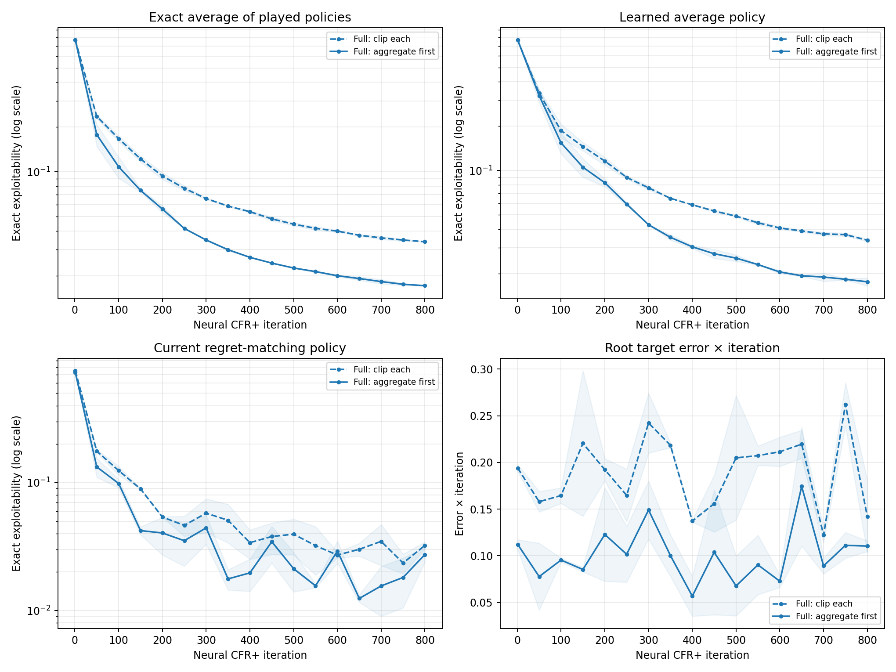

# Does the neural clip-order improvement persist?

**Purpose.** The [300-iteration neural experiment](2026-09-28_01-04-50_cfr_plus_neural_clip_order_cpu.md) found lower exact exploitability with aggregate-then-clip under full and capped traverser expansion. Both policies were still improving. This follow-up tests whether the full-expansion gain persists through a longer period, or fades as the current policy and average networks continue to change.

## Expected outcomes

| Observation | What it would suggest |
| --- | --- |
| Aggregate-first stays better at 800 iterations across both seeds | The intervention is more than a short initial optimization benefit on this game. It becomes reasonable to test an 18-claim version with exact evaluation. |
| Curves meet or reverse | Clip order influences early learning but does not settle late quality; prioritize independent regret-state and deep-infoset audits. |
| Either curve worsens after previously improving | This small game can expose a late feedback failure; inspect the root target audit and exact played average near that point. |

## Method

Use the same six-claim spec, networks, optimizer settings, 32 root traversals per player, full traverser-action expansion, and seeds 17 and 23 as the first neural experiment. Compare only `clip_each_record` and `aggregate_then_clip`, with exact evaluations every 50 iterations through 800. Full expansion removes claim-cap differences while still sampling private deals and opponent actions. The shadow ledger and root target audit remain observational. This is matched by iteration and traversal count; report wall time separately if later comparing efficiency.

Snapshot compilation preserves Torch RNG in this run. The evaluation schedule differs from the 300-iteration experiment, so this is a new matched run from iteration 1, not a continuation of those particular trajectories.

Run from the repository root:

```powershell
.\.venv\Scripts\python.exe -u scripts/shadow_neural_cfr_plus_cpu.py --iterations 800 --traversals 32 --eval-every 50 --caps full --seeds 17,23 --clip-modes clip_each_record,aggregate_then_clip --output docs/data/neural_clip_order_long_800.json
```

## Results

All four 800-iteration runs completed. The saved [evaluation rows](../data/neural_clip_order_long_800.json) include both seeds and both modes; regenerate the graph with `python scripts/plot_cfr_plus_cpu_experiments.py`. The two methods' shared evaluation points through iteration 300 match the isolated shorter run, checking that the changed evaluation interval no longer perturbs training. An earlier, interrupted run made before RNG isolation is [preserved separately](../data/neural_clip_order_long_800_pre_rng_fix_partial.json) and excluded from the results below.



**How to read the graph.** Solid means aggregate before clipping; dashed means clip each sampled record. The first three panels show **exact exploitability** on log y-axes, where lower is better and equal vertical distances represent equal ratios. The last panel shows root target error multiplied by iteration `t`, on a linear scale; it is not exploitability. Each line is the mean of seeds 17 and 23, and pale shading spans those two values rather than a confidence interval.

| Iteration | Clip-each learned average | Aggregate-first learned average | Clip-each exact played average | Aggregate-first exact played average |
| ---: | ---: | ---: | ---: | ---: |
| 300 | 0.0764 | **0.0429** | 0.0660 | **0.0347** |
| 500 | 0.0491 | **0.0255** | 0.0444 | **0.0225** |
| 800 | 0.0337 | **0.0176** | 0.0338 | **0.0171** |

At iteration 800, the learned average is about **48% less exploitable** with aggregate-first. The result holds for both seeds: clip-each finishes at 0.0343 and 0.0331; aggregate-first at 0.0165 and 0.0187. The exact average of played policies shows a similarly large advantage, so this is not only a difference in how well the average network fits. Both average-policy curves continue improving through 800 iterations; neither shows the late deterioration seen in larger games. Current-policy exploitability fluctuates in both modes and is a less stable endpoint comparison.

The mean scaled root absolute target error at iteration 800 is 0.142 for clip-each and 0.110 for aggregate-first. Its difference is smaller than at iteration 300, and it is measured against each run's own frozen policy. It supports the target-mechanism interpretation without proving it accounts for every policy improvement.

## Conclusion and next boundary

Aggregate-first's advantage lasts well past the first 300 iterations on this exactly evaluated six-claim game. The [subsequent 18-claim CPU comparison](2026-09-28_02-34-03_cfr_plus_18_claim_target_order_cpu.md) also favors aggregate-first for both seeds at every saved time through 75 minutes, despite fewer completed iterations. It does not yet cross the previously observed late deterioration point. A deeper information-set audit would help separate remaining sampling error from network-state drift. This CPU experiment does not establish whether aggregation is practical on the 69-claim GPU run: the current implementation groups one player's entire retained regret buffer on CPU and intentionally forbids GPU use.
