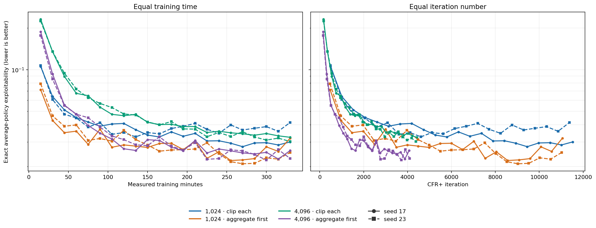
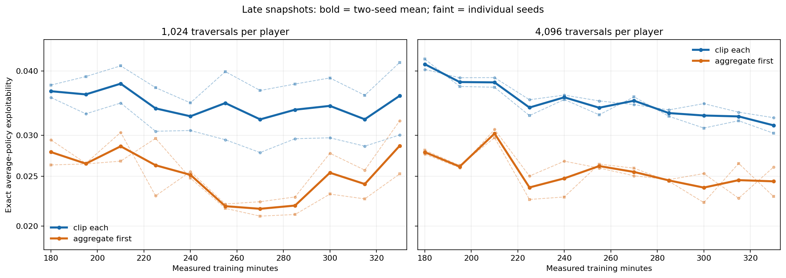

# 18-claim neural CFR+: regret-target grouping and traversal count

## Question

An earlier [18-claim experiment](2026-09-28_02-34-03_cfr_plus_18_claim_target_order_cpu.md) suggested that grouping sampled regret targets before clipping improved the learned average policy. We wanted to know whether that improvement lasts, and whether using four times as many traversals per CFR+ iteration is worth the extra training time.

The outcome is **exact exploitability of the saved average policy** on the 18-claim game. Lower is better. We compare both equal training time and equal iteration count; the former answers which use of CPU time works better.

## What was compared

At each visited information set, the trainer combines a sampled action
advantage with the previous regret-network prediction to make a raw target.
The two implemented modes treat that target differently:

| Mode | Regret-target processing |
| --- | --- |
| Clip each | Clip every sampled target at zero before fitting. |
| Aggregate first | Store raw targets from the current iteration; before fitting, group records with identical information-set features, take their weighted mean, clip that mean at zero, and assign it to those records. |

**The regret buffer is cleared at the start of every player's iteration.**
Grouping therefore uses only that iteration's *retained* records, across all
traversal batches; older records are not re-averaged. The regret buffer is a
500,000-row recent-record ring, so if an iteration produces more rows, its
earliest rows would be absent at fitting time. Inspection of all eight VM
`training.jsonl` files found that this never happened in the 330-minute run:
the largest per-iteration counts were 376,913 for Player 1 and 42,933 for
Player 2. Thus all generated regret records were retained for fitting. The weights
correct the inclusion probability of sampled acting-player action paths. This
experiment fully expands those actions, so every weight is one and the group
target is an ordinary mean. This is a comparison of two *same-iteration target
processing methods*: averaging before clipping also replaces noisy labels by
one repeated group label. That can reduce minibatch gradient noise. Moreover,
the fixed fitting loss assigns extra weight to positive targets, so changing
the targets can change their effective loss weights. The observed policy gap
cannot be attributed quantitatively to clipping bias alone.

Each player receives 24 regret-fitting batches of 1,024 rows per iteration,
sampled with replacement. Aggregate first computes each retained group's label
using all its retained visits *before* those 24 batches are drawn. Clip each
feeds the sampled visits' individual labels to the network. The two methods
therefore also differ in how much traversal information reaches a finite-step
optimizer through any one sampled row.

The row counts fall sharply after the first iteration. Across the four
1,024-root arms, median per-iteration regret counts were about 12,700–13,400
for Player 1 and 3,000–3,200 for Player 2. Across the four 4,096-root arms,
they were about 50,100–53,900 and 11,600–12,700. The fixed 24,576 fitting
draws therefore exceeded the median number of stored rows for both players
at 1,024 roots, but fell short of Player 1's median at 4,096 roots. Draws are
with replacement, so exceeding a buffer's size does not imply visiting every
row during fitting.

We crossed these two modes with **1,024 or 4,096 root traversals per player per iteration**, using seeds 17 and 23: eight runs in total. Traversals sampled deals and opponent actions but fully expanded the acting player's legal actions. More traversals might improve each update; they also cost more, and the number of regret-fitting steps remained fixed.

The game has four ranks, four suits, two cards per hand, the
RankHigh/Pair/TwoPair/Trips claim types, and suit symmetry. Every arm used a
512×512 regret MLP, a 256×256 average-policy MLP, learning rate 0.001,
batch size 1,024, 24 regret-fitting steps, six average-policy fitting steps,
positive-regret weight 0.5, linear average weighting, a per-iteration regret
buffer capacity of 500,000 records, and a persistent strategy replay capacity
of 2,000,000 records. Traversal batches held 512
roots. The batched traversal backend ran on **CPU**. Eight PyTorch threads per
arm gave higher aggregate throughput than sixteen in a short machine check
(2.915 versus 2.574 iterations/s).

Each arm trained for **330 measured training minutes**, with policies saved every 15 minutes. An exact best response evaluated every saved *average* policy: 22 snapshots × 8 arms = **176 exact evaluations**. Evaluation time is excluded from the training budget, although two one-thread evaluation workers sometimes contended with training on the same host. Current-policy exploitability was not evaluated. With only two seeds, repeated snapshots are not independent replications.

Before the run, a persistent gap between target modes would support changing target processing; a 4,096-traversal win at equal time would justify its sampling cost. If the curves slowed under all settings, these comparisons alone would not identify the remaining failure mechanism.

## Results

**Reading the graph:** the left panel compares equal *measured training time*; the right compares equal *CFR+ iteration count*. Both exploitability axes are logarithmic. Colour identifies the target mode and traversal budget; solid circles are seed 17 and dashed squares are seed 23. Each marker is one saved average policy evaluated against an exact best response. The lines join snapshots; they do not measure policy quality between them. The iteration panel does not hold compute cost constant.

The values below are **two-seed means at each saved time**, not averages over the whole run. The [complete rows](../data/neural_18_claim_parallel_cpu_330m_20260928.jsonl) retain individual seeds and iterations.

| Traversals | Target mode | 75m | 150m | 225m | 270m | 330m | Mean iterations at 330m |
| ---: | --- | ---: | ---: | ---: | ---: | ---: | ---: |
| 1,024 | Clip each | 0.04014 | 0.03440 | 0.03384 | 0.03221 | 0.03579 | 11,450 |
| 1,024 | Aggregate first | **0.02985** | **0.02799** | 0.02624 | **0.02160** | 0.02862 | 11,042 |
| 4,096 | Clip each | 0.06371 | 0.04180 | 0.03397 | 0.03502 | 0.03137 | 4,402 |
| 4,096 | Aggregate first | 0.04221 | 0.02973 | **0.02376** | 0.02547 | **0.02442** | 4,083 |

### Target processing matters throughout the run

Aggregate first beat clip each in **42 of 44** matched seed-and-snapshot comparisons at 1,024 traversals and **all 44** at 4,096. At the final snapshot its mean exploitability was about 20% lower at 1,024 traversals and 22% lower at 4,096. The two exceptions at 1,024 were seed 23 at 120 minutes and seed 17 at 330 minutes.

This is strong evidence that averaging the current iteration's sampled targets
before clipping produces better policies on this game. It is not 86 independent
trials. The experiment does not show that this correction alone can close the
gap to exact CFR+, because sampling, conditional regret units, network fitting,
and inherited network predictions remain in both arms.

### More traversals improve an update, with no stable equal-time win

At 330 minutes, 4,096-traversal aggregate-first arms had completed about **4,083** iterations versus **11,042** with 1,024 traversals. The right-hand graph shows that the larger budget reached similar quality in fewer updates. Each update took substantially more CPU time, however.

At 270 minutes, the 1,024-traversal aggregate mean was 0.02160 versus 0.02547 for 4,096. At 330 minutes the order reversed: 0.02862 versus 0.02442. Across the saved times from 240 to 330 minutes, the mean values averaged 0.02409 and 0.02480, respectively. Among the 12 paired seed-and-time comparisons from 255 through 330 minutes, 4,096 won only five. The endpoint does not establish that the larger budget is better per unit time. Because both settings used 24 regret-fitting steps per iteration, this comparison also changes new training records per fitting step.

### Late progress slows and can reverse

The close-up holds traversal count fixed in each panel and uses a narrower **logarithmic** y-axis. Bold lines are two-seed means; faint lines are individual seeds. The 1,024-traversal aggregate mean reached 0.02160 at 270 minutes, then worsened to 0.02862 at 330. Seed 17 rose from 0.02207 at 255 minutes to 0.03201 at 330. The 4,096-traversal aggregate mean stayed between roughly 0.02375 and 0.02615 from 225 through 330 minutes, without a sustained late decline. Both 4,096 clip-each seeds, meanwhile, attained their own best saved values at 330.

These curves show **diminishing and non-monotonic progress under fixed settings**, but do not prove a hard floor. Choosing the best saved policy matters. The same-game [exact tabular CFR+ run](../../artifacts/benchmark_runs/cfr_plus_runs/r4_s4_h2_hp2pt_ss___20260108-213016/metrics.json) reached 0.00197 after 10,350 iterations. The 1,024-traversal neural runs passed 11,000 iterations yet remained roughly an order of magnitude higher. Exact and neural iterations are different operations, so that benchmark indicates a quality gap rather than an equal-compute speed comparison.

## Conclusion

Use **aggregate first** as the stronger implemented CPU neural CFR+ baseline for this game. The evidence does not pick a consistent equal-time traversal winner, and more of the same fixed-setting training is unlikely to identify why the neural policies remain far from exact tabular CFR+.

The next useful test is an [exact-to-neural bridge](../explainers/neural_cfr_plus_regret_units_and_bridge.md). Compare counterfactual and conditional regret units, then sampled continuations, action sampling, and neural regret state separately. A table-based version of the same-iteration update would remove network fitting while retaining this clipping-order comparison.

## Reproducing and locating the data

The [eight-arm runner](../../scripts/run_cfr_plus_18_parallel_cpu.py) calls the [per-arm trainer](../../scripts/run_cfr_plus_18_target_order_cpu_overnight.py). The [figure script](../../scripts/plot_cfr_plus_18_parallel_cpu_archived.py) reads the [archived exact evaluations](../data/neural_18_claim_parallel_cpu_330m_20260928.jsonl). Full policies, checkpoints, logs, and the source-hash manifest are on the VM at `/root/liars_poker/artifacts/cfr_plus_18_parallel_cpu/long_20260928`.
