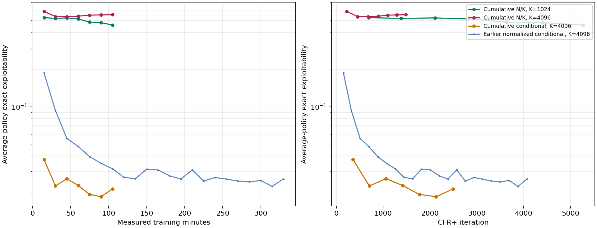
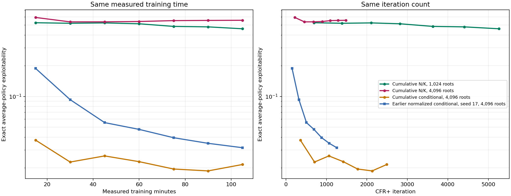
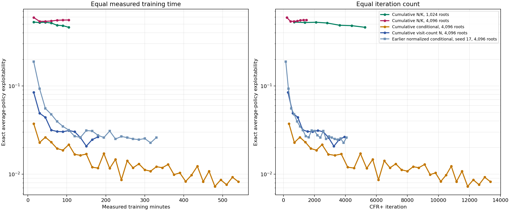

# 18-claim neural CFR+: cumulative regret and sampled reach

## Question

In an earlier neural run, multiplying sampled regret increments by the fraction of root traversals that visited an information set (`N/K`) gave poor policies. That run also trained the regret network on regret divided by the CFR+ iteration number. The resulting targets were very small, so the result did not tell us whether sampled reach itself was harmful.

This experiment removes the division by iteration number. It asks whether a network trained to predict **cumulative clipped regret** can learn with `N/K` increments, and whether more root samples help.

## Updates being compared

For an information set `I` and action `a`, let `K` be root traversals per player update, `N` the roots visiting `I`, `mean(G)` their mean sampled conditional action regret, and `old` yesterday's network prediction of cumulative clipped regret. For visited information sets, the target is:

| Run | Roots `K` | Target |
| --- | ---: | --- |
| `nk1024` | 1,024 | `max(0, old + (N/K) * mean(G))` |
| `nk4096` | 4,096 | `max(0, old + (N/K) * mean(G))` |
| `conditional4096` | 4,096 | `max(0, old + mean(G))` |

`N/K * mean(G)` equals the sum of sampled regrets divided by **all** roots, counting non-visits as zero. If `N=0`, there is no training row for that information set. Within an iteration, the code groups rows for the same information set, averages their raw increments, then clips once. On the first iteration, `old=0`.

These are neural updates: `old` comes from a network, and each new target is fitted with a limited number of optimizer steps. Even the `N/K` runs are therefore not exact tabular CFR+. The [regret-units explainer](../explainers/neural_cfr_plus_regret_units_and_bridge.md) describes the corresponding tabular updates.

## Setup and interpretation

All runs use the 18-claim game `r4_s4_h2_hp2pt_ss`, seed 17, full traverser-action expansion, and `aggregate_then_clip`. They use a 512-by-512 regret network, a 256-by-256 average-strategy network, learning rate `1e-3`, batch size 1,024, 24 regret fitting steps, and 6 strategy fitting steps per update. The 4,096-root runs have a 4-million-row regret buffer; the 1,024-root run has a 500,000-row buffer. Buffers are cleared between player updates. Each run has 330 measured training minutes. Saved average policies receive **exact exploitability** evaluations every 15 measured training minutes; evaluation and checkpoint time are excluded from that budget. Lower exploitability is better.

The main comparisons are:

1. `nk4096` versus `conditional4096`: same sampled roots and cumulative target units; isolates the `N/K` multiplier.
2. `nk1024` versus `nk4096`: tests whether more roots improve the reach-weighted update. Compare both **per iteration** and **per training minute**, since 4,096 roots cost more per iteration.
3. `conditional4096` versus the earlier 4,096-root normalized `aggregate_then_clip` run: tests the practical effect of fitting cumulative rather than iteration-normalized regrets. This comparison is about training behavior, since rescaling the targets also changes the optimizer's problem.

If `conditional4096` learns well but both `N/K` runs do not, the remaining issue is the sampled-reach update or how its smaller increments are fitted. If all three learn poorly, cumulative target scale is a plausible cause. If `N/K` catches up, the earlier failure was likely tied to target scale. The exact-evaluation curves will determine which case we observe; training loss alone will not.

## Results

The two `N/K` runs were stopped after the 105-minute snapshot because their exact exploitability stayed high. Their rolling checkpoints, policies, and logs remain on the VM. The cumulative conditional run completed 330 measured minutes. These are one-seed results.

### What “earlier normalized conditional” means

This label refers to the **seed-17, 4,096-root `aggregate_then_clip` neural arm** from the earlier 330-minute parallel CPU study, `trav4096__aggregate_then_clip__seed17`. It is a neural baseline, not the exact tabular solver. At each visited information set it aggregated sampled conditional advantages, then used the iteration-normalized update

`max(0, ((t - 1) / t) * old + mean(G) / t)`

where `old` is the previous normalized regret prediction and `mean(G)` is the within-iteration mean sampled conditional advantage. It does not multiply the increment by `N/K`. The table and blue curve use this run as a reference for the effect of cumulative target scaling. It reached iteration 4,072 and exploitability 0.02603 at 330 minutes. It is distinct from the later O/E/S/N normal run (seed 31), which also uses normalized conditional targets but follows a separate trajectory and has its own report.

| Run | 105m iteration | 105m exact exploitability |
| --- | ---: | ---: |
| Cumulative `N/K`, 1,024 roots | 5,265 | 0.4600 |
| Cumulative `N/K`, 4,096 roots | 1,483 | 0.5572 |
| Cumulative conditional, 4,096 roots | 2,492 | 0.0216 |
| Earlier normalized conditional (seed 17), 4,096 roots | 1,255 | 0.0315 |

Both vertical axes are logarithmic, so a given vertical gap represents an exploitability ratio. The left panel compares equal training time; the right panel compares equal CFR+ iteration count.

This is the original matched 105-minute comparison. The stopped `N/K` curves are intentionally retained in this report; removing them from the live dashboard did not remove or overwrite their archived results.

### What happened to the two `N/K` runs?

The standalone plot below isolates the two runs that multiply each conditional regret increment by the sampled reach fraction `N/K`. It compares them with the cumulative conditional run and the earlier normalized conditional run, truncated to the same first 105 measured minutes. Both panels use a logarithmic exploitability axis.

At 105 minutes, cumulative `N/K` with 1,024 roots reached iteration 5,265 and exploitability 0.4600. With 4,096 roots it reached iteration 1,483 and exploitability 0.5572. The conditional 4,096-root run was at iteration 2,492 and 0.0216; the earlier normalized conditional control was at iteration 1,255 and 0.0315. More roots did not rescue the reach-fraction update. On the overlapping iteration range, both `N/K` curves also remain far above the conditional run.

This is strong evidence that **these neural runs with cumulative `N/K` targets learn poorly under this fitting setup**. It is not evidence that reach weighting is generally wrong: the multiplier also makes the fresh targets smaller, and the neural optimizer is sensitive to target scale. A synthetic arithmetic check and traversal/checkpoint smoke test passed, but they do not prove every part of the sampled reach estimator is unbiased end to end. The dashboard now omits these stopped `N/K` arms; their full curves and data remain archived here and in `docs/data`.

The comparison per iteration is especially useful: cumulative conditional is already below the earlier normalized conditional at comparable iteration counts. In the *current code*, the intended arithmetic difference is regret target scale: normalized uses `((t-1)/t) old + g/t`; cumulative uses `old + g`, followed by the same grouping and clipping. The first iteration generated identical row counts, but later trajectories diverge because the fitted networks change the policies. The cumulative run also has a larger regret buffer, though the earlier 500,000-row buffer did not overflow: its largest observed player update had 376,913 rows. Thus buffer truncation does not account for the difference. The run budgets and CPU competition differ. More importantly, the source hashes recorded in the old and new run manifests differ. The code paths now appear equivalent apart from target scale, but we cannot prove the historical run had no other code changes without replaying it. A matched normalized control with today's code and the 4-million-row buffer is needed to attribute the improvement cleanly.

The completed cumulative conditional run strengthens the observed difference, while also showing that cumulative training is not monotone:

| Measured training minutes | Earlier normalized, 4,096 roots | Cumulative conditional, 4,096 roots |
| ---: | ---: | ---: |
| 60 | 0.047619 (iteration 691) | 0.023005 (iteration 1,416) |
| 120 | 0.026832 (iteration 1,442) | 0.016783 (iteration 2,893) |
| 180 | 0.027575 (iteration 2,196) | 0.011721 (iteration 4,555) |
| 240 | 0.026724 (iteration 2,936) | **0.008618** (iteration 6,133) |
| 330 | 0.026026 (iteration 4,072) | 0.012151 (iteration 8,371) |

At approximately 4,000 iterations, the normalized run was at 0.026026 (iteration 4,072), while cumulative conditional was at 0.011981 (iteration 4,147). Thus the advantage is present per iteration as well as per measured training minute. The two runs were conducted at different times under different machine load, and the old source revision differs; their iteration throughput should not be attributed to target scaling alone. The cumulative curve reached its best recorded value at 240 minutes and worsened by 330 minutes. It therefore has not eliminated late deterioration.

The `N/K` target implementation passes a synthetic check that isolates multiplication of the *fresh* grouped increment, plus an 18-claim traversal/checkpoint smoke check. The live runs emitted finite training and exact-evaluation results. This rules out a simple missing `/t`, an accidental scaling of the old prediction, or an obvious buffer overflow. It does **not** prove the reach formula is statistically correct end to end. In particular, when `N/K` is very small, the network has to fit tiny increments on top of its previous prediction; sparse or never-visited information sets receive no target. The failure could reflect those target units, the regression objective, or a subtler reach/counting issue. We should audit one update against exact conditional and exact counterfactual targets before treating the formula as validated.

The plotted evaluations and snapshot-to-iteration records are archived in `docs/data/cfr_plus_18_cumulative_*_20260929.jsonl`. The run definition is in [the launcher](../../scripts/run_cfr_plus_18_cumulative_scale.py); full artifacts are under `artifacts/cfr_plus_18_cumulative_regret/main_20260929` on the VM.

The conditional child survived the deliberate stop of the supervisor and completed its 330-minute target. On 29 September it was resumed from iteration 8,371 with a new target of **930 measured training minutes** (ten additional hours). The continuation runs in VM tmux session `cfr18_conditional_extend`, retaining 15-minute policy snapshots and a rolling 15-minute checkpoint. Port 8765 reads the new target from the resume event and continues evaluating snapshots exactly. The two `N/K` arms remain stopped. If the VM restarts, first confirm that the trainer process is absent, then resume only this arm with [the resume helper](../../scripts/resume_cfr_plus_18_cumulative_conditional.sh); `TARGET_HOURS` can be raised again to extend it further. The original three-arm supervisor cannot be used for this partial resume.

### Curves after the initial 105-minute comparison

The graph below keeps both failed `N/K` curves, extends cumulative conditional through its current continuation, and adds the separate visit-count `N` follow-up. The earlier normalized conditional curve is included as a reference. These are one-seed curves; the `N`-weighted arm is a distinct update and has its own [experiment note](2026-09-29_19-54-06_18_claim_cumulative_visit_count.md).

At the latest archived dashboard evaluation (29 September 2026, about 23:00 UTC), cumulative conditional had reached 540 measured minutes and iteration 13,352, with exact average-policy exploitability 0.00822. Its best saved point so far was 480 minutes, iteration 11,887, at 0.00727. The visit-count `N` run had reached 180 minutes and iteration 3,941, with exploitability 0.02643; its best saved point remained 150 minutes, iteration 3,254, at 0.02076. Both were still running at that check. The stopped `N/K` arms remain at their 105-minute endpoints shown above.

## Takeaways

- Removing `/t` did not rescue `N/K`; both reach-weighted neural runs stayed around 0.5 exploitability through 105 minutes, so they were stopped. Their curves remain in both report graphs and their evaluation rows remain archived.
- Cumulative conditional targets are promising and outperform the earlier normalized control in this one-seed comparison. The policy is not mathematically guaranteed to behave differently under perfect fitting; the observed difference points to optimization and approximation sensitivity to target scale.
- The fitted regret loss itself is not perfectly scale invariant: it gives an extra weight to targets above an absolute `1e-6` threshold. Limited fitting steps and network output scale also change the learned policy. A same-code normalized control is needed before assigning the observed gap to any one mechanism.
- The next diagnostic should separate errors in sampled targets from errors introduced by fitting those targets. A new `N`-weighted neural run could test scale directly, but is not a substitute for that audit.

The `N`-weighted follow-up is a separate 600-minute run displayed alongside cumulative conditional on port 8765. Its early curve is included in the updated comparison above; see [cumulative visit-count experiment](2026-09-29_19-54-06_18_claim_cumulative_visit_count.md) for the full method and interpretation.
