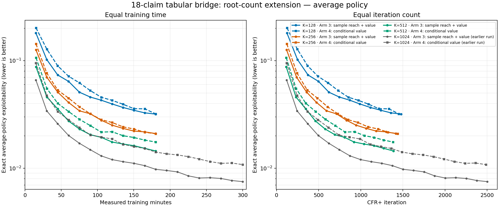
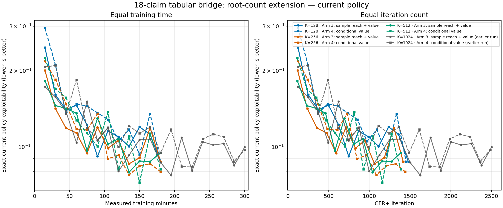

# 18-claim tabular bridge: fewer sampled roots

## Question

The original tabular bridge found that arm 3 (sample reach and conditional action values) learned better than arm 4 (conditional action values, with a unit increment at each visited information set). This follow-up reduced the root samples per player update from 1,024 to 512, 256, and 128.

The goal was to test whether fewer roots could preserve policy quality while making iterations cheaper, and whether arm 3's advantage over arm 4 survives when fewer information sets are visited.

## Method

All six runs use the 18-claim `r4_s4_h2_hp2pt_ss` game and seed 17. Each ran for 180 measured training minutes, with exact average- and current-policy exploitability evaluated every 15 minutes. The 1,024-root curves from the earlier bridge are shown as context; they were run separately and under different CPU load.

For an information set visited by `N` of `K` sampled roots, arm 3 weights the conditional sampled mean by `N/K`. Arm 4 uses the conditional mean itself, with a unit reach multiplier if visited and no update otherwise. Both sample action values and update the same tabular CFR+ regret representation. They differ in how visit frequency weights an update.

## Average-policy results

The figure shows two views of the **same** saved evaluations. The left panel compares equal measured training time. The right compares equal CFR+ iteration count. Both use a logarithmic exploitability axis, so equal vertical distances represent equal multiplicative changes. Solid lines are arm 3; dashed lines are arm 4. Color identifies root count. The gray 1,024-root reference came from the earlier run, so treat it as context rather than a controlled same-load comparison.

| Roots `K` | Arm 3 at 120m | Arm 4 at 120m | Arm 3 at 180m | Arm 4 at 180m | Iterations at 180m (arm 3 / arm 4) |
|---:|---:|---:|---:|---:|---:|
| 128 | 0.03962 | 0.04276 | 0.03189 | 0.03206 | 1,480 / 1,452 |
| 256 | 0.02517 | 0.02664 | 0.02103 | 0.02097 | 1,417 / 1,440 |
| 512 | 0.01755 | 0.02186 | 0.01449 | 0.01754 | 1,387 / 1,384 |
| 1,024, earlier run | 0.01205 | 0.01874 | 0.00979* | 0.01415* | — |

*The 1,024-root 180-minute values are the nearest saved points in the earlier run, not exact 180-minute measurements.

### What the curves show

- **More roots produced better average policies at the same training time.** The low-root curves are cleanly ordered: 512 outperforms 256, which outperforms 128. The earlier 1,024-root curves continue that pattern. This is the main result; fewer roots did not buy a useful time-for-quality tradeoff.
- **Arm 3's advantage is not equally strong at every root count.** At 128 roots, arm 3 and arm 4 finish essentially tied. At 256, they are also tied at 180 minutes, although arm 3 was ahead at 120 minutes. At 512, arm 3 remains better: 0.01449 versus 0.01754, about 17% lower exploitability. The earlier 1,024-root pair also favored arm 3. So the direction is consistent at higher K, while these one-seed runs do not support a strong claim at 128 or 256.
- **The iteration-count panel tells the same broad story.** The 512-root runs are better than the 128-root runs even where their iteration ranges overlap. The two rules at K=128 and K=256 track closely, and their endpoint ordering can swap. The benefit of arm 3 is therefore modest and noisy at low K, not a universal large gap.
- **All six had lower average exploitability at 180 than at 120 minutes.** The early descent is steep and then tapers, especially for K=128. There is no sustained late regression in this 180-minute window, but it is too short to rule out a longer plateau.

The earlier K=1,024 run is notably better than the low-root policies at both equal time and overlapping iterations. That comparison is suggestive, not a clean estimate of the causal effect of K: those runs were separate, CPU contention differed, and policies diverge as soon as their sampled updates differ.

## Current policies

Current-policy exploitability is much noisier than average-policy exploitability. The six low-root runs end between about 0.080 and 0.095, with no reliable ordering by K or update arm. These oscillations are expected in CFR+: the current policy is not the metric the algorithm is optimizing toward. The smoother average-policy curves above are the relevant comparison.

## Why fewer roots did not make the runs faster

The profiler answers this directly: root traversal was only a small part of each iteration, while several expensive tabular operations did not shrink when K fell.

For arm 3, the 90–120 minute medians were:

| Roots | Iteration time | Root sampling time | Sampling share |
|---:|---:|---:|---:|
| 128 | 7.37s | 0.21s | 2.9% |
| 512 | 7.90s | 0.46s | 5.8% |

Reducing K from 512 to 128 saves only about a quarter of a second in sampling in a roughly 7.5-second iteration. A separate five-iteration profile at K=128 measured 7.58s total: 3.43s rebuilding both players' dense regret-matched strategy tables, 1.17s recomputing history likelihoods, 2.76s in the update, and 0.22s sampling roots. The update includes a full-state sweep for exact own-reach, linear-weight average accumulation, as well as regret updates at sampled information sets.

Those fixed sweeps dominate the root-sampling savings. Consequently, fewer roots did not yield a meaningful throughput increase; the completed low-root arms also ended with broadly similar iteration counts. The bottleneck was the tabular strategy/likelihood/averaging work, not the sampled traversals. This is a result about this implementation and workload; it does not imply that traversal is negligible in a neural or larger-game implementation.

## Conclusions and limits

1. **Do not lower the root count here to chase speed.** K=128 saved only a small fraction of iteration time and produced substantially worse average policies than K=512 or the earlier K=1,024 reference.
2. **Visit-frequency weighting helps, but the evidence depends on K.** Arm 3 is better at K=512 and in the earlier K=1,024 comparison. At K=128 and 256, the 180-minute endpoints are effectively tied. More seeds would be needed to say the arm-3 advantage persists at low K.
3. **The measured cost is elsewhere.** Dense strategy rebuilding, likelihood recomputation, and exact average-policy accumulation dominate this tabular loop. Improving those operations is the plausible route to faster tabular iterations.
4. **This does not settle scaling to larger games.** Even K=128 revisits information sets often on this game. In a larger game, low root counts may cause much more severe coverage gaps. These results also say nothing directly about neural regret fitting or neural averaging.

## Data and reproducibility

The six per-run evaluation logs are archived under [`docs/data/low_root_tabular_bridge_20260929`](../data/low_root_tabular_bridge_20260929/). The figure is regenerated with [`plot_cfr_plus_18_tabular_bridge_low_roots.py`](../../scripts/plot_cfr_plus_18_tabular_bridge_low_roots.py). Run directories on the VM were `artifacts/cfr_plus_18_tabular_bridge/main_20260929/low_roots/k0128`, `k0256`, and `k0512`; each contains separate `sample_both` and `conditional` arms.
