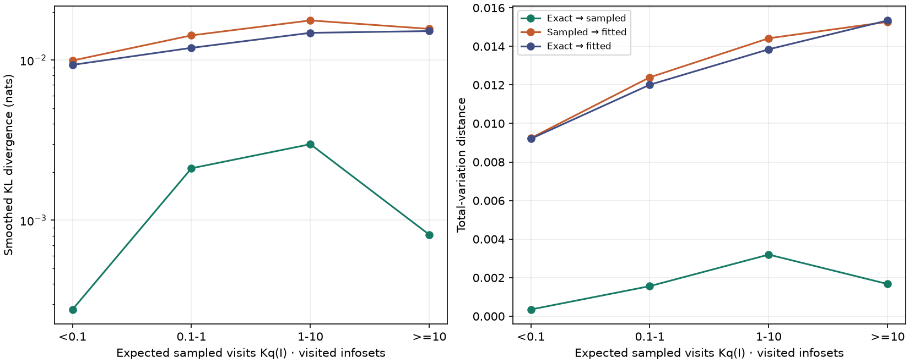
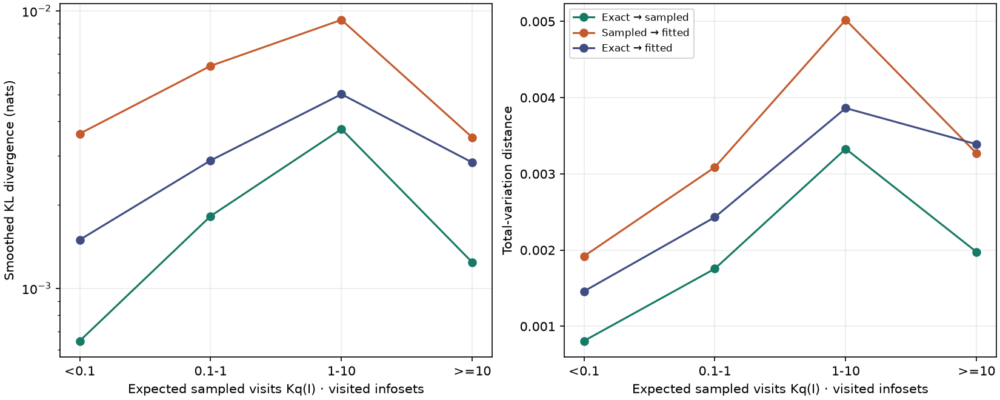

# A late neural CFR+ update: exact target, sampled target, fitted network

## Question

The 18-claim neural CFR+ runs improved slowly after several hours, while exact tabular CFR+ continued to improve. At the 330-minute checkpoints, where does **one player-1 update** lose the change it ought to make: in the sampled target or in fitting the regret network?

This audit loaded separate copies of the seed-17 and seed-23 checkpoints. It left their original training runs unchanged. Each copy took one normal 4,096-root traversal and 24 regret-fitting steps. Separately, an exact solver evaluated the same frozen current strategies.

## What the four policies mean

For every player-1 information set with at least two legal actions and positive exact reach, we turn four regret vectors into action probabilities by regret matching:

| Symbol | Regret vector | Question it answers |
| --- | --- | --- |
| **O**, old | Checkpoint network before the update | Where did this update start? |
| **E**, exact conditional target | Clip `((t−1)/t) × O + g(I,a)/t`, with exactly computed conditional action advantage `g` | Where would this one update aim if its conditional values were exact? |
| **S**, sampled target | The trainer's weighted aggregate of sampled records, then clip; at unvisited sets use O | What target did the traversal actually supply? |
| **N**, fitted | Network after training on S | What policy did fitting actually produce? |

`t` is the next CFR+ iteration. The exact target E **starts from the old network's prediction**; it is not an independent exact cumulative-regret ledger. The audit uses the historical conditional-regret units. It also computes a separate `qg` counterfactual using exact chance-and-opponent reach `q`, but adding `qg` to this conditional-unit network is **not** a valid replacement training recipe by itself.

```text
                 exact g
             O ----------> E
             |             |
      sampled traversal    |  discrepancy of final fit
             v             v
             S ----------> N
                24 fit steps
```

The arrows are comparisons, not a claim that N was trained on E. We compute policy distances **after regret matching**. They do not measure regret-vector error directly, and they do not measure exploitability of the average policy.

## How to read the numbers

**Total variation (TV)** is the main measure here: half the sum of absolute action-probability differences at an information set. It ranges from 0 to 1 and is symmetric.

- **O–E** is the size of the intended one-step policy change. This is the baseline for asking whether training has recovered the new signal.
- **E–S** measures sampling error **at visited sets**. Across all sets, it also includes the absence of a sampled target at missed sets.
- **S–N** measures how far fitting moved the policy from its actual target; a large value is not necessarily harmful if N moves closer to E.
- **E–N** measures the final one-step discrepancy. If it exceeds O–E, retaining O would have been closer to E **under that TV aggregation**. If it is smaller, that is encouraging but does not prove an improvement in exploitability.

We also report `KL(left || right)` in nats. It uses `1e-5` smoothing on legal actions because regret matching can assign zero probability. **KL is directional**: the available O→E KL cannot be compared directly with E→N KL as a “before versus after” test. TV permits that comparison. A future audit could additionally calculate `KL(E || O)`.

The principal tables below first average equally across **visited** information sets. Other rows weight each set by its exact `q`, or by `1/[-log q]` and then normalize by the sum of those weights. The latter gives low-reach sets more influence than direct `q` weighting, without giving every set equal weight. All included sets have `0 < q < 1`. None of these weightings is itself exploitability: rare sets may still offer a valuable best response.

## Results at the 330-minute checkpoints

Seed 17 was at iteration 4,072; seed 23 at 4,093. The sampled updates produced 50,742 and 54,460 regret records. These are **single updates**, not average-policy evaluations.

### Visited information sets

| TV comparison | Seed 17 | Seed 23 | Interpretation |
| --- | ---: | ---: | --- |
| O–E: exact one-step change | 0.00388 | 0.00540 | The signal we hope to recover |
| E–S: sampling difference | 0.00197 | 0.00219 | Sampling differs from exact target |
| S–N: fitting difference | 0.01323 | 0.00361 | Network differs from sampled target |
| E–N: final difference | **0.01292** | **0.00296** | Compare this row with O–E |
| E–exact `qg`: reach counterfactual | 0.00372 | 0.00528 | Reach changes this one-step target substantially |

There were 3,526 visited sets in seed 17 and 4,102 in seed 23. For seed 17, E–N is **3.3 times** O–E: under mean TV over visited sets, the fitted policy is farther from this exact one-step target than the old policy was. For seed 23, E–N is **0.55 times** O–E: the fit gets closer. This disagreement is a reason to gather more checkpoints or sampled updates before declaring fitting the cause of the plateau.

S–N can be greater than E–N because fitting can correct some sampling error. Conversely, E–N does not equal E–S plus S–N; TV obeys a triangle inequality, not an additive decomposition.

The corresponding **directional**, smoothed KL values on visited sets are:

| `KL(left || right)`, nats | Seed 17 | Seed 23 |
| --- | ---: | ---: |
| `KL(E || S)` | 0.00191 | 0.00219 |
| `KL(S || N)` | 0.01513 | 0.00640 |
| `KL(E || N)` | 0.01319 | 0.00340 |

For a KL version of the “is N closer than O?” test, we would need `KL(E || O)`; the existing O→E value has the reverse direction. That is why the conclusion above uses TV.

### The sets visited, and the sets missed

| Seed | Positive-reach legal sets | Visited | Visited fraction | Fraction of summed exact `q` in visited sets |
| --- | ---: | ---: | ---: | ---: |
| 17 | 344,220 | 3,526 | 1.02% | 96.6% |
| 23 | 424,530 | 4,102 | 0.97% | 96.0% |

The traversal touches about 1% of eligible sets by count, but those sets hold about 96% of the summed exact reach weight. At an **unvisited** set, S is O by definition; hence all-set E–S largely measures *coverage* rather than noisy estimates at observations.

| Scope / weighting | Seed | O–E TV | E–S TV | S–N TV | E–N TV |
| --- | --- | ---: | ---: | ---: | ---: |
| All sets, equal weight | 17 | 0.00099 | 0.00097 | 0.00215 | 0.00287 |
| All sets, equal weight | 23 | 0.00087 | 0.00084 | 0.00057 | 0.00048 |
| All sets, `1/[-log q]` weight | 17 | 0.00113 | 0.00106 | 0.00289 | 0.00365 |
| All sets, `1/[-log q]` weight | 23 | 0.00115 | 0.00105 | 0.00074 | 0.00061 |
| All sets, exact-`q` weight | 17 | 0.00528 | 0.00161 | 0.01337 | 0.01354 |
| All sets, exact-`q` weight | 23 | 0.00566 | 0.00183 | 0.00316 | 0.00317 |

Equal weighting over all sets makes every number look small because the many missed low-reach sets dominate the count. The `1/[-log q]` rows lie between equal and exact-`q` weighting: their seed-17 final discrepancy is 0.00365, compared with 0.00287 and 0.01354. Exact-`q` weighting exposes seed 17's much larger fitting discrepancy among heavily reached sets. It also makes the E–S gap look smaller, because most reach weight lies in observed sets. Under **each** weighting, E–N exceeds O–E for seed 17 and falls below it for seed 23.

### Does frequent visitation solve the problem?

`Kq` is the expected number of root visits with `K=4,096`. The next table uses **visited sets only**, with equal weight within each bin. The four TV columns have the same meanings as above.

| Seed | Expected visits `Kq` | Visited sets | O–E | E–S | S–N | E–N |
| --- | --- | ---: | ---: | ---: | ---: | ---: |
| 17 | <0.1 | 458 | 0.00180 | 0.00035 | 0.00924 | 0.00921 |
| 17 | 0.1–1 | 1,190 | 0.00272 | 0.00156 | 0.01239 | 0.01201 |
| 17 | 1–10 | 1,179 | 0.00471 | 0.00320 | 0.01442 | 0.01385 |
| 17 | ≥10 | 699 | 0.00583 | 0.00167 | 0.01527 | 0.01535 |
| 23 | <0.1 | 620 | 0.00299 | 0.00081 | 0.00192 | 0.00146 |
| 23 | 0.1–1 | 1,301 | 0.00454 | 0.00176 | 0.00309 | 0.00243 |
| 23 | 1–10 | 1,406 | 0.00680 | 0.00333 | 0.00502 | 0.00386 |
| 23 | ≥10 | 775 | 0.00626 | 0.00197 | 0.00327 | 0.00339 |

For seed 17, even the most frequently visited bin has E–N TV 0.01535 against an O–E signal of 0.00583. More visits to these particular sets did not prevent this fit from moving away from E. For seed 23 the final error is below the exact signal in every bin. The bins group different information sets, so the lines in the figures are **not** a training-time trajectory.





The left panel of each figure has a logarithmic KL axis; the right TV panel has a linear axis. The complete per-bin KL, reach-weighted TV, `1/[-log q]`-weighted TV, regret RMSE and support data are in [seed 17 CSV](../data/cfr_plus_18_late_update_seed17_metrics_20260929.csv) and [seed 23 CSV](../data/cfr_plus_18_late_update_seed23_metrics_20260929.csv). Support mismatch is sensitive to tiny positive action probabilities and should not be read as a direct exploitability measure.

## Conclusions and next tests

1. **Sampling error at observed sets is smaller than fitting error in these two updates.** This is clearest for seed 17. It does not rule out inadequate *coverage* of strategically important rare sets or poor sampling in other iterations.
2. **The network fit behaves differently in the two checkpoints.** Seed 17's one-step fit is worse than keeping the old policy by mean TV to E; seed 23's is better. We do not know whether this difference is typical, due to checkpoint state, or due to one stochastic update.
3. **This does not yet explain the average-policy plateau.** Local regret-matching distances are diagnostic. The outcome we ultimately care about is exact exploitability of the continued **average policy**, measured at matched training budgets.

A useful first follow-up is to continue a saved checkpoint with ordinary training and audit multiple later updates, ideally including repeated sampled updates at selected checkpoints to measure variation. A second, controlled fork could replace sampled conditional `g` with exact `g` **only at the same visited sets**, keeping coverage, optimizer, fitting budget and averaging fixed. Compare that fork with an ordinary continuation from the same checkpoint. Computing exact `g` for **all** sets each iteration would also change coverage and the training distribution, so it answers a broader question and costs more. Before committing to two hours of either fork, measure its time per iteration and evaluate both average and current-policy exploitability at matched iterations and wall time.

## Reproducibility

The source checkpoints are the completed seed-17 and seed-23 `trav4096__aggregate_then_clip` runs under `artifacts/cfr_plus_18_parallel_cpu/long_20260928`. The [audit script](../../scripts/audit_cfr_plus_18_late_update.py) and [launcher](../../scripts/launch_cfr_plus_18_late_audit.sh) wrote `summary.json`, `metrics.csv` and `kl_by_reach.png` for each seed on the VM. Audits ran sequentially with two CPU threads and took about 49 seconds each. No new checkpoint or policy copy was written. The original checkpoints were read only.
