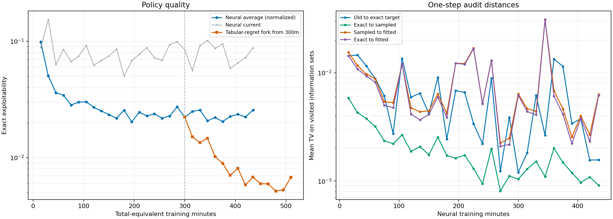

# 18-claim O/E/S/N audit and tabular-regret fork

## Questions

This work asks two connected questions about neural CFR+ on the 18-claim game:

1. As a normal neural CFR+ run continues, do one-step target and fitting errors change in a way that helps explain the average policy's progress or plateau?
2. If the regret networks are replaced by stored tabular regrets late in training, does the average policy keep improving?

The first is a diagnostic of one-step regret updates. The second is a longer intervention on the regret representation. They are separate experiments and should not be read as one controlled comparison.

## O/E/S/N audit

The fresh normal run uses seed 31 and the 18-claim `r4_s4_h2_hp2pt_ss` game. It uses the established neural CFR+ settings, including 4,096 root traversals per player update, aggregate-then-clip regret targets, normalized `1/t` units, 24 regret fitting steps and six strategy fitting steps. Every 15 measured training minutes, the run saves a resumable checkpoint and policy snapshot, measures exact exploitability of the average and current policies, and audits a cloned copy of the next player-1 update. The audit does not change the live trainer or its random-number state.

For each visited information set:

- **O** is the old policy/regret prediction before the update.
- **E** is the ideal one-step target using exact conditional action advantages `g`, while retaining the old regret prediction.
- **S** is the target from the normal sampled traversal data.
- **N** is the regret network after fitting S.

The comparisons separate the local stages: O→E is the intended update, E→S is sampling error, and S→N is fitting error. E→N compares the final fitted result with the exact one-step target. The audit also reports total-variation and KL distances with equal, reach, and `1/[-log(q)]` weights. These are local policy distances at one update, not direct exploitability estimates. A low distance does not guarantee that strategically important states are weighted enough, and one seed cannot establish a predictive relationship.

### Completed normal run and what the audit showed

The seed-31 trainer ran to its **435-minute checkpoint**, iteration **10,286**, then was stopped on 30 September 2026 because the average policy had stopped improving. Its best saved average-policy exact exploitability was **0.02029 at 195 minutes**; the 435-minute value was **0.02566**. The current policy ended at **0.08772** and remained much noisier. The last complete checkpoint and all 29 monitor rows remain under `artifacts/cfr_plus_18_oens_followups/main_20260929/normal/` on the VM. The incomplete interval after minute 435 was discarded. The live O/E/S/N process and its dashboard were stopped.

The left panel shows **exact** exploitability on a log scale. The tabular curve starts from the neural checkpoint at minute 300, so its horizontal coordinate is source training plus fork training; it is a separate intervention, not the continuation's earlier history. The right panel shows total variation (TV) between one-step policies at visited information sets. Smaller distance means two policies agree more closely *locally*; it is not an exploitability estimate.

The sampled target E→S was usually closer to the exact one-step target than the fitted network S→N was to the sampled target. At minute 435, mean visited-set TV was **0.00157** for O→E, **0.00091** for E→S, **0.00633** for S→N, and **0.00620** for E→N. But these distances changed sharply between audits without a correspondingly clear change in the average-policy curve. At minute 345, for example, S→N jumped to **0.03108** while the average policy made one of its best observations (**0.02073**). We could see fitting discrepancies, but could not turn the O/E/S/N measurements into a reliable diagnostic of the plateau or a rule for choosing a better update. The average policy also reflects many previous updates, whereas the audit clones only one next update. The full records are in [the archived monitor data](../data/cfr_plus_18_oens_monitors_20260930.jsonl).

## Why the exact-G rescue was retired

An earlier rescue fork started from the seed-17 neural checkpoint at iteration 4,072 (330 minutes). It replaced sampled conditional action values with exact `g` at the same sampled/visited information sets, leaving the other training machinery in place. After 120.6 additional measured minutes it had reached only iteration 4,214. Average exploitability moved from 0.02603 at the source to 0.02261 at total minute 390, then rose to 0.02826 by minute 450. The transient improvement did not persist.

The run was also prohibitively slow: median iteration time was 51.23 seconds, of which 49.14 seconds was in the regret-training phase containing the exact dense calculation, versus 2.10 seconds for traversal and 0.05 seconds for strategy fitting. It generated only 142 additional CFR+ iterations in two hours. With no same-checkpoint ordinary continuation, the result did not isolate whether exact `g` helps. It is best treated as an expensive, inconclusive pilot, not evidence that exact values cannot help. We stopped pursuing it and moved to a more direct test of the regret representation.

## Follow-up: replace the regret networks with a tabular regret state

The current fork starts from the seed-31 O/E/S/N run's 300-minute checkpoint, at iteration 7,417. The source average policy's exact exploitability was 0.02224. The fork keeps the neural strategy/average-policy network and its replay state, but replaces the regret networks with a lazy tabular store:

1. On first lookup of an information set, initialize its table row from the frozen source regret network's prediction.
2. At each iteration, collect the usual 4,096-root sampled regret records.
3. For each visited information set, aggregate its conditional targets, then clip once and store the updated regret vector in the table. The source settings use normalized regret units. Unvisited entries stay at their frozen source predictions.
4. Continue training the strategy network and evaluating the exact average policy every 15 fork-training minutes.

This is **not exact tabular CFR+** and does not use exact `g` or exact reach. It keeps sampled conditional updates and the neural average. It asks whether removing repeated regret-network fitting and prediction drift helps the late trajectory when regrets are stored explicitly. If it improves, that implicates some part of the regret-network approximation/fitting loop, but it will not distinguish those components by itself. If it does not, the remaining causes include sampled updates, the normalized `1/t` scale, coverage, and the learned average.

The fork is configured for 600 additional measured minutes, with exact average-policy evaluation and a resumable checkpoint every 15 minutes. In the results available for this writeup, it reached **0.00517 at 180 fork minutes** (iteration 25,911) and **0.00677 at 210 minutes** (iteration 28,915), versus **0.02224 at the source checkpoint**. The local copy of its evaluation data covers the first 210 minutes; the fork itself was left running on the VM. Recent iterations took about 0.6 seconds, with roughly 0.53 seconds in traversal, 0.01 seconds in the tabular regret update and 0.05 seconds in strategy fitting. The [saved evaluation series](../data/cfr_plus_18_tabular_regret_fork_evaluations_20260930.jsonl) and left-hand plot show a large improvement despite fluctuations.

The fork runs in tmux session `cfr18_tabular_fork`, with its average-policy curve overlaid on the cumulative dashboard on port 8765. Its VM directory is `artifacts/cfr_plus_18_tabular_regret_forks/oens_0300m`. The source checkpoint is preserved separately in that directory.

## How to read the combined evidence

- The O/E/S/N audits did not identify a local distance that tracked the average-policy plateau. Small E→S distances suggest sampling error was often smaller than fitting error *at visited sets*, but this alone does not locate the cause of long-run exploitability.
- The exact-G rescue produced too few iterations and no lasting improvement, so it was not a useful long-run test.
- The tabular-regret fork is more informative about the regret representation. Its large gain while retaining sampled traversal and neural averaging implicates some part of the neural-regret update loop. It does not isolate limited fit steps from function-class limits, extrapolation to unvisited information sets, or repeated prediction drift. The fork also stays in normalized units, so its result does not directly measure the best cumulative neural recipe.
- Compare fork and source at both iteration and measured time, and remember their policies diverge after the fork. The source checkpoint is the starting point, not a concurrent control.

## Files and run records

- Normal/OENS run and audits: `artifacts/cfr_plus_18_oens_followups/main_20260929/normal/`
- Retired exact-G pilot: `artifacts/cfr_plus_18_oens_followups/main_20260929/exact_g/`
- Active tabular-regret fork: `artifacts/cfr_plus_18_tabular_regret_forks/oens_0300m/`
- Implementation: [`cfr_plus_tabular_fork.py`](../../liars_poker/algo/cfr_plus_tabular_fork.py) and [`run_cfr_plus_18_tabular_regret_fork.py`](../../scripts/run_cfr_plus_18_tabular_regret_fork.py)
