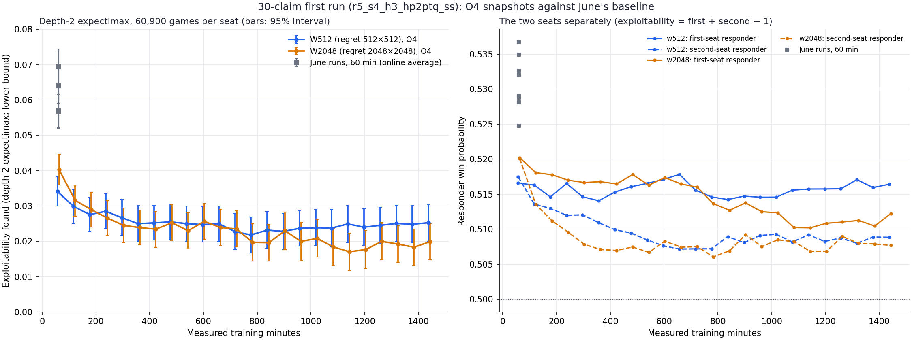

# 30 claims: first run with the settled recipe (regret width 512 vs 2048)

**Status: complete (4 October 2026).** Both arms ran 1,440 measured minutes; results below. This supersedes the benchmark-only plan in [30-claim port and benchmark](2026-10-03_03-16-57_30_claim_port_and_benchmark.md).

**Evaluation update (3 October):** The original 2,000-game depth-two screens were too noisy to compare the arms. Saved policies are being rescored with 60,900 games per seat, hand stratification, terminal belief averaging, and paired comparisons. See the [precise checkpoint BR experiment](2026-10-03_17-30-00_30_claim_precise_checkpoint_br.md). Routine depth-three/four screens have stopped; training is unaffected.

## Benchmark decisions (3 October)

The two widths ran together on the RTX 4060 Ti 16 GB, alongside the existing O4 worker. Traversal batch 1,024 ran out of memory with W2048; batch 256 worked. At K=32,768, W2048 took roughly 25–27 seconds per iteration, above the 10-second cutoff. The ramp therefore ends at **K=16,384**. At that K the largest observed per-player regret batch was about 0.91M rows, so the 2M regret buffer clears the planned 1.5× margin. The two arms fit with **4M strategy records per player each**; 8M leaves too little GPU headroom. These are the parameters in the runner manifest.

The first smoke found two resume-only memory spikes: O4 fitting left cached CUDA memory in a persistent controller, and checkpoint loading allocated a second GPU reservoir before replacing the first. The controller now runs O4 fitting in a short-lived subprocess; checkpoint restore copies saved rows in chunks into the reservoir that the trainer already owns. A 20-measured-minute smoke passed four five-minute save, O4 fit, and resume cycles for both arms. Its saved policies and logs remain; its temporary full checkpoints were removed after the check to free disk space. The 1,000-iteration 18-claim regression gave **0.02195** exact exploitability for the online average and **0.01073** after O4, close to the earlier N-arm O4 reference near 0.0105.

The 30-claim depth-two responder could not be scored by enumerating every possible full game: the first smoke policy occupied a CPU core for more than 20 minutes without completing. We now keep exact opponent beliefs in the responder's *choice* calculation and estimate its full-game win rate with sampled complete games. On an 18-claim policy, 100,000-game MC found 0.01886 versus 0.02261 by exact enumeration, within the MC 95% half-width of 0.00618. The 30-claim screen uses 2,000 games per seat at depth two, 500 at depth three, and 100 at depth four, recording confidence bounds. These are noisy screens; promising policies can be reevaluated with more games. The 5-minute fitted-return BR remains the final independent check.

## Live run

VM run root: `/root/liars_poker/artifacts/cfr_plus_30_claim_first_run/main_20261003`. The dashboard is on VM port `8774`, forwarded locally to `http://127.0.0.1:18774`. It shows measured training time, iteration, current K, cumulative roots, O4 snapshots, checkpoint size, and available BR results. Seven independent CPU workers evaluate W512, W2048, and the four June baseline policies. Evaluation can lag behind training.

To pause, create `PAUSE` in the run root. The controller checkpoints after the current iteration or snapshot. To resume after a VM restart, remove `PAUSE` and run the same launcher in a fresh tmux session:

```bash
cd /root/liars_poker_20261001
RUN=/root/liars_poker/artifacts/cfr_plus_30_claim_first_run/main_20261003
rm -f "$RUN/PAUSE"
tmux new-session -d -s cfr30main bash scripts/launch_cfr_plus_30_first_run.sh "$RUN" 1440 60 5000 16384
```

The controller has a lock to prevent two copies from advancing the same run. `controller.log`, each arm's `train.log`, `fit.log`, and the `eval_*.log` files contain progress and failures. The final fitted-return BR runs automatically after both training arms finish.

## Results (complete: 1,440 measured minutes each, 4 October)

Both arms reached 1,440 measured minutes on 4 October:

| Arm | Iterations | Roots per player | Final K |
| --- | ---: | ---: | ---: |
| W512 | 24,244 | 138M | 16,384 |
| W2048 | 15,608 | 90M | 16,384 |

All 24 hourly O4 snapshots per arm, and June's four 60-minute policies, were scored with the precise depth-2 expectimax screen ([precise checkpoint BR](2026-10-03_17-30-00_30_claim_precise_checkpoint_br.md)): 60,900 games per seat, hand stratification, terminal belief averaging, about ±0.005 at 95%. Comparisons use paired games. All values are **lower bounds** on exploitability. Data: [`cfr_plus_30_claim_first_run_20261003`](../../data/cfr_plus_30_claim_first_run_20261003). Figure: [`plot_cfr_plus_30_claim_first_run.py`](../../../scripts/plot_cfr_plus_30_claim_first_run.py).



| Policy | 60 min | 120 min | 300–540 min (mean) | 720–900 min (mean) | 1,080–1,440 min (mean) | 1,440 min |
| --- | ---: | ---: | ---: | ---: | ---: | ---: |
| W512, O4 | 0.0341 | 0.0299 | 0.0255 | 0.0226 | 0.0246 | 0.0253 |
| W2048, O4 | 0.0403 | 0.0316 | 0.0240 | 0.0214 | **0.0186** | **0.0199** |
| June runs, 60 min (four schedules) | 0.057–0.069 | | | | | |

**The final fitted-return best response found nothing.** Five minutes of training, 200,000 games per seat, gave −0.003 (W512) and −0.005 (W2048), meaning the responder loses on average. Depth-2 search finds about 0.02 against the same policies. At this level the fitted-return responder is no longer a usable gauge.

**1. Both arms clearly beat June.** At 60 minutes, both beat all four June policies in paired games, by 0.017–0.035 (every 95% interval excludes zero). By the end they are 2.5–3.5× lower.
- **Split between averaging and the regret recipe** (measured 4 October). June's policies were *online* average networks, so our own online policies were scored too, with the same paired games:

| Paired comparison | W512 | W2048 |
| --- | --- | --- |
| Our online average − June's (online) averages, 60 min | **−0.008 to −0.020** (all four significant) | −0.001 to −0.014 (two of four significant) |
| O4 − our online average, 60 min | **−0.015** (online 0.049, 1.44×) | **−0.015** (online 0.056, 1.38×) |
| O4 − our online average, 1,440 min | −0.004 ± 0.005 (online 0.029, 1.17×) | **−0.011** (online 0.031, 1.54×) |

Roughly half of the improvement over June comes from O4 averaging and half from the new regret recipe and sampling. Like-for-like (online against online), the new recipe is about 15–30% better at 60 minutes.

**2. W512 stalls; W2048 keeps improving.** The width compared here is the **regret** network's. The online average network and O4 refit are 512×512 in both arms.
- **W512** reached about 0.022–0.023 at 720–900 minutes, then drifted back to about 0.025.
- **W2048** went from 0.0214 (720–900 minutes) to a mean of 0.0186 over 1,080–1,440 minutes.
- **Paired comparisons:** W2048 is significantly better at 1,140, 1,200, 1,320, 1,380 and 1,440 minutes (by 0.005–0.008), and better or equal at every snapshot from 780 minutes on.
- **It did so with 65% of the roots,** because each W2048 iteration takes about 1.5× as long.
- **Early on, width didn't matter:** W512 was ahead at 60 minutes and tied from 120 to 720.

**3. The two seats.** The second-seat responder plays against our first-seat strategy, and vice versa.
- **First-seat strategy:** both arms flattened after about 600 minutes, with second-seat responders at 0.507–0.509.
- **Second-seat strategy:** W512's first-seat responder stayed at about 0.515–0.517 throughout. **W2048's fell from about 0.516 to 0.510–0.512 after 700 minutes.** All of W2048's late gain is in its second-seat strategy.

**4. Snapshot-to-snapshot noise** is about ±0.002–0.003 in paired comparisons, so only trends over several snapshots are meaningful.

**What it means for the next 30-claim run.**
- **The regret network's size matters once training runs long.** The narrow network plateaus after about 12 hours; the wide one keeps learning. Whether simply training W512 longer would catch up is answered by its own curve: it has been flat or slightly worse for the last 12 hours.
- **Hold a much larger reservoir in CPU RAM.**
- **Use the largest traversal batch that fits.** W2048's speed is the main cost of width.
- **Evaluation:** measure how much depth 2 misses, using depth 3 paired on the final snapshots, especially for the first-seat responder.

## Summary

- **Goal:** the first real 30-claim run of the recipe settled at 18 claims, on the GPU, for 24 measured hours.
- **Arms:** two, run concurrently. They are identical except for the regret network width:
  - **W512:** 512×512, as at 18 claims;
  - **W2048:** 2048×2048, as in the June 30-claim screen.
- **Evaluation:** there is no exact evaluation at 30 claims. Instead:
  - hourly snapshots get an O4 refit and are saved;
  - they are evaluated afterwards with the calibrated depth-limited expectimax (exact beliefs), once its lazy-query version exists;
  - the June fitted-return responder is used as a cross-check comparable with June's numbers.
- **What it answers:**
  - whether the 18-claim recipe keeps improving over a long 30-claim run;
  - whether a wider regret network matters at 30 claims;
  - how it compares with June (about 0.027 by fitted-return estimate after 60 minutes, with an older recipe).

## Decisions

| Decision | Choice | Why |
| --- | --- | --- |
| Game | `r5_s4_h3_hp2ptq_ss`: ranks 5, suits 4, hand size 3; RankHigh, Pair, TwoPair, Trips, Quads; suit symmetry. 30 claims, 35 hand types | The 30-claim spec used before (June); its policies and fitted-return estimates are a baseline |
| Arms | W512 and W2048 regret networks; everything else identical | Width is the main question new at 30 claims. June used 2048 wide; 512 is the 18-claim recipe. |
| Budget | 24 measured hours per arm, concurrent, seed 17 | Long enough to see late-run behaviour. Compare by measured time and by cumulative roots, since iteration speed differs by width. |
| Regret targets | Cumulative conditional regret, aggregate then clip, plain masked MSE (`regret_positive_weight=0`), bootstrapped | Settled at 18 claims |
| Regret fit | 24 Adam steps per update, batch 1,024, constant `1e-3` | The 18-claim fit, kept for both widths, so width is the only difference |
| Average | Online average network, 512×512, 6 steps per iteration, linear weighting; **O4 refit** at every snapshot (warm, 5,000 steps, batch 16,384, cosine `1e-3` → `1e-5`) | O4 is the settled averaging. 512×512 is June's strategy width; 30 claims has far more information sets than 18. |
| Reservoir | **8M records**, or **4M** if both arms don't fit in GPU memory (decided in step 1, same for both arms) | The long-run check showed the reservoir thinning over long runs; the larger game makes this worse |
| Roots per player (K) | **Ramp, linear in each arm's measured time, from 1,024 to an end value fixed in step 1** (16,384 or 32,768), in multiples of 256. Never decreases. | Part B's rule. The end value is set by iteration cost. |
| Sampling | Full traverser-action expansion; sampled opponent actions | Affordable at 30 claims; sampling is for 69 |
| Snapshots | Every 60 measured minutes | Each costs an O4 refit plus later evaluation; 24 per arm |

## Background: what we know about 30 claims already

The June learning-rate screen ran this spec on the GPU (local `artifacts/cfr_plus_30_claim_lr_schedule_screen/`):
- **Setup:** K=1,024, a 2048×2048 regret network and a 512×512 strategy network; an older target recipe (`regret_positive_weight=0.5`, not aggregate-then-clip with plain MSE).
- **Cost per iteration:** traversal 0.23 s and regret fit 0.22 s, about 7,700 iterations per hour.
- **Results:** fitted-return estimates (5-minute responder, 200,000 games per seat) of about 0.08, 0.05 and 0.03 after 10, 20 and 30 minutes, and about 0.027 after 60.

So the GPU traversal already works for this spec, and cost per iteration is modest at K=1,024. Traversal should scale roughly linearly with K: about 3.7 s at K=16,384.

## Steps

### 1. Benchmark (about 1 hour, GPU)

Run both arms together on the GPU, about 20 iterations at each of K = 1,024, 4,096, 16,384 and 32,768. Record:

- seconds per iteration, split into traversal, regret fit, online average steps and reservoir insertion;
- **regret records per iteration per player** (this sizes the regret buffer; see the implementation notes), visited information sets, and rows per visited set;
- peak GPU memory for each arm with a 4M and an 8M reservoir.

**Then fix:**
- **The ramp's end K:** 32,768 if a W2048 iteration at that K takes 10 s or less with both arms running, otherwise 16,384.
- **The reservoir:** 8M if both arms fit with at least 2 GB of GPU memory to spare, otherwise 4M.
- **The regret buffer:** 1.5× the largest number of regret records per iteration measured at the end K.

Write these to each arm's manifest.

### 2. Checks before launch

- **The CUDA aggregate guard.** `DeepCFRPlusTrainer` only allows aggregate-then-clip on CUDA for the 18-claim spec (`_CUDA_AGGREGATE_SPEC`, [`deep_cfr_plus.py`](../../../liars_poker/algo/deep_cfr_plus.py)).
  - Find out why it was restricted.
  - Check that `_aggregate_regret_targets` gives identical per-information-set means on CUDA and on CPU for a batch of 30-claim records.
  - Then allow this spec.
- **An 18-claim regression run**, the only place exact evaluation exists. Run the new runner on the 18-claim spec for about 1,000 iterations at K=4,096, with one O4 refit, and evaluate it exactly. It should land near the N run (0.0105 exact average at 1,000 iterations; O4 typically about 1.1–1.2× exact). This catches mistakes in the new runner that would otherwise go unnoticed at 30 claims.
- **A 30-claim smoke run:** about 20 minutes with snapshots every 5 minutes, one O4 refit, and a stop and resume.

### 3. Launch

One tmux controller starts two concurrent trainer processes. Both trainers exit at each hourly snapshot; a short-lived O4 process then fits both policies before the trainers resume. This prevents the fitter and two full replay buffers from competing for 16 GB of GPU memory. The controller and evaluator have separate tmux sessions, and each arm has its own rolling checkpoint and training log. Restarting the controller resumes both arms from those checkpoints.

### 4. Evaluation (separate, mostly CPU, can lag behind training)

| What | When | How |
| --- | --- | --- |
| **Expectimax screen** | Every snapshot's O4 policy, both arms | d=2, ε=10⁻⁴, lazy opponent queries ([calibration](../18_claim/2026-10-03_03-16-56_18_claim_approximate_best_response_calibration.md)) |
| **Expectimax, deeper** | Every 4th snapshot and the final one | d=3, ε=10⁻⁴; d=4 on the final snapshot if affordable. Agreement across depths shows convergence at 30 claims. |
| **Online versus O4** | Snapshots at 6, 12 and 24 hours | Same screen on the online policy. O4 should be clearly better, as at 18 claims. |
| **Fitted-return responder** | Final snapshot of each arm, after training ends (GPU free) | June's setting: 5 minutes, 200,000 games per seat. Directly comparable with June's numbers, and a cross-check on expectimax. Both are lower bounds; the larger is the better estimate. |
| **June baseline** | Once | Run the same expectimax screen on June's four final policies, so the old and new recipes are compared with the same evaluator |

**Snapshots are kept until they are evaluated.** The lazy-query evaluator is still to be written (step 1 of the calibration's next steps). Training does not wait for it.

## Measurements during training

Every iteration, logged in `training.jsonl`:
- K;
- iteration time and its breakdown;
- regret records per player;
- visited information sets and rows per visited set;
- regret-fit loss;
- reservoir records seen and inserted.

At every snapshot:
- the O4 policy;
- the online policy;
- the regret networks, so the current policy can be evaluated later;
- the O4 fit time.

## How to read the results

| Observation | Meaning |
| --- | --- |
| Expectimax exploitability keeps falling over 24 hours in both arms | The recipe scales to 30 claims. Next: longer runs, and tune the ramp with Part B's O4 results. |
| W2048 is clearly below W512 at matched time | Regret network capacity matters at 30 claims. Use the wider network (and consider 1,024 as a cost compromise). |
| The arms are similar, or W512 is better at matched time | Width isn't the bottleneck here; keep 512 for speed. |
| Either arm stops improving or turns upward | Look at the regret-fit loss and visited-set statistics around the turn. Note that the 18-claim CPU run's late rise did not reproduce in the clean N run. |
| d=3 is well above d=2 | Search hasn't converged at 30 claims. Use d=3 or deeper as the main number, and consider MCTS with extrapolation. |
| New recipe below June at matched time | The 18-claim lessons transfer |

## Implementation notes for Codex

**New runner:** `scripts/run_cfr_plus_30_claim_first_run.py`, assembled from existing pieces:

- **Trainer:** `DeepCFRPlusTrainer` on CUDA with `gpu_native` traversal, as in the [N/T runner](../../../scripts/run_cfr_plus_18_regret_bootstrap_teacher_forced.py)'s N arm (`target_source="bootstrap"`). Drop the N/T runner's shadow table and exact average: both are hard-coded to 18 claims (`H=1<<18`, `NH=10`, `A=19`) and are impossible at 30.
- **Settings:**
  - `regret_target_mode="aggregate_then_clip"`, `regret_accumulation_mode="cumulative"`, `regret_increment_reach_mode="none"`, `regret_positive_weight=0`, `validation_fraction=0`;
  - `strategy_train_steps=6`, `strategy_weighting="linear"`;
  - `device_replay=True`;
  - `traversal_batch_size` of 1,024 (as in June), or what the benchmark favours.
- **K ramp:** the measured-time ramp logic from [`run_cfr_plus_18_root_schedules.py`](../../../scripts/run_cfr_plus_18_root_schedules.py), with the start and end from step 1.
- **O4 at snapshots:**
  - freeze the reservoir, online strategy network and its Adam state to `/dev/shm`;
  - have one GPU worker fit and publish the O4 policy, as Part C and the Part B O4 follow-up do. That follow-up's worker can be reused if its runner accepts another spec.
  - delete the frozen input after publishing.
- **Policies:** save the O4 and online average policies as `NeuralPolicy`, and the regret networks as a regret-matching policy, via `liars_poker.serialization`.

**Regret buffer overflow.** `DeviceRecentBuffer` is a ring buffer. If one iteration's regret records exceed its capacity, the oldest records of that same iteration are silently overwritten, and the per-set mean is taken over a partial set of visits.
- Size it from step 1.
- Add a guard that raises if `seen` exceeds `capacity` within an iteration, rather than overwriting.

**Resources, with the Part B O4 follow-up still running until about 13:30 UTC on 3 October.**
- **GPU:** that follow-up's refit worker holds about 4.4 GB of GPU memory and uses about 15% of the card. Both 30-claim arms must fit in the remaining roughly 11 GB; step 1 checks this.
- **Disk:** about 19 GB is free. Each rolling checkpoint holds the reservoir (about 3 GB at 8M records of 30-claim features). Write checkpoints atomically, keep one per arm, and refuse to write if less than 3 GB would remain.
- **Snapshots:** the 24 hourly snapshots per arm are small; policy networks are only a few MB each.

**Outputs:** `artifacts/cfr_plus_30_claim_first_run/main_YYYYMMDD/<arm>/`, holding:
- `manifest.json`, `training.jsonl`, `snapshots.jsonl`;
- `snapshots/<minute>/{o4_policy, online_policy, regret_policy}`;
- `latest_checkpoint.pt`.
