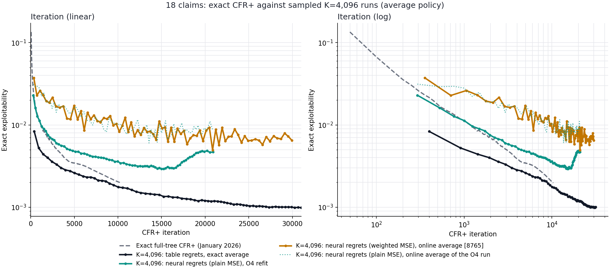

# 18-claim CFR+: exact full-tree reference against sampled K=4,096 runs

## Question

How do our best sampled 18-claim runs compare, iteration for iteration, with exact full-tree CFR+ on the same game? Earlier notes said sampled tabular regrets with 4,096 roots and an exact average "match exact CFR+ per iteration". This note checks that claim against the actual curves and adds two neural-regret runs on the same axes: the run with O4 refits, and the earlier cumulative conditional run with its online average (shown on the 8765 monitor).

No new runs were trained. The note compares four existing curves, plus the online average of the O4 run as a bridge between the two neural runs.

## Curves

All are the 18-claim game `r4_s4_h2_hp2pt_ss`: 4 ranks, 4 suits, 2-card hands, claims RankHigh, Pair, TwoPair and Trips. All use alternating player updates and linear average weights. Each point is the exact exploitability of the run's **average policy**.

| Curve | Regrets | Sampling | Average policy | Source |
| --- | --- | --- | --- | --- |
| Exact full-tree CFR+ | Exact table, reach-weighted (`q × g`), floor at zero | None: every deal and action enumerated | Exact | January 2026 benchmark, [`cfr_plus_dense.py`](../../liars_poker/algo/cfr_plus_dense.py); run `artifacts/benchmark_runs/cfr_plus_runs/r4_s4_h2_hp2pt_ss___20260108-213016/`, evaluated every 50 iterations to 10,350 |
| `exact4096` | Table, cumulative conditional mean (no reach factor), aggregate then clip | 4,096 sampled deals per player; opponent actions sampled; traverser actions fully expanded | Exact, own-reach weighted | [Batched bridge control](../experiments/18_claim/2026-09-30_00-55-09_18_claim_tabular_discounting.md#batched-bridge-controls), seed 17 |
| `neural_o4_k4096` | 512×512 network, same conditional rule, plain MSE | Same as `exact4096` | 256×256 network, O4 refit of each snapshot | [Neural O4 refit run](../experiments/18_claim/2026-10-01_07-56-40_18_claim_neural_o4_refit_cpu.md), seed 17 |
| `conditional4096` (8765) | 512×512 network, same conditional rule, **weighted MSE** (positive targets weighted 1.5×) | Same as `exact4096` | 256×256 **online** network, six steps per iteration | [Cumulative regret scale](../experiments/18_claim/2026-09-29_11-14-31_18_claim_cumulative_regret_scale.md), seed 17; ran 1,200 measured minutes to 29,939 iterations |

`conditional4096` and `neural_o4_k4096` share everything else: network sizes, learning rate `1e-3`, batch 1,024, 24 regret steps, 4,000,000 regret and 2,000,000 strategy records, linear strategy weighting and CPU batched traversal. They differ in the regret loss weighting and in how the average is computed. The O4 run also saved its own online average at every snapshot, which is plotted as a dotted line. That makes the two neural runs comparable with the same averaging.

Data: [`cfr_plus_18_exact_full_tree_reference_20260108.jsonl`](../data/cfr_plus_18_exact_full_tree_reference_20260108.jsonl), [`exact4096.jsonl`](../data/cfr_plus_18_batched_bridge_controls_20260930/exact4096.jsonl) [`neural_o4_k4096.jsonl`](../data/cfr_plus_18_neural_o4_cpu_20261001/neural_o4_k4096.jsonl) and [`cfr_plus_18_cumulative_conditional4096_full_20260930.jsonl`](../data/cfr_plus_18_cumulative_conditional4096_full_20260930.jsonl). [`plot_cfr_plus_18_exact_reference_comparison.py`](../../scripts/plot_cfr_plus_18_exact_reference_comparison.py) regenerates the figure.

## Results

*Both panels use a log exploitability axis. Left: linear iteration. Right: log iteration. The dashed curve is exact CFR+. The dotted teal curve is the online average of the O4 run, from the same snapshots as its O4 refits.*

| Iteration | Exact CFR+ | `exact4096` | Neural + O4 | `conditional4096` (online) | `exact4096` ÷ exact | Neural + O4 ÷ exact | `conditional4096` ÷ exact |
| ---: | ---: | ---: | ---: | ---: | ---: | ---: | ---: |
| 500 | 0.0177 | 0.0074 | 0.0166 | 0.0292 | 0.42 | 0.94 | 1.65 |
| 1,000 | 0.0111 | 0.0051 | 0.0113 | 0.0257 | 0.45 | 1.01 | 2.31 |
| 2,000 | 0.0069 | 0.0039 | 0.0074 | 0.0190 | 0.57 | 1.07 | 2.73 |
| 4,000 | 0.0039 | 0.0028 | 0.0053 | 0.0135 | 0.73 | 1.37 | 3.48 |
| 8,000 | 0.0026 | 0.0021 | 0.0040 | 0.0108 | 0.82 | 1.57 | 4.22 |
| 10,350 | 0.0020 | 0.0017 | 0.0034 | 0.0091 | 0.88 | 1.74 | 4.62 |

Values are interpolated in log-iteration and log-exploitability where a run has no snapshot at that iteration. The online-average curve jumps by up to about 30% between neighbouring snapshots, so its single values are rough. Final points beyond the reference: `exact4096` reached 0.0013 at 17,855 iterations; neural + O4 reached 0.0032 at 11,949; `conditional4096` reached 0.0065 at 29,939 (best 0.0050 at 20,850; geometric mean 0.0071 over 20,000–30,000).

### What the curves show

1. **Sampled table regrets beat exact CFR+ per iteration, not merely match it.** `exact4096` is about 2.2× better at 500–1,000 iterations. The advantage shrinks steadily, to 0.88× by 10,350. "Matches exact CFR+" in earlier notes understated the early gap and hid the trend.
2. **Exact CFR+ has the steepest late slope.** Between 4,000 and 10,350 iterations, the log-log slopes are about **−0.71** for exact CFR+, **−0.51** for `exact4096` and **−0.45** for neural + O4. If those slopes held, exact CFR+ would pass `exact4096` at roughly 20,000 iterations, since a slope gap of 0.2 needs about a 1.9× longer run to close a 0.88 ratio. That is an extrapolation beyond the reference data, not a measurement.
3. **Neural regrets with O4 track exact CFR+ up to about 2,000 iterations,** within 10%. After that the shallower slope opens a gap: 1.4× by 4,000 and 1.7× by 10,350. Against `exact4096` the neural run is about 2× worse throughout, as in the [O4 refit note](../experiments/18_claim/2026-10-01_07-56-40_18_claim_neural_o4_refit_cpu.md).
4. **The 8765 run is the same neural trajectory averaged by a worse method.** Its curve lies on top of the O4 run's own online average. Their geometric means over matching windows agree within about 5%: 0.0227 against 0.0224 at 1,000–2,000 iterations, 0.0123 against 0.0131 at 4,000–8,000, and 0.0102 against 0.0096 at 8,000–12,000. Weighted versus plain MSE in the regret loss made no visible difference here. The whole gap between the 8765 curve and the O4 curve, 2.5–2.9× from 2,000 iterations on, is the online average network's error.
5. **The online average also flattens the slope.** Between 4,000 and 10,350 iterations the 8765 run falls at about −0.41 in log-log terms, against −0.45 for the O4 average of the same kind of trajectory. From about 10,000 to 25,000 iterations its slope is about −0.40. At 29,939 iterations it scores 0.0065, still 2.3× above where `exact4096` was at 4,000.

### Interpretation

The early advantage of `exact4096` most likely comes from its regret update, not from sampling. It adds the **conditional** advantage at every visited infoset, without exact CFR+'s reach factor `q`. Rarely reached infosets therefore get much larger updates relative to frequently reached ones, and they move away from uniform play much sooner. That is a faster start. The visit gate keeps some implicit reach weighting (see the [tabular bridge](../experiments/18_claim/2026-09-29_01-42-50_18_claim_tabular_bridge.md)), but it is not the reach-weighted regret sum that CFR+'s guarantee is about.

The shallower late slopes are consistent with two effects. Sampling noise in the regret increments sets a floor that exact CFR+ does not have. The conditional weighting may also converge more slowly once the early benefit is spent. These curves cannot separate the two. A sampled run with reach-weighted updates (`q × g`, as in bridge arm 1a) at 4,096 roots and an exact average, run to about 20,000 iterations, would. Extending exact CFR+ itself past 10,350 iterations would test the extrapolation directly.

**For the neural work, the relevant reference is `exact4096`, not exact CFR+.** It uses the same update rule and sampling as the neural run, and differs only in storing regrets in a table and in how its average is computed. The neural run's loss of slope after 2,000 iterations, relative to both table curves, is the regret-network cost. Exact CFR+ shows where the rule itself is heading: for long runs, the sampled conditional rule may end up behind exact CFR+ even with a perfect regret table.

### Caveats

- **Different code and dates.** The reference used January 2026 `cfr_plus_dense.py`; the sampled runs use the September batched traversal code. Both use alternating updates and linear averaging. I did not check line by line that "one iteration" means the same amount of work in each. The September [tabular bridge](../experiments/18_claim/2026-09-29_01-42-50_18_claim_tabular_bridge.md) `exact` arm, an independent exact CFR+ run, agrees with the reference: 0.0114 at 1,097 iterations against 0.0111 at 1,000.
- **One seed per sampled run.** The reference is deterministic. The sampled runs are seed 17 only.
- **Neural averaging.** The O4 curve uses refits about 1.1× worse than an exact average on the same checkpoints ([Part A](../experiments/18_claim/2026-10-01_10-25-57_18_claim_average_fit_traversal_schedule_regret_noise.md)). The online curves are 2–5× worse than an exact average.
- **Two neural runs, not one.** `conditional4096` and `neural_o4_k4096` are separate trajectories with the same seed but different regret losses. Their agreement under the same online averaging says the loss change is small at this scale, not that it is zero. `conditional4096`'s manifest does not record the regret weighting. Its runner at the time hard-coded `regret_positive_weight=0.5` (commit bfd16d0), which gives positive targets weight 1.5.

## Reading p_first and p_second

The exact evaluator ([`br_exact_dense_to_dense.py`](../../liars_poker/algo/br_exact_dense_to_dense.py)) solves a best response twice: once with the best responder **moving first** (`p_first`) and once with it **moving second** (`p_second`). Each value is the best responder's win probability against the evaluated policy.

At a Nash equilibrium, `p_first` is the first player's game value `v` and `p_second` is `1 − v`, so they sum to 1. Exploitability is `p_first + p_second − 1`. At the reference's final point, `p_first = 0.53810` and `p_second = 0.46387`, giving 0.00197.

**The first player is favoured.** A best responder wins 53.8% when moving first but only 46.4% when moving second. The true first-player value lies between `1 − p_second = 0.5361` and `p_first = 0.5381`. So the first player wins about **53.6–53.8%** of the time under equilibrium play.
